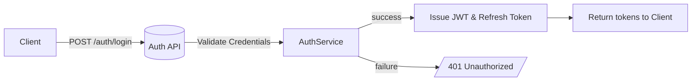

# API Design for Campus Lost & Found System

**Executive Summary:** This document outlines a comprehensive REST API design for the Campus Lost & Found AI System. Core entities include Users, LostItems, FoundItems, Claims, Matches, Notifications, and auxiliary data (e.g. community posts). We use JWT‐based authentication (with optional Google OAuth), enforce role‐based access control (students vs. admins), and all communication must be over HTTPS. Each endpoint follows REST conventions with standard HTTP verbs and status codes. The API supports pagination, filtering, and sorting for list endpoints, and enforces input validation and security best practices (OWASP guidelines). An OpenAPI 3.0 specification is provided at the end.

## Core Entities & Relationships

- **User:** A registered campus user or admin. Fields include `name`, `email` (unique), `passwordHash` (stored securely), `role` (enum: Student, Admin, SuperAdmin), `department`, etc. Users can report lost/found items, submit claims, and receive notifications.  
- **LostItem:** A report of an item lost by a user. Fields: `reporter` (User reference), `title`, `description`, `category` (e.g. Electronics, Documents), `lostDate`, `location` (geo-coordinates), `images`, `status` (Open/Matched/Claimed/Closed), `isApproved` (admin flag), timestamps.  
- **FoundItem:** A report of an item found. Fields mirror LostItem (with `foundDate` instead of `lostDate`).  
- **Match:** An AI-generated candidate pairing between a LostItem and a FoundItem. Fields: `lostItem`, `foundItem` (refs), `score`, `textScore`, `imageScore`, `status` (Pending/Confirmed/Rejected).  
- **Claim:** Created when a user believes a found item is theirs. Fields: `user` (User ref), `foundItem` (ref), `status` (Pending/Approved/Rejected), `evidence` (e.g. photo proof), `admin` (admin reviewer ref), timestamps.  
- **Notification:** Alerts for users (e.g. “Possible match found” or “Claim approved”). Fields: `user`, `type` (Match, ClaimApproved, etc.), `message`, `link` (optional), `isRead`, `createdAt`.  
- **CommunityPost (optional):** Forum posts by users (e.g. hints about found items). Fields: `author`, `title`, `description`, `category` (Lost/Found), `expiresAt`, etc. Admins or cron jobs auto-expire posts.  
- **Other:** Chat threads, AI analysis logs, audit logs, sessions/OTPs, etc. (These are optional or for internal use, not exposed as primary API resources.)

The relationships are summarized in the following ER diagram. Users report many LostItems and FoundItems, and make Claims on FoundItems. Matches link LostItems and FoundItems, and Notifications belong to Users. Each Claim is reviewed by an Admin (also a User). This mermaid diagram illustrates cardinalities:

```mermaid
erDiagram
    USER ||--o{ LOST_ITEM       : reports
    USER ||--o{ FOUND_ITEM      : reports
    USER ||--o{ CLAIM           : makes
    USER ||--o{ NOTIFICATION    : receives

    LOST_ITEM ||--o{ MATCH       : matches
    FOUND_ITEM ||--o{ MATCH      : matches
    FOUND_ITEM ||--o{ CLAIM      : has_claim

    COMMUNITY_POST ||--o{ USER   : "created_by"    %% if implemented

    %% (Other relationships like Chats, AIAnalysis, Logs are omitted)
```

## Data Models

Each entity’s data model (illustrated here in Mongoose/MongoDB form) includes field types, constraints, and indexes:

- **User:** `{ name: String (req), email: String (req, unique, email format), passwordHash: String (req), role: String (enum, default "Student"), department: String, createdAt: Date, lastLogin: Date, isActive: Boolean }`.  
  - *Indexes:* unique index on `email`.  
  - *Validation:* email format regex, required fields enforced.  

- **LostItem:** `{ reporter: ObjectId→User (req), title: String (req), description: String (req), category: String (enum, req), lostDate: Date (req), location: { type: "Point", coordinates: [Number, Number] } (req), images: [String], status: String (enum, default "Open"), isApproved: Boolean (default false), createdAt: Date, updatedAt: Date }`.  
  - *Indexes:* 2dsphere index on `location` for geo-search; text index on `title`+`description` for keyword search; compound index on `{reporter, status}`.  

- **FoundItem:** Same as LostItem but with `foundDate` instead of `lostDate`. Similar indexes.  

- **Match:** `{ lostItem: ObjectId→LostItem (req), foundItem: ObjectId→FoundItem (req), createdAt: Date, score: Number, textScore: Number, imageScore: Number, status: String (enum: Pending/Confirmed/Rejected, default Pending) }`.  
  - *Indexes:* unique compound index on `{lostItem, foundItem}` to prevent duplicate matches.  

- **Claim:** `{ user: ObjectId→User (req), foundItem: ObjectId→FoundItem (req), createdAt: Date, status: String (enum: Pending/Approved/Rejected, default Pending), admin: ObjectId→User, evidence: String }`.  
  - *Indexes:* index on `{foundItem, status}` for queries (e.g. admin’s pending claims), index on `user` for user’s claims.  

- **Notification:** `{ user: ObjectId→User (req), type: String (enum: Match/ClaimApproved/ClaimRejected/AdminMessage/System, req), message: String (req), link: String, isRead: Boolean (default false), createdAt: Date }`.  
  - *Indexes:* `{user, isRead}` to quickly fetch unread alerts.  

- **CommunityPost (if implemented):** e.g. `{ author: ObjectId, title: String, description: String, category: String, createdAt: Date, expiresAt: Date }`.  

*(Other models like Chat, AIAnalysis, Logs, Sessions follow similar patterns.)*

## RESTful Endpoints

Endpoints follow a logical resource-based structure. Key endpoints include:

- **Auth/User:**  
  - `POST /auth/register` – Create a new user account. *Request:* JSON with `name`, `email`, `password`. *Response:* HTTP 201 with user info (excluding password).  
  - `POST /auth/login` – Authenticate user. *Request:* JSON `{email, password}`. *Response:* HTTP 200 with JWT `accessToken` and `refreshToken`. Example: 
    ```json
    { "accessToken": "eyJ...", "refreshToken": "xyz..." }
    ```
    Invalid credentials return 401 Unauthorized.  
  - `POST /auth/refresh` – (Optional) Exchange refresh token for new JWT.  
  - `POST /auth/forgot-password`, `/auth/reset-password` – Initiate and complete password reset (via OTP or email link).  

- **User Profile:**  
  - `GET /users/me` – Retrieve the authenticated user’s profile. (Auth: Bearer token)  
  - `PUT /users/me` – Update profile fields (e.g. `department`).  

- **Lost Items:**  
  - `GET /lost` – List lost item reports. Supports pagination (`?page=..&limit=..`), filtering by `category`, `status`, date range, and full-text search (`?q=keyword`). Returns JSON array of lost item objects with fields like `id, title, category, lostDate, location, status`.  
  - `POST /lost` – Create a new lost-item report. *Auth:* User must be logged in. *Request:* multipart/form-data or JSON with fields: `title`, `description`, `category`, `lostDate`, `location` (latitude/longitude), and optional images. *Response:* HTTP 201 with created LostItem (including assigned `id`).  
  - `GET /lost/{id}` – Get details of one lost item. Returns 404 if not found.  
  - `PUT /lost/{id}` – Update a lost item (e.g. admin approval, status change). *Auth:* Admin role required. *Request:* JSON with updatable fields (e.g. `status`, `isApproved`). *Response:* HTTP 200 on success. Forbidden (403) if non-admin.  
  - `DELETE /lost/{id}` – (Optional) Delete a lost report (admin only) or mark closed.  

- **Found Items:**  
  - `GET /found` – List found item reports (similar to /lost endpoint, with pagination and filters).  
  - `POST /found` – Report a new found item. *Auth:* User. *Request:* `title, description, category, foundDate, location, images`. Returns HTTP 201 with created FoundItem.  
  - `GET /found/{id}` – Get one found item’s details (404 if not exist).  
  - `PUT /found/{id}` – Update found item (admin approval/status). *Auth:* Admin.  

- **Claim Workflow:**  
  - `GET /claims` – List claims. For regular users, returns their own claims; admins can pass `?status=pending` to get all pending claims.  
  - `POST /claims` – Submit a claim for a found item. *Auth:* User. *Request:* JSON `{ "foundItemId": "...", "evidence": "..." }`. Creates a Claim with `status=Pending`. Returns HTTP 201 with claim data.  
  - `PUT /claims/{id}` – Admin approves or rejects a claim. *Auth:* Admin. *Request:* JSON `{ "status": "Approved"|"Rejected", "adminId": "<adminUserId>" }`. Optionally include `adminId` implicitly from token. On approve, system may generate a QR code for pickup. *Response:* HTTP 200. 403 if non-admin, 404 if claim not found.

- **Matches & Notifications:**  
  - (No public “matches” endpoint needed: matches are generated automatically on the backend.)  
  - `GET /notifications` – Get current user’s notifications (filterable by `isRead`).  
  - (Optionally, endpoints like `PUT /notifications/{id}/read` to mark read.)  

- **Community Board:**  
  - `GET /community/posts` – List active community posts (found/lost notices).  
  - `POST /community/posts` – Create a community post/hint. *Auth:* User. *Request:* JSON `{ title, description, category }`. Posts automatically expire after 24h (via background job).  

- **Analytics (Admin):**  
  - `GET /analytics/dashboard` – Returns stats (total lost/found, recovery rate, etc.) for admin dashboard.  

(**Example Request/Response:** Creating a lost item via cURL)
```
curl -X POST https://api.example.com/v1/lost \
  -H "Authorization: Bearer <accessToken>" \
  -H "Content-Type: application/json" \
  -d '{"title":"Blue Earbuds","category":"Electronics","description":"Lost blue earbuds with logo","lostDate":"2026-06-30T10:00:00Z","location":{"latitude":40.712,-74.006}}'
```
_Response (201 Created):_
```json
{
  "id": "lost123",
  "reporterId": "user456",
  "title": "Blue Earbuds",
  "description": "Lost blue earbuds with logo",
  "category": "Electronics",
  "lostDate": "2026-06-30T10:00:00Z",
  "location": {"latitude":40.712,"longitude":-74.006},
  "status": "Open",
  "isApproved": false,
  "createdAt": "2026-06-30T12:00:00Z"
}
```

## Authentication & Authorization

Authentication uses **JWT Bearer tokens**. After login (`POST /auth/login`), the server issues a short-lived access token and a refresh token. Clients include `Authorization: Bearer <accessToken>` in subsequent requests. Protected endpoints reject requests with 401 if the token is missing/invalid. Role-based access control enforces that only *Admin* users can perform sensitive actions (e.g. approving items or claims). For example:



*(Figure: Login flow – the server validates credentials and returns a JWT or error.)*

For Google OAuth, users can “Login with Google”, and the backend verifies the Google ID token before issuing a local JWT. All JWTs should include standard claims (`iss`, `exp`, etc.) and be signed (per OWASP JWT guidelines). Session or OTP tokens (e.g. password reset codes) are stored in a separate `sessions` collection with TTL index, not in-memory, to preserve statelessness.

## Error Handling

The API uses standard HTTP status codes and JSON error bodies. Successful creation returns **201 Created** with a `Location` header pointing to the new resource. Common error codes:
- **400 Bad Request:** Input validation failed or malformed JSON. (e.g. missing required field). Example body: `{"error":"ValidationError","message":"Title is required"}`. Clients should **not** repeat the bad request without changes.  
- **401 Unauthorized:** Authentication token missing or invalid (login required).  
- **403 Forbidden:** Authenticated user lacks permission (e.g. non-admin trying admin action). Return `{"error":"Forbidden"}`.  
- **404 Not Found:** Resource not found (e.g. bad ID). Return minimal message `{"error":"NotFound","message":"Item not found"}`. Do not leak internal details.  
- **409 Conflict:** Duplicate resource (e.g. email already registered).  
- **415 Unsupported Media Type:** Wrong Content-Type (e.g. sending text instead of JSON).  
- **429 Too Many Requests:** Rate limit exceeded (see below).  
- **500 Internal Server Error:** Unexpected failures (should be rare; return generic error without stack trace).

All error responses should be JSON and use generic messages to avoid exposing internals. For example:
```json
HTTP/1.1 400 Bad Request
Content-Type: application/json

{"error":"BadRequest","message":"Lost date must be in the past"}
```

## Rate Limiting & Throttling

To prevent abuse, implement rate limiting per IP or per user token. For example, allow up to *X* requests per minute (e.g. 100/minute) and *Y* requests per day (e.g. 1000/day). When a client exceeds the quota, respond with **429 Too Many Requests** and include relevant headers (e.g. `Retry-After`, `X-RateLimit-Limit`, `X-RateLimit-Remaining`). For instance:
```
HTTP/1.1 429 Too Many Requests
Retry-After: 60
X-RateLimit-Limit: 100
X-RateLimit-Remaining: 0

{"error":"RateLimitExceeded","message":"Rate limit exceeded. Try again later."}
```
Throttling can be implemented via in-memory stores (small scale) or distributed caches (Redis) for larger deployments. Login and password-reset endpoints should have stricter limits to mitigate brute-force.

## Pagination, Sorting & Filtering

List endpoints (`GET /lost`, `/found`, `/claims`, etc.) support **pagination** and **filter parameters**. Use query parameters like `?page=1&limit=20` (offset/limit) or cursor-based paging for large data sets. Support filters: e.g. `?category=Electronics&status=Open&startDate=2026-06-01&endDate=2026-06-30&q=headphones`. Sorting can be done via a `sort` parameter (e.g. `?sort=lostDate,-createdAt`). Responses include metadata (total count, page) or HTTP headers for pagination as needed. By default, return recent items first. This allows clients to build efficient list views.

## Data Validation Rules

All inputs must be validated *server-side*. Never trust client data. Key rules include: 
- **Type/Format:** Ensure fields match expected types (string, date, number). For example, `email` must match an email regex, `lostDate`/`foundDate` must be valid ISO dates (and not in the future).  
- **Required Fields:** Check required fields (title, description, category, etc.). Return 400 if missing.  
- **Ranges & Lengths:** Constrain lengths (e.g. title ≤100 chars, description ≤1000 chars) and numeric ranges.  
- **Enum Values:** Reject values outside defined enums (e.g. category must be one of allowed list).  
- **Content-Type:** Ensure `Content-Type: application/json` for JSON bodies. Reject unexpected/missing types with 415 or 406.  
- **File Uploads:** If allowing image uploads, validate file type (JPG/PNG) and size.  
- **Location:** Ensure coordinate arrays have valid lat/long.  
- **Misc:** Stop any malicious content (e.g. scripts). Use libraries/framework validation where possible.  

Invalid requests should fail fast (return 400) and include an error message. OWASP recommends rejecting requests exceeding size limits with 413 Payload Too Large.

## Idempotency Considerations

Idempotent methods (GET, PUT, DELETE) naturally handle retries safely. For non-idempotent creates (POST), consider using client-generated UUIDs or idempotency keys if duplicate submissions are possible (e.g. double-click). For example, submitting the same user registration twice should either succeed once and conflict the second time (due to unique email) or be detected via an `Idempotency-Key` header. In practice, enforcing unique constraints (email, match pair) ensures that replaying a create request will return a 409 Conflict rather than creating a duplicate.

## Webhooks & Event Handling

While not explicitly required, the system is event-driven under the hood. For example:
- When a new LostItem or FoundItem is created, an event triggers the AI matching process and real-time notifications (via WebSocket/Socket.IO) to relevant users.  
- When a claim is approved/rejected, events notify the claimant.  
- Background jobs (cron) handle tasks like expiring community posts after 24h.  
We could expose webhook endpoints if the university system wanted to receive events (e.g. `POST /webhooks/claim` when a claim is finalized), but this is optional and not in the core spec.

## Versioning Strategy

We include a version prefix in the path (e.g. `/v1/` in all routes as shown above). For backward compatibility, non-breaking changes (new optional fields, endpoints) can stay under v1. For breaking changes, bump to `/v2/`. Using path versioning is straightforward and clear. We could also support version negotiation via `Accept` headers, but path-based versioning is simpler for this context.

## Deployment & Hosting Considerations

- **Statelessness:** The API should be stateless. Do not store session state in memory; use JWTs for auth and external stores (Redis) for any needed caching. This allows horizontal scaling.  
- **CORS:** Since the frontend (possibly served from a different domain) will call the API, configure CORS properly: only allow origins you trust (e.g. `https://app.campus.example.edu`). Disable CORS entirely if all clients are same-origin.  
- **TLS/HTTPS:** All API endpoints must be served over HTTPS to protect credentials and tokens in transit. Enforce HSTS headers to prevent SSL stripping.  
- **Rate-Limiting at Network Edge:** In production, consider using an API gateway or CDN (e.g. Cloudflare) to enforce rate limits and provide DDoS protection.  
- **Containerization/Serverless:** The API can be deployed in Docker containers (k8s) or as serverless functions (e.g. AWS Lambda) depending on scale. Ensure environment variables store secrets (DB credentials, JWT secret) securely.  
- **CORS & Security Headers:** Include security headers (e.g. `X-Content-Type-Options: nosniff`, `Cache-Control: no-store`) especially if API is accessed from browsers.  
- **Monitoring & Logging:** Log all requests (with correlation IDs) and security events (logins, failed attempts). Use centralized logging.

## Security Best Practices (OWASP)

We follow OWASP guidance for REST APIs:

- **Input Validation:** All inputs are validated as above. Use libraries (e.g. JSON schema validators) to enforce types and sanitize content (reject HTML/scripts).  
- **Authentication:** Verify JWT signatures and claims (`iss`, `exp`) on every request. Do not use weak algorithms or `alg=none`.  
- **Access Control:** Enforce role checks at each endpoint. Do not rely solely on obscurity.  
- **Error Information:** Do not leak stack traces or internal errors in responses; return generic messages.  
- **Sensitive Data:** Never include passwords or tokens in URLs or logs. Clients should send them in headers or body. All passwords are hashed (e.g. bcrypt) and never returned by APIs.  
- **Transport Security:** Use TLS 1.2+ everywhere.  
- **HTTP Methods:** Only enable required HTTP methods. For example, disable `TRACE` or `PUT` on endpoints that don’t need them.  
- **Rate Limiting:** As above, to mitigate brute-force and denial-of-service.  
- **OWASP API Top 10:** Review OWASP API Security Top 10 (2023) and ensure countermeasures (e.g. prevent Excessive Data Exposure by controlling fields returned, validate Access Control on IDs, use API security testing).

## Technology Options

No specific tech stack was mandated, so we outline three common options:

| Technology       | Pros | Cons |
|------------------|------|------|
| **Node.js + Express** | - Vast ecosystem (npm).<br>- Non-blocking I/O for high concurrency.<br>- Rapid development with JavaScript/TypeScript.<br>- Many middleware (e.g. passport.js for auth). | - Less type safety unless using TypeScript.<br>- Callback/async complexity.<br>- Single-threaded (scale via clustering). |
| **Python + FastAPI** | - FastAPI auto-generates docs (Swagger UI) and validations from Python types.<br>- High performance (async, Uvicorn).<br>- Easy to write and maintain (Python). | - Slightly smaller ecosystem than Node.<br>- GIL limits CPU-bound tasks (but OK for I/O).<br>- Need to manage async properly. |
| **Java + Spring Boot** | - Enterprise-grade: strong typing, robust tooling.<br>- Built-in security modules (Spring Security), data binding, scalability.<br>- Excellent concurrency (multi-threaded). | - Verbose configuration, steeper learning curve.<br>- Slower development cycle (compilation).<br>- Heavier memory footprint. |

Choice depends on team expertise and requirements. For example, Node/Express suits quick prototypes and JavaScript-heavy teams; FastAPI suits Python shops wanting modern async support; Spring Boot suits large-scale enterprise deployments.

## OpenAPI Specification (Draft)

Below is a truncated **OpenAPI 3.0** YAML spec draft. It defines key paths, request/response schemas, and components (data models). (In practice, this would be auto-generated or maintained in a separate YAML/JSON file.)

```yaml
openapi: 3.0.0
info:
  title: Campus Lost & Found API
  version: 1.0.0
servers:
  - url: https://api.campus-lostfound.example.com/v1
paths:
  /auth/register:
    post:
      summary: Register a new user
      requestBody:
        content:
          application/json:
            schema:
              $ref: '#/components/schemas/UserRegistration'
      responses:
        '201':
          description: User created
          content:
            application/json:
              schema:
                $ref: '#/components/schemas/User'
        '400':
          description: Invalid input
  /auth/login:
    post:
      summary: User login (returns JWT)
      requestBody:
        content:
          application/json:
            schema:
              $ref: '#/components/schemas/UserLogin'
      responses:
        '200':
          description: Successful login
          content:
            application/json:
              schema:
                $ref: '#/components/schemas/AuthToken'
        '401':
          description: Invalid credentials
  /lost:
    get:
      summary: List lost items (paginated)
      parameters:
        - name: page
          in: query
          schema: {type: integer, default: 1}
        - name: limit
          in: query
          schema: {type: integer, default: 20}
        - name: category
          in: query
          schema:
            type: string
            enum: [Electronics, Clothing, Documents, Other]
        - name: status
          in: query
          schema:
            type: string
            enum: [Open, Matched, Claimed, Closed]
      responses:
        '200':
          description: Array of lost items
          content:
            application/json:
              schema:
                type: array
                items: { $ref: '#/components/schemas/LostItem' }
    post:
      summary: Report a lost item
      requestBody:
        content:
          multipart/form-data:
            schema:
              $ref: '#/components/schemas/LostItemCreate'
      responses:
        '201':
          description: Lost item created
          content:
            application/json:
              schema:
                $ref: '#/components/schemas/LostItem'
  /lost/{id}:
    get:
      summary: Get a lost item by ID
      parameters:
        - name: id
          in: path
          required: true
          schema: {type: string}
      responses:
        '200':
          description: Lost item details
          content:
            application/json:
              schema: { $ref: '#/components/schemas/LostItem' }
        '404':
          description: Item not found
    put:
      summary: Update lost item (admin only)
      parameters:
        - name: id
          in: path
          required: true
          schema: {type: string}
      requestBody:
        content:
          application/json:
            schema:
              $ref: '#/components/schemas/LostItemUpdate'
      responses:
        '200': {description: Lost item updated}
        '403': {description: Forbidden}
        '404': {description: Not found}
  /found:
    get:
      summary: List found items
      parameters:  # similar to /lost
        - name: page
          in: query
          schema: {type: integer, default: 1}
        - name: limit
          in: query
          schema: {type: integer, default: 20}
      responses:
        '200':
          description: Array of found items
          content:
            application/json:
              schema:
                type: array
                items: { $ref: '#/components/schemas/FoundItem' }
    post:
      summary: Report a found item
      requestBody:
        content:
          multipart/form-data:
            schema:
              $ref: '#/components/schemas/FoundItemCreate'
      responses:
        '201':
          description: Found item created
          content:
            application/json:
              schema:
                $ref: '#/components/schemas/FoundItem'
  /found/{id}:
    get:
      summary: Get a found item by ID
      parameters:
        - name: id
          in: path
          required: true
          schema: {type: string}
      responses:
        '200':
          description: Found item details
          content:
            application/json:
              schema: { $ref: '#/components/schemas/FoundItem' }
        '404': {description: Not found}
    put:
      summary: Update found item (admin only)
      parameters:
        - name: id
          in: path
          required: true
          schema: {type: string}
      requestBody:
        content:
          application/json:
            schema:
              $ref: '#/components/schemas/FoundItemUpdate'
      responses:
        '200': {description: Found item updated}
        '403': {description: Forbidden}
        '404': {description: Not found}
  /claims:
    get:
      summary: List claims (user or admin)
      parameters:
        - name: status
          in: query
          schema:
            type: string
            enum: [Pending, Approved, Rejected]
      responses:
        '200':
          description: Array of claims
          content:
            application/json:
              schema:
                type: array
                items: { $ref: '#/components/schemas/Claim' }
    post:
      summary: Submit a claim
      requestBody:
        content:
          application/json:
            schema:
              $ref: '#/components/schemas/ClaimCreate'
      responses:
        '201':
          description: Claim created
          content:
            application/json:
              schema: { $ref: '#/components/schemas/Claim' }
  /claims/{id}:
    put:
      summary: Approve/reject a claim (admin only)
      parameters:
        - name: id
          in: path
          required: true
          schema: {type: string}
      requestBody:
        content:
          application/json:
            schema:
              $ref: '#/components/schemas/ClaimDecision'
      responses:
        '200': {description: Claim updated}
        '403': {description: Forbidden}
        '404': {description: Not found}
components:
  schemas:
    UserRegistration:
      type: object
      required: [name, email, password]
      properties:
        name: {type: string}
        email: {type: string, format: email}
        password: {type: string, format: password}
    User:
      type: object
      properties:
        id:   {type: string}
        name: {type: string}
        email:{type: string}
        role: {type: string}
        department: {type: string}
    UserLogin:
      type: object
      required: [email, password]
      properties:
        email:    {type: string}
        password: {type: string}
    AuthToken:
      type: object
      properties:
        accessToken:  {type: string}
        refreshToken: {type: string}
    LostItem:
      type: object
      properties:
        id:           {type: string}
        reporterId:   {type: string}
        title:        {type: string}
        description:  {type: string}
        category:     {type: string}
        lostDate:     {type: string, format: date-time}
        location: 
          type: object
          properties:
            latitude:  {type: number}
            longitude: {type: number}
        status:       {type: string}
        isApproved:   {type: boolean}
        createdAt:    {type: string, format: date-time}
    LostItemCreate:
      type: object
      required: [title, description, category, lostDate, location]
      properties:
        title:       {type: string}
        description: {type: string}
        category:    {type: string}
        lostDate:    {type: string, format: date-time}
        location:
          type: object
          properties:
            latitude:  {type: number}
            longitude: {type: number}
        images:
          type: array
          items: {type: string}
    LostItemUpdate:
      type: object
      properties:
        status:     {type: string}
        isApproved: {type: boolean}
    FoundItem:
      type: object
      properties:
        id:           {type: string}
        reporterId:   {type: string}
        title:        {type: string}
        description:  {type: string}
        category:     {type: string}
        foundDate:    {type: string, format: date-time}
        location: 
          type: object
          properties:
            latitude:  {type: number}
            longitude: {type: number}
        status:       {type: string}
        isApproved:   {type: boolean}
        createdAt:    {type: string, format: date-time}
    FoundItemCreate:
      type: object
      required: [title, description, category, foundDate, location]
      properties:
        title:        {type: string}
        description:  {type: string}
        category:     {type: string}
        foundDate:    {type: string, format: date-time}
        location:
          type: object
          properties:
            latitude:  {type: number}
            longitude: {type: number}
        images:
          type: array
          items: {type: string}
    FoundItemUpdate:
      type: object
      properties:
        status:     {type: string}
        isApproved: {type: boolean}
    Claim:
      type: object
      properties:
        id:          {type: string}
        userId:      {type: string}
        foundItemId: {type: string}
        status:      {type: string}
        createdAt:   {type: string, format: date-time}
    ClaimCreate:
      type: object
      required: [foundItemId]
      properties:
        foundItemId: {type: string}
        evidence:    {type: string}
    ClaimDecision:
      type: object
      required: [status]
      properties:
        status:  {type: string, enum: [Approved, Rejected]}
```

*Note:* This YAML is a draft. In a real project, it would include all endpoints (e.g. Notifications, Community posts) and more detailed component schemas. 

**Sources:** API design best practices are informed by OWASP (e.g. REST Security Cheat Sheet), standard HTTP semantics (MDN docs), and API tutorials. This design also reflects requirements from the provided project documents (SRS, TDD, etc.). All recommendations above come from those specifications and established API design guidelines.