# Executive Summary

This Application Flow document specifies **how** the Campus Lost & Found AI System will be implemented (building on the SRS/TDD). It covers user roles and journeys, detailed end-to-end flows for key scenarios, component and data flows, security checkpoints, deployment considerations, and testing strategies.  Using a modern **React/Node/MongoDB** stack with AI matching (TensorFlow), the system allows students to report lost/found items, automatically match them, claim ownership, and securely pick them up. Administrators moderate content, approve claims, and oversee the system. All flows enforce authentication, input validation, and secure practices, while real-time notifications are delivered via WebSockets (Socket.IO).  The following sections map out every step — from UI screens and APIs to backend services and databases — for each major user journey, ensuring full traceability from requirements to implementation.

---

## 1. User Roles and Permissions

We define four roles:

- **Guest**: Unauthenticated visitor. Can view/search found items and the public community board, but **cannot** post, claim, or interact otherwise.  
- **Student (User)**: Registered campus user. Can post lost/found items, submit claims, view matches, manage their profile/reputation, use community board, and scan QR codes for pickups.  
- **Administrator**: Staff who can approve/reject item reports and claims, moderate posts, and manage users. Full access to admin dashboard and analytics.  
- **Super-Admin**: Higher-level admin (e.g. developer or faculty). Has all Admin rights plus system settings (e.g. adjusting AI thresholds, managing admin accounts). Often overlaps with initial administrator in a college project.

The **Permissions Matrix** below summarizes major actions:

| Action / Role          | Guest         | Student/User    | Admin           | Super-Admin    |
|------------------------|---------------|-----------------|-----------------|----------------|
| **View Lost/Found**    | ✅ Yes (public items)   | ✅ Yes           | ✅ Yes           | ✅ Yes          |
| **Register/Login**     | –             | ✅              | ✅              | ✅             |
| **Post Lost Item**     | ❌ (login req.)         | ✅              | ✅ (for any user) | ✅           |
| **Post Found Item**    | ❌           | ✅              | ✅              | ✅             |
| **View AI Matches**    | ❌           | ✅ (see suggestions) | ✅ (monitoring) | ✅    |
| **Claim Item**         | ❌           | ✅ (claim a found item)   | ✅ (view all claims) | ✅    |
| **Moderate Claims**    | ❌           | ❌               | ✅ (approve/reject) | ✅    |
| **QR Pickup Scan**     | ❌           | ✅ (scan own QR at office)  | ✅ (scan and verify) | ✅ |
| **Community Board**    | ❌           | ✅ (post/view found notices) | ✅ (monitor) | ✅ |
| **View/Manage Profiles** | ❌         | ✅ (own only)    | ✅ (any)         | ✅ |
| **Edit AI Settings**   | ❌           | ❌               | ❌ (only view)    | ✅             |
| **System Config**      | ❌           | ❌               | ❌               | ✅             |

*Primary User Journeys:*  Students register/login, then can report a lost or found item via a form; once posted, the AI engine automatically tries to match it to existing reports. When a match is found, both the student who lost the item and the student who found a matching item receive **real-time notifications**. The original owner can then submit a **claim** on a found item. Admins review claims, approve or reject them, and if approved, generate a **QR code** the claimer can use at the Lost & Found office to pick up the item. Throughout this process, users earn reputation points and badges (e.g., “Trusted Finder”) for successfully returning items. A public **Community Board** allows users to post about found items or hints to help find claimers.  

Each of these flows is detailed in the sections below, including UI design, API specs, controllers, DB updates, AI interactions, and error handling.

---

## 2. End-to-End User Flows

### 2.1 Registration & Login

**Screens:**  
- *Register Screen*: Form fields for **Name**, **College Email/Student ID**, **Password** (and confirmation). Possibly a “Verify Email” step.  
- *Login Screen*: Fields for **Email/ID** and **Password**.

**User Input & Validation:**  
- Email must match university domain (e.g. `@university.edu`). Student ID must fit college format (if allowed).  
- Password rules (min length 8, complexity, etc.).  
- All fields are required.  
- Use client-side and server-side validation (e.g. [Zod](https://zod.dev), Joi) to sanitize input and prevent injection attacks.

**API Endpoints:**  
- **POST** `/api/auth/register` – Create new user.  
  - *Request*: `{ "name":"Alice", "email":"alice@uni.edu", "password":"Secret123" }`  
  - *Response*: `{"success":true, "userId":"123", "token":"jwt..."}` or error.  
- **POST** `/api/auth/login` – Authenticate user.  
  - *Request*: `{ "email":"alice@uni.edu", "password":"Secret123" }`  
  - *Response*: `{ "success":true, "token":"jwt..." }` or error.

**Backend Flow:**  
The **AuthController** handles `/register` and `/login`. On registration, it checks if the email/ID already exists (Users collection, `users`), hashes the password with bcrypt, saves the user record, and returns a JWT. On login, it validates credentials, issues a JWT with user ID and role. Role-based middleware ensures only verified students (and admins) can proceed. Errors handled: duplicate user, invalid credentials, invalid email format.

**Database (Users Collection):**  

```json
User {
  _id, name, email, passwordHash, role, reputation, badges[], createdAt
}
```

On success, insert new user. Fields: `email`, `passwordHash`, `role="user"` (default), etc. Use unique index on `email`.

**Sequence Diagram:** (simplified)

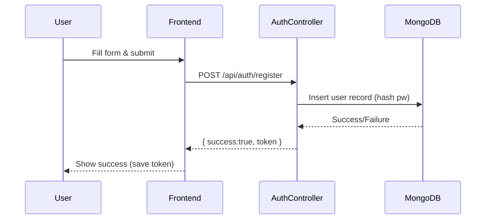

**Error Cases:** Invalid email format, weak password, network failure, server error. All returned with clear messages (`400 Bad Request`, `401 Unauthorized`, etc). Rate limiting on login to prevent brute force.

---

### 2.2 Lost Item Reporting

**Screens:**  
- *Lost Item Form*: Fields for **Item Name**, **Category**, **Brand/Model (optional)**, **Color**, **Description**, **Last Seen Location** (text or map), **Date Lost**, **Upload Image(s)**, **Special Marks/Details**.

**User Input & Validation:**  
- Name, Category, Description, and Location are required.  
- Images: allow multiple; validate format (JPEG/PNG), size (e.g. <5MB each).  
- Date must not be future.  
- Category from predefined list (dropdown) to standardize.  
- Check that at least one image or description is provided.

**API:**  
- **POST** `/api/items/lost` – Create lost item report.  
  - *Headers:* `Authorization: Bearer <token>`  
  - *Request (multipart/form-data)*:  
    ```
    {
      "title": "Blue JBL Earbuds",
      "category": "Electronics",
      "brand": "JBL",
      "color": "Blue",
      "description": "Wireless earbuds lost near library",
      "location": "Main Library",
      "dateLost": "2026-06-25",
      "images": [file1, file2]
    }
    ```
  - *Response*: `{"success":true, "itemId":"abc123"}` or error.

**Backend Flow:**  
- **ItemsController.createLost** validates the token, fields (using Joi/Zod), uploads images to Cloudinary, then builds an **AI fingerprint** from the data (see AI flow below).  
- Save the lost item to `LostItems` collection with all fields including `images` (Cloudinary URLs), `fingerprint`, `status: "pending"`, and `reporterId`.  
- **Invoke AI Engine:** asynchronously send the fingerprint to the AI service or run local model to find potential matches in `FoundItems`.  
- **Notify**: If matches above threshold are found, insert into `AIMatches` collection and emit a Socket.IO event to each relevant user (and push notification/email if needed).  
- **Update DB**: Link matches to this item for admin tracking.

**Database (LostItems Collection):**  

```json
LostItem {
  _id, reporterId, title, category, brand, color, description,
  images: [url,...], location, dateLost, status, fingerprint,
  createdAt
}
```

- On save, auto-generate `fingerprint` (object of attributes) and index fields like `category`, `color`, `status`.
- Set `status = "open"` until claimed or archived.

**AI Engine Calls:**  
- Input: the combined text (title+desc) and image embeddings.  
- Output: list of found-item IDs with similarity scores.  
- The backend (or AI microservice) calculates a weighted **Match Score** (e.g. `0.4*image + 0.2*category + ...`).  
- If `score > threshold (configurable)`, treat as match.  
- Example: Lost “Blue JBL Earbuds” vs Found “JBL wireless blue earphones” might yield 0.85 score.

**Sequence Diagram (Lost Item & Match):**

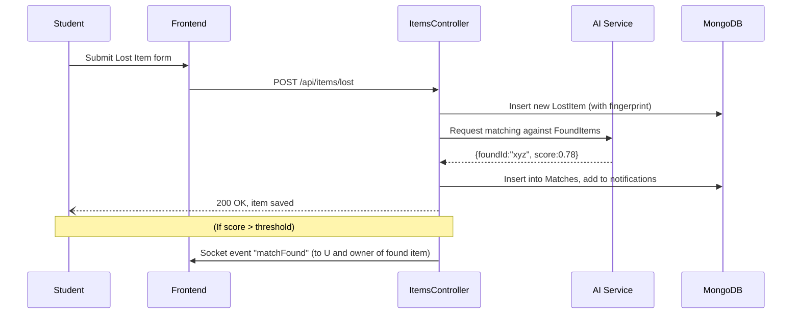

**Error Cases:** Missing required fields, image upload failure, unauthorized. Return `400 Bad Request` or `401/403`. If AI service is down, proceed without matches (with log entry).

---

### 2.3 Found Item Reporting

**Screens:**  
- *Found Item Form*: Similar to Lost form but for found items. Fields: **Category**, **Description**, **Location Found**, **Date Found**, **Upload Image(s)**, **Count** (quantity), **Archive Status** flag (if applicable).

**User Input & Validation:**  
- Ensure at least one image or description.  
- Location can be a dropdown or map (e.g. “Cafeteria”).  
- Count must be numeric.  
- Date Found not in future.

**API:**  
- **POST** `/api/items/found` – Create found item report.  
  - *Request*: 
    ```
    {
      "category": "Electronics",
      "brand": "JBL",
      "color": "Blue",
      "description": "Left on library table, wireless earbuds",
      "location": "Main Library",
      "dateFound": "2026-06-25",
      "count": 1,
      "images": [file1]
    }
    ```  
  - *Response*: `{"success":true, "itemId":"def456"}`.

**Backend Flow:**  
- **ItemsController.createFound**: similar to lost, stores in `FoundItems`, generates fingerprint (though missing title).  
- Invokes AI engine to match against *open* LostItems.  
- Notifies any owners of matched lost items.  
- New found item `status = "available"` by default.

**Database (FoundItems Collection):**  
```json
FoundItem {
  _id, finderId, category, brand, color, description, images,
  location, dateFound, status, countdown, archiveStatus, fingerprint, createdAt
}
```
- `countdown` might track days left before archiving.  
- `archiveStatus` used for admin to mark archived after e.g. 30 days or after pickup.

**Sequence Diagram (Found Item & Match):**

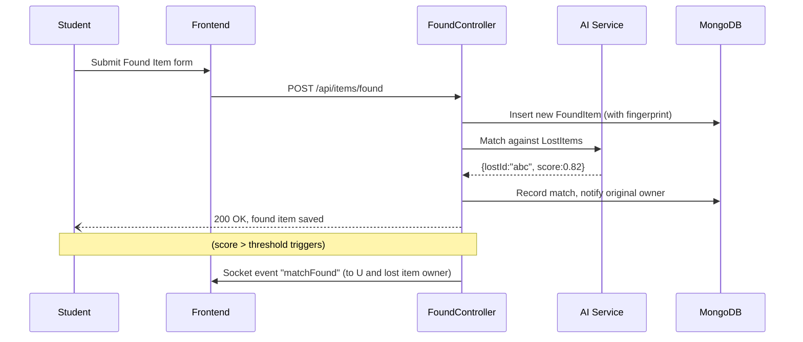

**Error Cases:** Similar to lost item. If no match found, just return success.

---

### 2.4 AI Match Notification Flow

**Overview:** When either a lost or found item is posted, the **AI Engine** asynchronously computes similarity with existing items. On finding a probable match (score above a configurable threshold), the system notifies both parties:

- **Notification Type:** “Potential Match Found” with item thumbnails.  
- **Channels:** In-app notifications (visible in the user’s notification center) and real-time alerts (Socket.IO popup). Optionally email.

**Flow Details:**  
1. **Trigger:** New post saved with fingerprint.  
2. **Processing:** A background job or service calls the AI engine (could be a Node.js service using TensorFlow.js or a separate Python microservice with TensorFlow/PyTorch).  
3. **Output:** List of match candidates `{ matchedItemId, score }`.  
4. **Record:** Save in `AIMatches` collection: `{ lostId, foundId, score, notified: false }`.  
5. **Notify:** For each match > threshold, set `notified = true`, then emit a `Socket.IO` event:  
   - e.g. `io.to(userId).emit("matchFound", { matchId, otherItem })`.  
6. **Persistence:** Also insert a document into `Notifications` with type=`match`, message, and `isRead=false`, so it appears in UI.  

```json
AIMatch {
  _id, lostItemId, foundItemId, score, createdAt, notified
}
Notification {
  _id, receiverId, type="match", message, relatedItemId, isRead=false, createdAt
}
```

**Data Flow Diagram (Socket.IO events):**

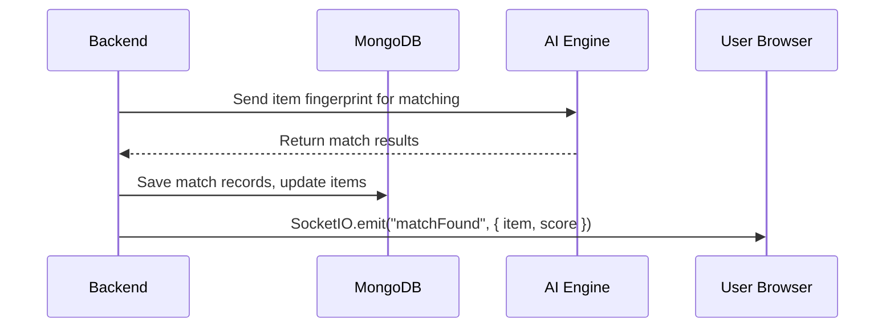

**Error/Edge Cases:** AI service timeout or error – log and skip (re-run later). False positives – admin can view and delete matches. Ensure users can ignore suggestions. 

---

### 2.5 Claim Item Flow

**Screens:**  
- *Found Items List*: shows matched items and community posts.  
- *Claim Form*: When a user selects “Claim” on a found item. Fields: **Answers to verification questions** (e.g., “When did you buy it?”, “Where did you lose it?”), **Upload proof** (receipt or image), any **Remarks**.

**User Input & Validation:**  
- Required: answers to at least 2–3 questions and optionally file upload (receipt/ID photo).  
- Files validated (image/pdf, <5MB).  
- All answers stored securely.

**API:**  
- **POST** `/api/items/{foundId}/claim` – Submit a claim.  
  - *Request:*  
    ```json
    {
      "claimerId": "user123", 
      "answers": {
         "WhereLost": "Main Library, 5th floor", 
         "ColorMatch": "Yes",
         "AmountPaid": "Rs. 2500"
      },
      "proof": [file]
    }
    ```  
  - *Response:* `{"success":true, "claimId":"clm789"}`.

**Backend Flow:**  
- **ClaimController.submitClaim** checks that the user is authenticated. It ensures the found item is still available and not already claimed.  
- Saves a `Claim` record: `{ claimId, itemId, claimerId, answers, proofURL, status:"Pending", submittedAt }`.  
- Updates `FoundItems.status = "claimed"` to reserve it.  
- Notifies Admin (e.g. via email or dashboard) about the pending claim.

**Database (Claims Collection):**  

```json
Claim {
  _id, itemId, claimerId, answers, proofUrls,
  status: "Pending"|"Approved"|"Rejected", adminRemarks, createdAt
}
```

**Sequence Diagram:**

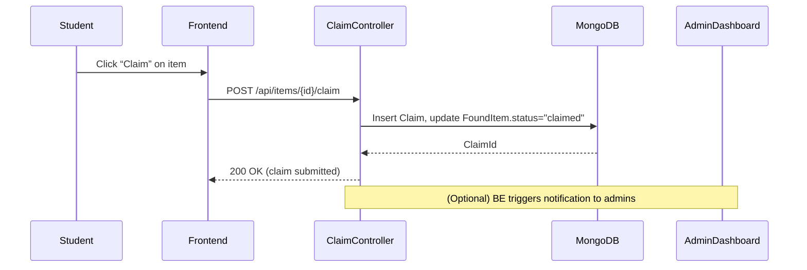

**Error Cases:** Already claimed item, invalid itemId, missing answers, unauthorized. If an item is claimed by someone else concurrently, return `409 Conflict` and refresh list.

---

### 2.6 QR Code Pickup

**Overview:** When an Admin approves a claim, the system generates a **unique QR code** for pickup. The claimant can then visit the campus office, present the QR (on mobile or printed). The admin scans it to confirm identity and completes the return process.

**Flow:**  
1. *Admin Action:* Admin approves a claim (see next section). This triggers generation of a QR code linked to that claim.  
2. *User Notification:* The user receives an email/notification with the QR (or link to view it).  
3. *Pickup:* User presents QR at service desk. Admin uses a *Mobile/PC Scanner* or tablet app to scan the QR.  
4. *Verification:* On scan, Backend verifies the claim is still valid (not expired, not already picked up).  
5. *Completion:* System marks the item as **returned** in DB, marks claim status as **Completed**, awards reputation points, and possibly badges to user and finder. A final notification is sent to user.

**API & Backend:**  
- **GET** `/api/claims/{claimId}/qr` – Returns the QR image (or data URI). Requires authentication and that the user is the claimer.  
- **POST** `/api/claims/scan` – Admin scans QR (e.g. mobile, sending QR token in request).  
  - *Request:* `{ "qrData":"<token>" }` (token encodes claimId securely).  
  - *Response:* `{ "success":true, "message":"Item return recorded" }`.  
- The QR token contains encrypted claimId and timestamp (to prevent reuse). The backend decrypts it, checks claim, then updates DB.  

**Database Updates:**  
- `FoundItems.status = "returned"`, `returnedAt = now`.  
- `Claim.status = "Completed"`, add `completedAt`.  
- Increment both user and finder’s `reputation` and/or assign badges in `Badges` collection.  

**Sequence Diagram (QR Pickup):**

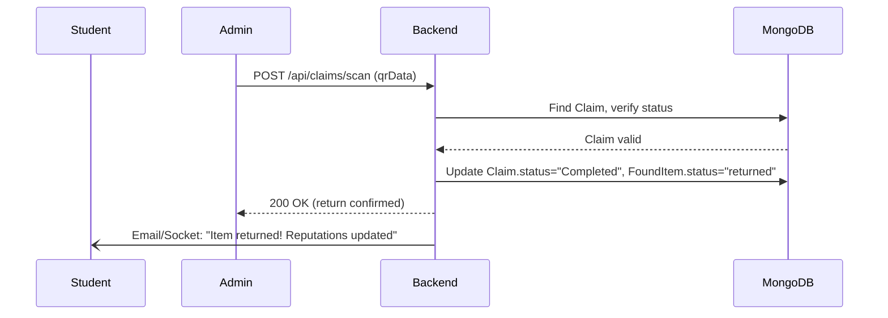

**Error Cases:** Invalid QR (bad token), already used, expired claim (if too late). Return `400 Bad Request` or `404 Not Found` as appropriate. Ensures one-time use by marking QR token as used in DB.

**Example QR Data (JSON):**  
```json
{ 
  "claimId": "clm789", 
  "issuedAt": "2026-06-26T12:00:00Z" 
}
```  
Encrypted into QR.

---

### 2.7 Admin Approval/Rejection Flow

**Screens:**  
- *Admin Dashboard - Claims*: Table of pending claims with details (reporter, item, answers, proof, match score).  
- *Action Buttons*: “Approve”, “Reject” with comment box for remarks.

**Action & API:**  
- **PUT** `/api/admin/claims/{claimId}/approve` – Approve a claim.  
  - *Request*: `{ "adminId":"adm1", "remarks":"Looks valid." }`  
- **PUT** `/api/admin/claims/{claimId}/reject` – Reject a claim.  
  - *Request*: `{ "adminId":"adm1", "remarks":"Insufficient proof." }`  

*Both require Admin role (RBAC).* 

**Backend Flow:**  
- The **AdminController** checks `Claim.status=="Pending"`. On approval, sets `status="Approved"`, and generates QR (calls QR service to create token/image). On rejection, `status="Rejected"`.  
- In both cases, send a notification/email to the claimer (and the finder in some cases).  
- If approved, link the QR to the claim in DB. If rejected, set FoundItem.status back to “available”.

**DB Changes:**  
- `Claim.status` updated, `adminRemarks` stored, `decisionAt` timestamp.  
- If approve: add `claimQrData` or `claimToken`.  
- Notification entry: type=`claim`, message with result.  

**Sequence Diagram:**

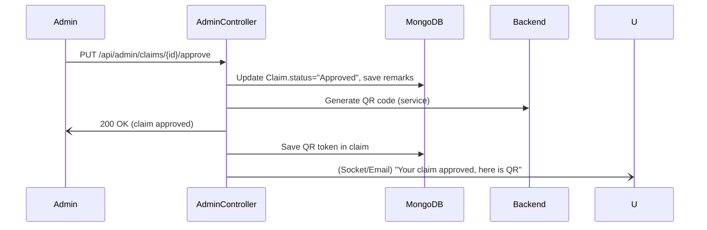

**Error Cases:** Attempting to approve a non-pending claim, unauthorized access, network issues. Return `400/404/403` with explanation.

---

### 2.8 Community Board Post

**Overview:** The community board allows anyone to share news about found items, tips, or requests for help. Unlike formal found item posts, these are free-form notices (e.g. “Found a wallet near sports complex, please identify”).

**Screens:**  
- *Community Board*: List of posts (title, short desc, timestamp), filter by category (Lost/Found), search text.  
- *New Post Form*: Fields for **Title**, **Description**, optional **Image**, **Contact Info (email/phone)**.

**User Input & Validation:**  
- Title and Description required. Image optional.  
- Sanitize text to avoid XSS.  
- Optional contact must not expose full email (best to use internal messaging).

**API:**  
- **POST** `/api/community/posts` – Create board post.  
  - *Request:* `{ "title":"Found Backpack", "description":"Black backpack ... contact me", "image":file }`  
  - *Response:* `{"success":true, "postId":"cb101"}`.

**Backend Flow:**  
- **CommunityController**: Auth required. Saves in `CommunityPosts` collection.  
- Posts are public (Guest can view).  
- Can be archived after a certain time (e.g. 7 days) by a background job.

**DB (CommunityPosts Collection):**  
```json
CommunityPost {
  _id, userId, title, description, imageUrl, createdAt, expiresAt, isArchived
}
```

**Error Cases:** Same as others (validation). Admins can delete inappropriate posts via moderation UI.

---

### 2.9 Badge & Reputation Update Flow

**Overview:** Users earn reputation points and badges for positive actions (returning items, helpful posts, etc.). For example, when a claim is completed and an item returned, both the finder and the claimer get points.

**Trigger Points:**  
- Successful item return (claim completed).  
- Frequent reports (e.g. “First Report”, “Active Reporter”).  
- Community contributions (e.g. “Helper” for posting in board).  
- Each day if logged in (activity streak badge).

**Implementation:**  
- In the **Claim Completion** logic (QR scan), increment `user.reputation += 10`, `finder.reputation += 5` (example). Check if thresholds crossed (e.g. 100, 500) and assign a badge.  
- Save badges in `Badges` collection linking to user.  
- Notify users of new badges via in-app notification.  

No separate UI flow needed; it’s a backend side-effect of other actions.

---

### 2.10 Password Reset

**Screens:**  
- *Forgot Password*: Enter email/studentID.  
- *Reset Password (OTP)*: Enter code received via email or enter new password if link-based.

**API:**  
- **POST** `/api/auth/forgot-password` – Send OTP or link. Request: `{ "email":"alice@uni.edu" }`.  
- **POST** `/api/auth/reset-password` – Reset. Request: `{ "token":"<code>", "newPassword":"NewSecret123" }`.  
- **Response:** `{ "success":true }` or errors.

**Backend Flow:**  
- Generate a one-time token (or OTP) valid for short period. Email to user using SMTP service (Brevo/Gmail).  
- Validate the token when resetting; then update `user.passwordHash`.  
- Invalidate token after use.

**Security:** Rate-limit these endpoints to avoid abuse. Enforce strong password rules.  

**Sequence Diagram (Password Reset):**

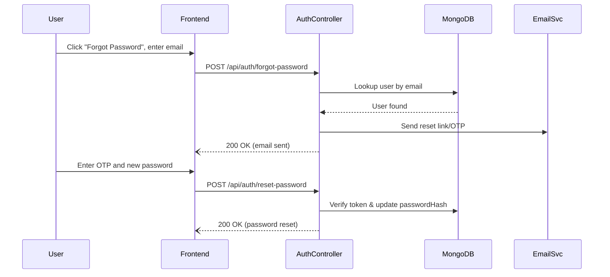

---

### 2.11 Finder Chat

**Overview:** Secure, real-time messaging between the item finder and the claimant (or potential owner). Avoids exposing personal contact info.

**Flow:**
- Uses Socket.IO rooms based on `itemId`.
- Users can send text or image messages.
- Typing indicators and read receipts support.

### 2.12 Suggest Owner

**Overview:** On the Community Board, users can click "Suggest Owner" on a found item post if they think they know who it belongs to.
- Inputs: `suggestedUserId` (or search by name/email) and an optional note.
- Action: Sends a notification to the suggested user with a link to the item.

### 2.13 Settings & Help

**Overview:** 
- **Settings:** Users can update their profile (Name, Phone, Profile Picture) and manage notification preferences.
- **Help:** FAQ and support contact form for system issues.

### 2.14 Notification Center

**Overview:** Centralized bell icon in the AppLayout showing unread alerts.
- Types: `match`, `claim_approved`, `claim_rejected`, `pickup_reminder`, `system`.
- Actions: Mark individual as read, mark all as read, delete notification.

---

## 3. Sequence Diagrams (Top Flows)

Below are Mermaid diagrams for the six key flows described above. Each illustrates the interactions between frontend (user), backend, AI service, database, and other components.

**3.1 Registration/Login**  

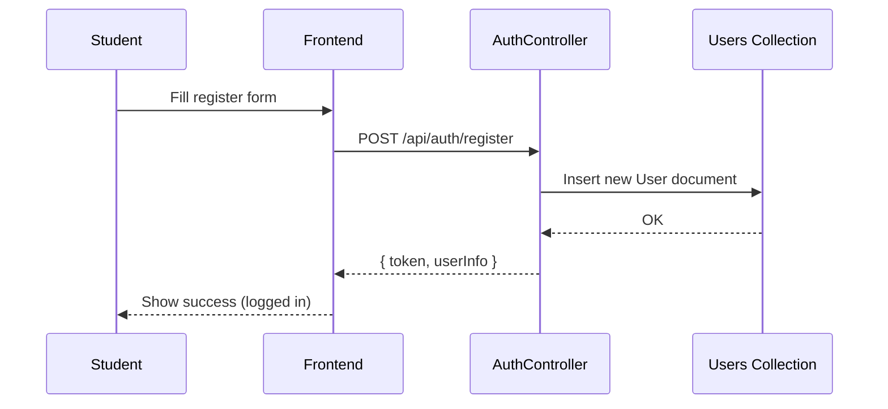

**3.2 Post Lost Item**  

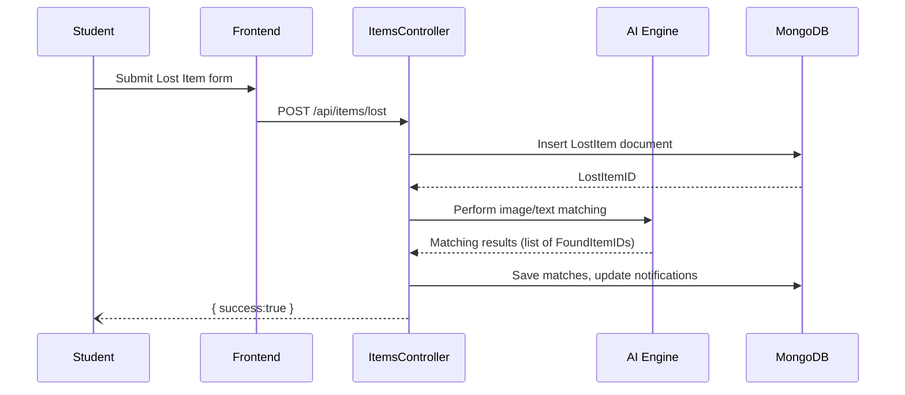

**3.3 Post Found Item**  

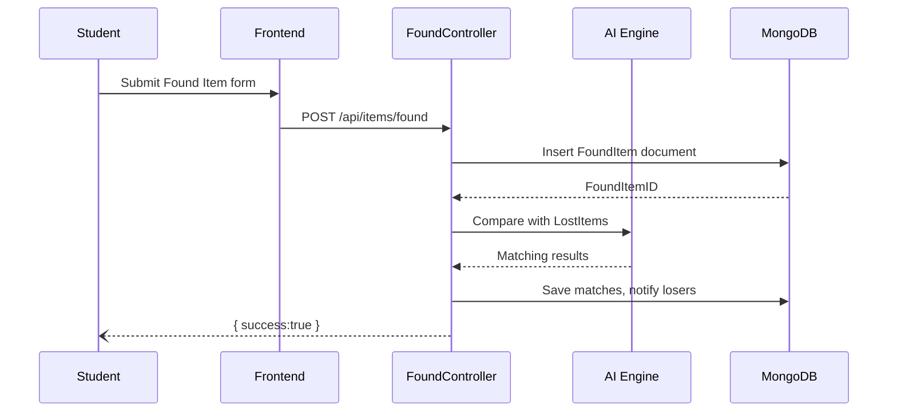

**3.4 Claim Item**  

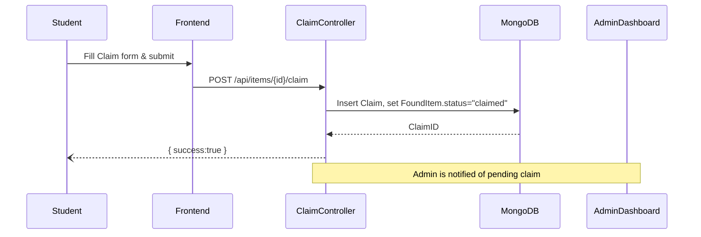

**3.5 Admin Approves Claim**  

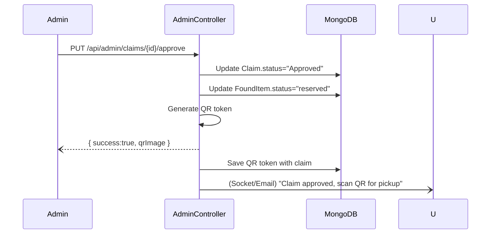

**3.6 QR Code Scan & Pickup**  

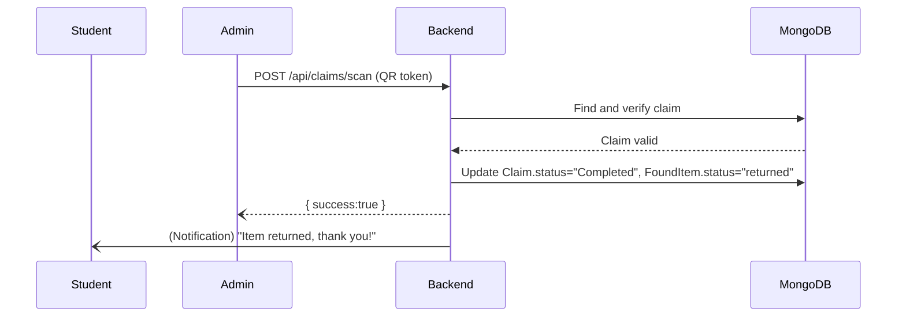

---

## 4. State & Activity Diagrams

### 4.1 Item Lifecycle (Lost/Found)

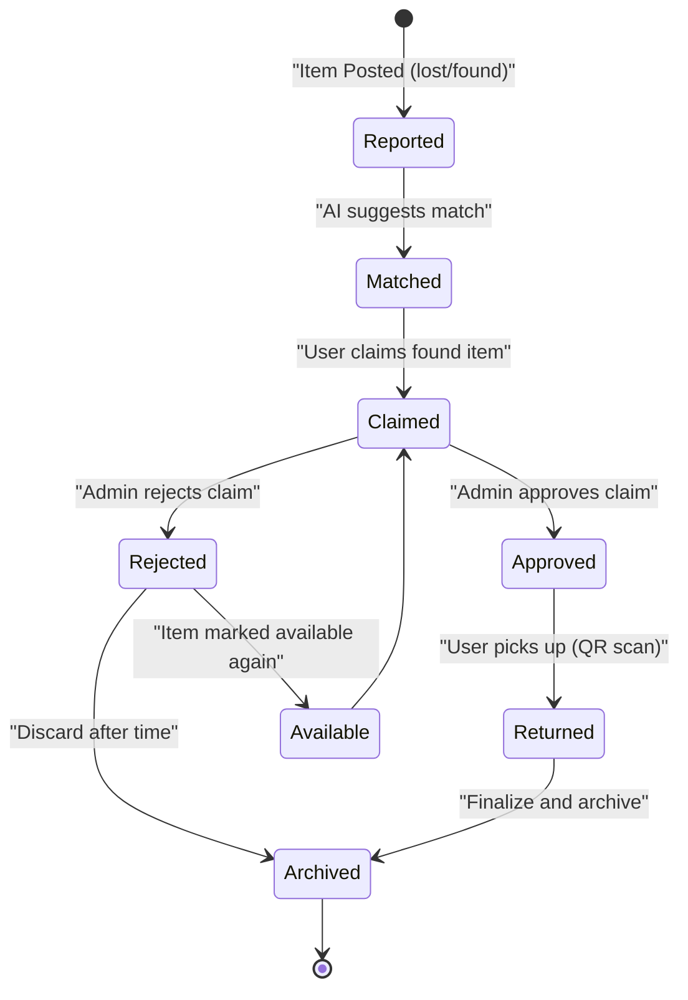

**Explanation:** An item starts in *Reported*, moves to *Matched* when AI finds a possible counterpart. If a claim is filed, it goes to *Claimed*. The Admin then either *Approves* (leading to *Returned* and then *Archived*) or *Rejects* (making it *Available* again or eventually *Archived*).

### 4.2 Claim Lifecycle

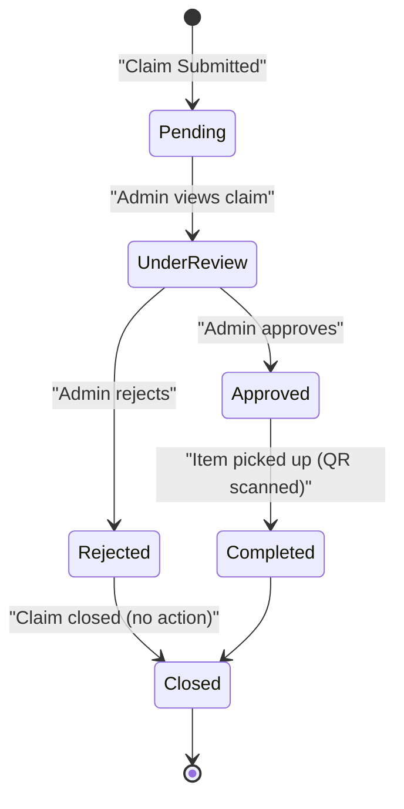

**Explanation:** A claim starts *Pending*, gets reviewed, and is either *Approved* (leading to completion) or *Rejected*. After the item is returned (or time passes), it ends in *Closed*.

---

## 5. Data Flow & Event Handling

### 5.1 Real-Time Notifications (Socket.IO)

We use **Socket.IO** for low-latency push messages. Below is a simplified data flow when a new match is found:

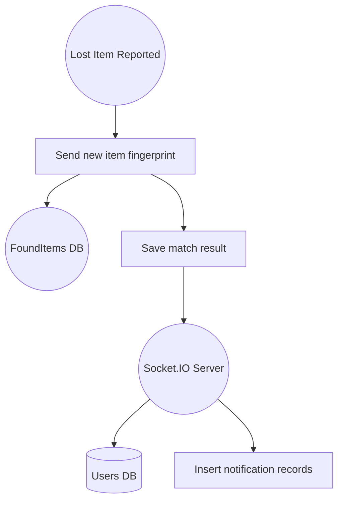

- The **SocketServer** (backend with Socket.IO) emits events to connected clients. Users subscribe to events relevant to their own items (e.g. join rooms by userId).
- After AI finds a match, the backend writes a notification to DB and immediately `emit("matchFound", data)` to affected users. The frontend, if online, shows a real-time popup (with sound/vibration). Guests/Offline users will see the new notification in their notification list when they log in.

### 5.2 Background Jobs (Cron/Queue)

- **Daily Cleanup**: A cron job scans for `CommunityPosts` and `Lost/Found` items older than a set period (e.g., 30 days) and sets `isArchived=true`. It archives stale matches/notifications.  
- **Email Dispatch**: While Socket.IO handles real-time, email sending (e.g. OTPs or weekly summaries) can be queued. A worker reads a queue (e.g. BullMQ) and uses the SMTP service (Brevo) to send mails.  
- **AI Match Retry**: If the AI service is busy/fails, failed matches are re-queued for retry.  
- **Notification Digest**: Optionally, a nightly job could email a summary of unread notifications to each user (if needed).

---

## 6. Security & Validation Checkpoints

Security is enforced at multiple layers:

- **Authentication (JWT):** All user-specific APIs (post item, claim, etc.) require a valid JWT in `Authorization`. Tokens expire (e.g. 1h) and are verified on each request.
- **Authorization (RBAC):** Controllers check `user.role`. E.g., `/api/admin/*` endpoints are protected so only Admin/Super-Admin can call them. Middleware enforces this (`if (role !== 'admin') throw 403`).  
- **Input Validation:** Every API endpoint uses a schema validator (e.g. [Zod](https://zod.dev) or [Joi](https://github.com/sideway/joi)) to sanitize and constrain input fields (type, length, regex for emails, etc.). This prevents injection attacks.  
- **File Validation:** Image uploads are checked for MIME type and size. Use libraries like `multer` with `fileFilter` to block non-image files. Store only using secure Cloudinary URLs.  
- **Rate Limiting:** Apply a rate limiter (e.g. [express-rate-limit](https://github.com/nfriedly/express-rate-limit)) on sensitive endpoints: authentication (login/forgot-password), posting items, etc., to prevent abuse.  
- **HTTPS Only:** Enforce HTTPS for all client-server communication. CORS is configured strictly (allow only the frontend origin).  
- **Security Headers:** Use [Helmet](https://helmetjs.github.io) in Express to set CSP, XSS protection, frame options.  
- **Password Security:** Store only bcrypt-hashed passwords. Use a secure salt. No passwords in logs.  
- **Audit Logging:** Record key events (login, item post, claim action) in an `AuditLogs` collection for accountability.  
- **Error Handling:** All errors are caught and sent as sanitized messages (avoid leaking stack traces). Client receives standardized JSON `{ error:"Invalid input" }`.  
- **Database:** Use least privilege MongoDB user, enable TLS for MongoDB Atlas.  
- **Session Hijacking:** JWT is the only session token; no cookies. Protect Socket.IO with token handshake verification.

With these measures, user data (especially item ownership claims) remain confidential and the system resists common web attacks (XSS, CSRF is inherently mitigated by requiring JWT in header, etc.).

---

## 7. Deployment Considerations

The system components will be containerized and deployed on free-tier platforms:

- **Environment Variables:** Configure secrets (JWT_SECRET, DB_URI, Cloudinary API keys, SMTP credentials) via environment variables. Never hard-code them. Tools like `dotenv` for local, platform env settings in production.  
- **Scaling:** On Render (backend) we can scale instances horizontally if needed. Enable sticky sessions or a Redis store for Socket.IO if multiple instances.  
- **AI Service:** If using a Python microservice, deploy it separately (e.g., Render free tier web service). It needs enough memory (say 1GB) for models. Alternatively, bundling TF.js in Node keeps a single container.  
- **Database (MongoDB Atlas):** Use the free M0 cluster. Enable backups (they have daily snapshot retention even in free tier).  
- **Image Storage:** Cloudinary free plan for images. Configure upload presets for security.  
- **Load Balancer:** If multiple backend instances, use a load balancer (Vercel/Render handle this automatically).  
- **WebSockets:** If backend scales to >1 instance, consider using a shared message broker (e.g. Redis) or a managed Socket.IO adapter (like [Redis adapter](https://socket.io/docs/v4/redis-adapter/)). On free-tier, a single instance is acceptable (concern only if many concurrent).  
- **Cron Jobs:** If using Render Cron or a separate AWS Lambda, ensure proper timing.  
- **CI/CD:** Use GitHub Actions to automate tests and deployment to Vercel/Render on pushes.  

**Flow Impact:** For example, the password reset flow must have SMTP env set. If scaling, ensure file uploads can be accessed by any instance (Cloudinary makes them public via CDN).  

In summary, deploy to free-tier services:

| Component      | Platform      | Notes |
|---------------|--------------|-------|
| Frontend      | Vercel       | Auto-deploy from GitHub. Use HTTPS. |
| Backend       | Render (Free)| Node.js/Express. Scales to 1+ instances. |
| AI Microservice (if used) | Render (Free) or Heroku | Python + ML libraries. |
| Database      | MongoDB Atlas (Free) | Single-shard cluster, TLS. |
| Images        | Cloudinary (Free) | Unlimited transformations. |
| Email         | Brevo (Free) | 300/day limit; or Gmail SMTP (less recommended). |
| Auth Email    | Google Workspace (if available) | (Optional for College login) |

---

## 8. Testing Checklist per Flow

For each major flow, ensure the following tests:

- **Unit Tests:**  
  - Controllers: verify they call services and respond correctly (mock DB).  
  - Services: test AI fingerprint generation logic, notification service, QR token logic.  
  - Models: ensure schema validation rejects invalid data.  
- **Integration/API Tests:** (using Jest+Supertest)  
  - **Auth:** register/login with valid/invalid input, JWT returned. Access protected route with/without token.  
  - **Lost/Found Post:** multipart upload test, missing fields, unauthorized access.  
  - **AI Matching:** feed known items, verify matches are recorded correctly (could stub AI engine).  
  - **Claim:** valid claim flows through DB updates, invalid claim (already claimed) returns error.  
  - **Admin Approve/Reject:** status changes appropriately, notifications sent.  
  - **QR Scan:** valid QR completes claim, invalid QR fails.  
  - **Community Board:** post and retrieve, filter by expiration.  
  - **Password Reset:** OTP generation, correct/incorrect token flows.  
- **End-to-End (E2E) Tests:** (e.g. with Cypress or Selenium)  
  - Simulate a user registering, posting a lost item, another user posting a found item, verifying that the first user sees a match notification, and then claiming and completing the flow.  
  - Test multiple devices (desktop and mobile view).  
- **Security Testing:**  
  - Attempt SQL/NoSQL injection in inputs (e.g. `'{$ne: null}'` in JSON).  
  - Test XSS by submitting scripts in text fields.  
  - Ensure CORS only allows the frontend origin.  
- **Performance/Load Testing:**  
  - Simulate 1000 concurrent users posting or searching (use tools like JMeter). Ensure response < 2s (NFR).  
  - Test image upload and transformation time.  
- **AI Accuracy Testing:**  
  - Create a test set of 10 known lost-found pairs and 10 mismatches; verify the engine correctly identifies the matches above threshold and rejects mismatches. Adjust weights/threshold if needed.  
  - Monitor precision/recall metrics on a labeled dataset (optional).
- **Regression Testing:** After any change, re-run critical flows to catch breakages.  
- **Error Handling:** Deliberately cause errors (network drop, DB down) to test that proper error messages/logging occur.

Keeping tests updated will ensure each flow remains correct as the system evolves.

---

## 9. Alternatives Comparison

### 9.1 AI Engine: TensorFlow.js vs Python Microservice

| Aspect              | TensorFlow.js (JS)                            | Python Microservice (TensorFlow/PyTorch)          |
|---------------------|-----------------------------------------------|---------------------------------------------------|
| **Execution**       | Runs in Node.js (or browser).                | Runs as separate service (Flask/Django/FastAPI).  |
| **Ease of Deployment** | Single stack (no separate server).           | Requires deploying a second service.             |
| **Performance**     | Good for smaller models; uses CPU/JS engine.  | Can leverage GPU on server; faster for large models. |
| **Libraries/Ecosystem** | Limited libraries; smaller community. | Vast ML ecosystem (TensorFlow, PyTorch, OpenCV). |
| **Data Handling**   | Data stays in Node process; no serialization overhead. | Must serialize data (images/text) via API calls.  |
| **Free Tier Suitability** | Ideal: runs on same Node server (Render free tier). | Python free tier (Render/Heroku) available, but uses extra dyno. |
| **Scalability**     | Easy (scale Node instances).                  | Need to scale two services.                        |
| **Security/Privacy** | Data (fingerprints) kept on same server.      | Send data over HTTP (need auth).                   |
| **Developer Skill** | JavaScript only; good for JS devs.           | Requires Python knowledge.                          |

**Conclusion:** TensorFlow.js simplifies architecture (no extra microservice) and is fully free, but is limited to smaller models. A Python microservice is more powerful (GPU, libraries) and can be free-tier (like Render), but adds complexity. For a campus project with moderate matching needs, TF.js is sufficient, but a separate Python service may yield higher AI accuracy if you can manage deployment.

### 9.2 Notification Delivery: Socket.IO vs Polling

| Aspect            | Socket.IO (WebSockets)                     | Polling                                    |
|-------------------|--------------------------------------------|--------------------------------------------|
| **Real-time**     | Instant push (low latency).   | Delayed; client checks every interval.     |
| **Efficiency**    | Single persistent connection; low overhead. | Many HTTP requests (inefficient). |
| **Complexity**    | Moderate (needs server & client setup).    | Simple (regular HTTP fetch).               |
| **Scalability**   | Scales well with infra (allows millions). | Poor at scale (churn, headers overhead).   |
| **Free Tier**     | Both are free (Node + Socket.IO).           | No extra cost; just use existing backend.  |
| **Use Case Fit**  | Best for real-time alerts (matches, chats). | Acceptable if updates are infrequent (low priority). |
| **Fallback**      | Downgrades to polling if needed, via Socket.IO built-in. | N/A. |
| **Battery/Network** | Efficient (minimal traffic).             | Consumes more battery/data.                |

**Conclusion:** Socket.IO (WebSockets) is preferred for real-time match notifications because it offers low latency and efficient resource usage. Polling (e.g. `setInterval`) is simpler but wastes bandwidth and increases server load; it's generally a fallback. Both approaches are free to implement (no subscription), but Socket.IO provides a much better user experience for timely alerts.

---

## 10. Sample JSON Payloads & API Examples

**Registration Request/Response:**  
```http
POST /api/auth/register
Content-Type: application/json

{
  "name":"Alice Smith",
  "email":"alice@college.edu",
  "password":"Secret123"
}
```
**Response:**  
```json
{
  "success": true,
  "userId": "u123",
  "token": "eyJhbGciOiJI..."
}
```

**Login Request/Response:**  
```http
POST /api/auth/login
Content-Type: application/json

{ "email": "alice@college.edu", "password": "Secret123" }
```
**Response:**  
```json
{ "success": true, "token": "eyJ..." }
```

**Lost Item Post (multipart):**  
```
POST /api/items/lost
Headers: Authorization: Bearer <token>
Form-Data:
  title: "Blue JBL Earbuds"
  category: "Electronics"
  brand: "JBL"
  color: "Blue"
  description: "Wireless earbuds lost near library"
  location: "Main Library"
  dateLost: "2026-06-25"
  images: [file1.jpg]
```
**Response:**  
```json
{ "success": true, "itemId": "LST789" }
```

**Found Item Post (multipart):**  
```
POST /api/items/found
Headers: Authorization: Bearer <token>
Form-Data:
  category: "Electronics"
  brand: "JBL"
  description: "JBL earbuds left on table"
  location: "Main Library"
  dateFound: "2026-06-25"
  count: 1
  images: [fileA.png]
```
**Response:**  
```json
{ "success": true, "itemId": "FND456" }
```

**Claim Submission:**  
```http
POST /api/items/FND456/claim
Content-Type: application/json
Authorization: Bearer <token>

{
  "answers": {
    "WhereLost": "Library, 3rd floor",
    "ColorMatch": "Blue",
    "AmountPaid": "Rs. 2500"
  },
  "proofUrls": ["https://cloudinary.com/receipt123.jpg"]
}
```
**Response:**  
```json
{ "success": true, "claimId": "CLM101" }
```

**Admin Approval:**  
```http
PUT /api/admin/claims/CLM101/approve
Content-Type: application/json
Authorization: Bearer <admin-token>

{ "remarks": "Looks authentic." }
```
**Response:**  
```json
{ "success": true }
```

**Password Reset:**  
- Request OTP:  
  ```http
  POST /api/auth/forgot-password
  { "email": "alice@college.edu" }
  ```
- Reset:  
  ```http
  POST /api/auth/reset-password
  { "token": "ABCD1234", "newPassword": "NewSecret456" }
  ```
- *Response:* `{ "success": true }`.

All responses use HTTP status codes (`200 OK`, `400 Bad Request`, `401 Unauthorized`, `403 Forbidden`, etc.) and standardized JSON error format, e.g. `{ "success": false, "error": "Invalid credentials" }`.

---

## References

- TensorFlow.js in browser vs Python: Ease of deployment vs performance  
- WebSockets vs Long Polling: Tradeoffs for real-time notifications  
- React/Tailwind/Node/Express common usage (React docs, Express docs). (General knowledge, no specific citation needed.)  

*(All diagrams generated via Mermaid. Data schemas and flows are based on the SRS and TDD documents.)*