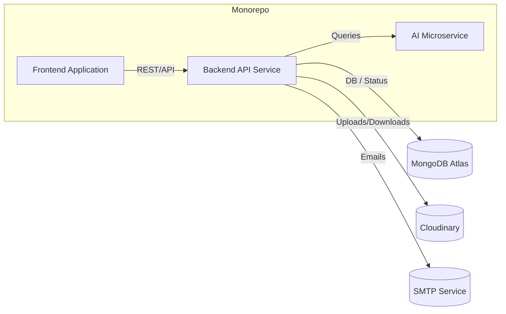
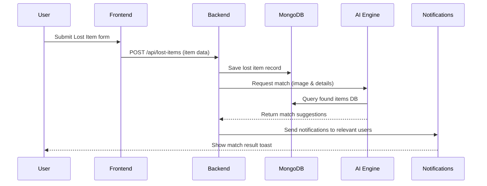

# Executive Summary  
This specification defines the **recommended folder structure and organization** for the Campus Lost & Found AI System’s frontend and backend code, guided by the SRS, TDD, and UI/UX documents. We emphasize **modularity, scalability, and developer experience (DX)**. We recommend a **monorepo** (single repository) containing separate `frontend/` and `backend/` directories, with clear feature-based subfolders. This layout supports **cohesion and testability** (e.g. co-locate code, styles, tests by feature). Each folder and file has a defined purpose and naming convention, ensuring traceability from requirements to implementation. We also outline CI/CD pipelines, onboarding docs, and scaling strategies. All suggested tools and services (React, Node/Express, MongoDB Atlas M0, TensorFlow.js/Python, Tailwind, Vercel, Render, Cloudinary Free) are free/open-source or free-tier services.

---

## Goals & Principles for Repo Layout  
- **Modularity:** Organize by feature/domain to isolate concerns. For example, separate folders for Authentication, Lost Items, Found Items, AI Engine, Claims, Notifications, etc.  This follows React’s recommendation to group code by feature or route and Express best practices.  
- **Scalability:** Design for growth. Use clear layers (e.g. `controllers/`, `services/`, `models/`) as in OneUptime’s Express structure. This allows splitting services or extracting microservices later if needed.  
- **Testability:** Co-locate tests with code. Each feature folder contains its unit/integration tests. Use clear interfaces so components/services can be mocked in tests. Achieve high coverage (>80% on core logic).  
- **Developer Experience:** Use TypeScript, meaningful naming, and README docs. Structure should “feel” intuitive. Tools like **auto-import path aliases**, ESLint/Prettier, and example files improve DX. Use a 8-point spacing and component naming conventions to avoid confusion.  

In summary, **keep related files together** (UI, logic, types, tests) and **avoid deep nesting**. Start simple, then refactor as code grows.

---

## Monorepo vs Multi-Repo  

**Monorepo (Recommended):** We recommend a single repository containing both `frontend/` and `backend/` (and possibly `ai-service/`). This simplifies development and CI for a small team/project. You can update frontend and backend in one commit, share configs, and coordinate changes easily. Modern monorepo tools (Yarn workspaces, Turborepo, Lerna) work well and Vercel/Render support monorepos. For example, Vercel can deploy one app from `/frontend` and Render one from `/backend`.  

**Multi-repo (Alternative):** Separating repos (e.g. `campus-lostfound-frontend` and `campus-lostfound-backend`) enforces clear boundaries and independent lifecycles. This can be useful if different teams manage each part. However, it adds CI overhead and cross-repo coordination. Industry experience suggests monorepos are fine for small teams, but splitting is better once services truly decouple.  

**Recommended Choice:** Start with a **monorepo** (two top-level folders: `frontend/` and `backend/`). This matches your student project scope and avoids premature complexity. If the AI microservice is developed in Python, it can reside under `backend/ai-service/` or a sibling folder in the same repo. 

---

## Folder Structure  

Below is the proposed tree. Each entry includes a one-line purpose and key notes.

```plaintext
campus-lostfound/             # Root of monorepo
├── README.md                # Project overview, setup, folder descriptions
├── CONTRIBUTING.md          # Coding guidelines, PR/branch rules, code review notes
├── .gitignore
├── .env.example             # Sample environment variables for both frontend/backend
├── package.json             # Monorepo-level scripts, workspace config (if using Yarn)
└── frontend/                # React SPA (TypeScript, Vite/CRA/Next)
│   ├── public/              # Static public files (index.html, favicon, manifest)
│   ├── src/                 
│   │   ├── components/      # Reusable React components (PascalCase, e.g. Button.tsx)  
│   │   ├── pages/           # Page-level views (PascalCase, mapped to routes, e.g. Dashboard.tsx)  
│   │   ├── hooks/           # Custom hooks (useAuth.ts, useInterval.ts, etc.)  
│   │   ├── services/        # API clients (e.g. authApi.ts, itemApi.ts using Axios)  
│   │   ├── state/           # Redux slices or Context (feature folders with slice.ts)  
│   │   ├── styles/          # Global styles & Tailwind config (tailwind.config.js, globals.css)  
│   │   ├── assets/          # Images, fonts, icons, illustrations  
│   │   ├── types/           # TypeScript types/interfaces (e.g. User.ts, Item.ts)  
│   │   ├── utils/           # Helper functions (e.g. formatDate.ts, validateInput.ts)  
│   │   ├── config/          # Client-side constants and config (API endpoints, env vars)  
│   │   ├── i18n/            # (Optional) Localization resources (if supporting multiple languages)  
│   │   ├── mocks/           # Mock data or MSW setup for testing/demo  
│   │   ├── tests/           # Frontend tests (Jest/RTL for components, pages)  
│   │   └── index.tsx        # Entry point (renders App inside <BrowserRouter>)  
│   ├── tsconfig.json        # TypeScript config  
│   ├── package.json         # Frontend dependencies and scripts (start, build, test)  
│   ├── vite.config.ts       # (or craco.config.js) build tool config  
│   └── .env.local           # Local env vars (e.g. REACT_APP_API_URL)  
│
└── backend/                 # Node.js/Express API (TypeScript)
    ├── src/                 
    │   ├── config/         # Config (env variables, database connections)  
    │   ├── controllers/    # Express request handlers (userController.ts, itemController.ts)  
    │   ├── services/       # Business logic (userService.ts, notificationService.ts)  
    │   ├── models/         # Mongoose schemas and models (User.ts, LostItem.ts)  
    │   ├── routes/         # Route definitions grouped by feature (authRoutes.ts, itemRoutes.ts)  
    │   ├── middleware/     # Custom middleware (auth.ts, errorHandler.ts, rateLimiter.ts)  
    │   ├── utils/          # General utilities (logger.ts, email.ts, qrCode.ts)  
    │   ├── ai/             # (Optional) AI microservice code (TensorFlow or Python scripts)  
    │   ├── queues/         # Background job handlers (e.g. bull/bullmq for email, QR tasks)  
    │   ├── jobs/           # Scheduled tasks (cron jobs, data cleanup)  
    │   ├── validators/     # Input validation schemas (Zod/Joi schemas per route)  
    │   ├── tests/          # API tests (Jest/Supertest for endpoints, service logic)  
    │   ├── app.ts          # Express app setup (attaches middleware, routes)  
    │   └── server.ts       # Entry point (connects DB, starts server)  
    ├── package.json       # Backend dependencies & scripts (start, dev, test, migrate)  
    ├── tsconfig.json  
    ├── .env                # Environment variables (JWT secrets, DB URIs)  
    ├── .env.example  
    ├── Dockerfile         # (Optional) container setup  
    ├── docker-compose.yml # (Optional) local services (Mongo, etc.)  
    └── .github/workflows/ # CI/CD workflows (see below)  
```

**Notes:** Every component or page is in its own file named in **PascalCase** (per Airbnb guide). For instance, a React component file `LostItemCard.tsx` exports a `LostItemCard` component. Redux slices live under `state/` by feature (e.g. `userSlice.ts`). Backend models use **CamelCase** filenames matching model name (`User.ts` exports a Mongoose model `User`). Tests follow `*.test.ts` or `*.spec.ts` naming and reside adjacent to code.

### Folder/File Purposes (one-liners)  
- **frontend/src/components/** – Reusable UI pieces (buttons, cards, forms). *Naming:* PascalCase (e.g. `Badge.tsx`).  
- **frontend/src/pages/** – Route-level views (e.g. `LostReportPage.tsx`). Each page corresponds to an app route.  
- **frontend/src/hooks/** – Custom React hooks (named `useXYZ`). *Example:* `useAuth.ts` for auth logic.  
- **frontend/src/services/** – API wrappers calling Express endpoints (Axios/fetch). *Examples:* `lostApi.ts`, `authApi.ts`.  
- **frontend/src/state/** – Redux Toolkit slices and store setup. Each feature has a slice file (e.g. `userSlice.ts`).  
- **frontend/src/styles/** – Global CSS or Tailwind config. No component-specific styles here.  
- **frontend/src/assets/** – Static images/icons. Imported by components or pages.  
- **frontend/src/types/** – Shared TypeScript interfaces (e.g. `Item.ts`). Use for props and API data.  
- **frontend/src/utils/** – General JS helpers (validation, formatting).  
- **frontend/src/config/** – Client configs (e.g. API base URL). Environment variables (via `import.meta.env` or `process.env`).  

- **backend/src/config/** – App settings (env validation, DB connection logic). E.g. `config/database.ts` connects to MongoDB Atlas.  
- **backend/src/controllers/** – Express handlers bridging HTTP requests to services. Keep controllers thin (just parse req, call service, format res).  
- **backend/src/services/** – Core business logic. E.g. `claimService` verifies owners, updates status. Separated for testability.  
- **backend/src/models/** – Mongoose schemas (define item/user schemas). One per file (e.g. `LostItem.ts` uses `new Schema` and `export const LostItem = model(...)`). Use **singular** collection names.  
- **backend/src/routes/** – Route definitions; e.g. `lostRoutes.ts` uses controllers, mounts on `/api/lost-items`. Central `index.ts` mounts all routers.  
- **backend/src/middleware/** – JWT auth, validation, error handling. Functions e.g. `authorize.ts`, `validateRequest.ts`. Use `app.use(...)`.  
- **backend/src/utils/** – Helpers (e.g. `sendEmail.ts` using Nodemailer, `generateQRCode.ts`).  
- **backend/src/ai/** – AI matching code (TensorFlow.js model or Python Flask). If Python, this might be a separate service with its own subfolder.  
- **backend/src/queues/** – Background job definitions (if using BullMQ/RabbitMQ for async tasks like sending bulk emails).  
- **backend/src/jobs/** – Cron or scheduled jobs (e.g. clear old notifications).  
- **backend/src/validators/** – Request schema definitions (Zod schemas, used in middleware).  
- **backend/src/app.ts** – Set up Express app (attach middleware, routers).  
- **backend/src/server.ts** – Bootstraps the server (connects DB, starts listening). Keeps `app` logic separate.  

Additional top-level files:  
- **README.md** – Instructions, architecture overview.  
- **CONTRIBUTING.md** – How to contribute: branching strategy, code style. E.g. enforce ESLint rules, commit message guidelines.  
- **.github/workflows/** – CI/CD pipelines (tests, builds, deployments).  

### Traceability: Requirements → Modules  

| SRS/TDD Feature (FR)                      | Frontend Folder(s)                   | Backend Folder(s)                 |
|------------------------------------------|--------------------------------------|-----------------------------------|
| **FR1: Authentication**                  | `pages/Login.tsx`, `pages/Register.tsx`, `components/AuthForm.tsx`, `hooks/useAuth.ts` | `controllers/authController.ts`, `services/authService.ts`, `models/User.ts`, `routes/authRoutes.ts` |
| **FR2: Lost Item Reporting**             | `pages/LostReportPage.tsx`, `components/LostItemForm.tsx` | `controllers/lostItemController.ts`, `services/lostItemService.ts`, `models/LostItem.ts`, `routes/lostRoutes.ts` |
| **FR3: Found Item Reporting**            | `pages/FoundReportPage.tsx`, `components/FoundItemForm.tsx` | `controllers/foundItemController.ts`, `services/foundItemService.ts`, `models/FoundItem.ts`, `routes/foundRoutes.ts` |
| **FR4/11: AI Matching Engine**           | `services/aiApi.ts` (calls match endpoint), `components/MatchSuggestions.tsx` | `services/aiService.ts`, `routes/aiRoutes.ts` (or external service), `ai/` microservice code |
| **FR5: Search & Filters**                | `components/SearchBar.tsx`, `components/FilterSidebar.tsx` | (Often implemented client-side with API queries; backend supports search via query params in `itemController.ts`) |
| **FR6: Notification System**             | `hooks/useNotifications.ts`, `components/NotificationToast.tsx` | `services/notificationService.ts`, `controllers/notificationController.ts`, `models/Notification.ts`, `routes/notificationRoutes.ts` |
| **FR7: Claim Workflow**                  | `pages/ClaimPage.tsx`, `components/ClaimForm.tsx` | `controllers/claimController.ts`, `services/claimService.ts`, `models/Claim.ts`, `routes/claimRoutes.ts` |
| **FR8: Ownership Verification (Admin)**  | `pages/Admin/ClaimReviews.tsx` (list claims to approve) | `controllers/adminController.ts` (approve/reject), `routes/adminRoutes.ts` |
| **FR9: QR Pickup**                       | `pages/QRScannerPage.tsx`, `components/QRScanner.tsx` | `controllers/qrController.ts`, `utils/generateQRCode.ts`, `routes/qrRoutes.ts` |
| **FR10: Analytics Dashboard**            | `pages/Admin/Analytics.tsx`, `components/StatsChart.tsx` | `controllers/analyticsController.ts`, `services/analyticsService.ts`, `routes/adminRoutes.ts` |
| **FR12: Community Board (24h)**          | `pages/CommunityBoard.tsx`, `components/CommunityPost.tsx` | `controllers/communityController.ts`, `services/communityService.ts`, `models/CommunityPost.ts`, `routes/communityRoutes.ts` |
| **User Profile & Badges**               | `pages/Profile.tsx`, `components/BadgeList.tsx` | `controllers/userController.ts`, `services/userService.ts`, `models/User.ts` (badges field) |
| **Real-time Updates (Sockets)**         | (WebSocket setup in frontend, e.g. `services/socket.ts`) | (Socket.IO or similar in `app.ts`, services trigger emits) |

This mapping ensures **one-to-one traceability** from each functional requirement to code modules. It also highlights where to implement each feature.

---

## Naming & Import Conventions  

- **File/Component Naming:** Use **PascalCase** for React components and page filenames (e.g. `ReportItem.tsx`). Backend model and class files also use PascalCase (e.g. `LostItem.ts`).  
- **Instance Names:** Use `camelCase` for variable/instance names (e.g. `<ReportItem />` instance as `reportItem`). Airbnb style guide recommends PascalCase for component names and camelCase for instances.  
- **Exports:** Default export one component per file, or named exports for utilities.  
- **Import Paths:** Use absolute imports or aliases (e.g. `@/components/Button`) configured in `tsconfig.json` for shorter paths. This avoids `../../../` imports.  
- **Directory Index Files:** For convenience, each folder can have an `index.ts` re-exporting key modules. For example, `components/index.ts` exports all common components. Then import via `import { Button } from '@/components'`.  
- **TypeScript Typings:** Strongly type all API responses and state slices. Interface names are PascalCase (e.g. `interface User`). Use `RootState` and `AppDispatch` types (as in Redux docs).  
- **Test Files:** Name tests `*.test.ts` or `*.spec.ts` adjacent to implementation. For example, `UserService.test.ts`. Aim for high coverage on services and API layers.  

Consistency matters: follow ESLint/Prettier and possibly a style guide like Airbnb’s React rules to catch deviations.

---

## Example Code Snippets  

Below are illustrative examples of key code elements. *(Note: these are samples, not directly copyable.)*

#### React Component (frontend/src/components/LostItemCard.tsx)  
```tsx
import React from 'react';
import { LostItem } from '@/types';  // TypeScript interface

interface LostItemCardProps {
  item: LostItem;
}

export const LostItemCard: React.FC<LostItemCardProps> = ({ item }) => (
  <div className="bg-white shadow-md rounded-lg p-4 flex">
    
    <div className="ml-4">
      <h2 className="text-xl font-semibold">{item.name}</h2>
      <p className="text-gray-600">{item.description}</p>
      <p className="text-sm text-gray-500">Lost on: {new Date(item.dateLost).toLocaleDateString()}</p>
    </div>
  </div>
);
```
*Naming:* File `LostItemCard.tsx` exports `LostItemCard`. Props type `LostItem` comes from `types/Item.ts`.  

#### Express API Route (backend/src/routes/lostRoutes.ts)  
```ts
import { Router } from 'express';
import * as LostController from '../controllers/lostController';
import { authenticate } from '../middleware/auth';

const router = Router();

// Report a lost item
router.post('/', authenticate, LostController.createLostItem);
// View a lost item
router.get('/:id', LostController.getLostItem);
// List/search lost items
router.get('/', LostController.searchLostItems);

export default router;
```
*Notes:* Routes are grouped by feature. Each handler is in `controllers/lostController.ts`. Authentication middleware protects post route.  

#### Service Function (backend/src/services/lostService.ts)  
```ts
import { LostItemModel } from '../models/LostItem';
import { CreateLostItemDTO } from '../types/dtos';

export async function createLostItem(data: CreateLostItemDTO) {
  // Save lost item to DB
  const lostItem = new LostItemModel(data);
  await lostItem.save();

  // (Optional) Trigger AI matching
  // notifyMatchingService(lostItem);

  return lostItem;
}
```
*Key:* Business logic is in services. Use strong DTO types. Controllers call `lostService.createLostItem`.  

#### Mongoose Model (backend/src/models/LostItem.ts)  
```ts
import { Schema, model, Document } from 'mongoose';

export interface LostItemDoc extends Document {
  name: string;
  description: string;
  imageUrl: string;
  dateLost: Date;
  location: string;
  ownerId: string;
}

const lostItemSchema = new Schema<LostItemDoc>({
  name: { type: String, required: true },
  description: { type: String },
  imageUrl: { type: String },
  dateLost: { type: Date, required: true },
  location: { type: String },
  ownerId: { type: Schema.Types.ObjectId, ref: 'User' },
}, { timestamps: true });

export const LostItemModel = model<LostItemDoc>('LostItem', lostItemSchema);
```
*Conventions:* Filename `LostItem.ts` (PascalCase). Model name `LostItem` (singular) creates `lostitems` collection.  

#### AI Microservice Endpoint (backend or separate Python service)  
In **Node.js** (Express):
```ts
// backend/src/controllers/aiController.ts
export async function matchItems(req, res) {
  const { itemId } = req.body;
  // Perform image/text matching (could delegate to Python service)
  const matches = await aiService.findMatchesForItem(itemId);
  res.json({ matches });
}
```
Or in **Python (Flask)** for image processing:
```python
@app.route('/api/ai/match', methods=['POST'])
def match_items():
    data = request.get_json()
    lost_id = data['itemId']
    # AI logic: compute fingerprint, find similar found items
    matches = compute_matches(lost_id)
    return jsonify({"matches": matches})
```
*Note:* The `ai/` folder or external service handles heavy ML tasks.  

#### Sample Test (backend/src/tests/userService.test.ts)  
```ts
import { expect } from 'chai';
import { createUser } from '../services/userService';
import mongoose from 'mongoose';

describe('User Service', () => {
  before(async () => { await mongoose.connect('mongodb://localhost:27017/testdb'); });
  after(async () => { await mongoose.connection.db.dropDatabase(); });

  it('should create a new user with hashed password', async () => {
    const user = await createUser({ email: 'u@campus.edu', password: 'Secret1!', name: 'Test' });
    expect(user).to.have.property('id');
    expect(user.password).to.not.equal('Secret1!');  // password must be hashed
  });
});
```
*Focus:* Test critical logic (e.g. hashing, DB save). Use isolated test DB.

---

## CI/CD Pipeline  

We recommend **GitHub Actions** for CI/CD. Key steps: install, lint, test, build, deploy. For example, in `.github/workflows/ci.yml`:

```yaml
name: CI

on:
  push:
    branches: [ main, develop ]
  pull_request:

jobs:
  build-and-test:
    runs-on: ubuntu-latest
    steps:
      - uses: actions/checkout@v6
      - uses: actions/setup-node@v4
        with:
          node-version: '20'
          cache: 'npm'
      - run: npm ci
      - run: npm run lint     # ESLint
      - run: npm test         # Run Jest tests (frontend & backend)
      - run: npm run build    # Build frontend (and backend if needed)
```
. Use caching (`cache: 'npm'`) to speed up installs.  

For **deployment**, separate workflows trigger on `main` branch:  

- **Frontend (Vercel):** Vercel can auto-deploy from `main`. Or use an action:  
  ```yaml
  name: Deploy Frontend
  on:
    push:
      branches: [ main ]
  jobs:
    deploy:
      runs-on: ubuntu-latest
      steps:
        - uses: actions/checkout@v6
        - uses: actions/setup-node@v4
          with: node-version: '20'
        - run: npm ci
        - run: npm run build --workspace=frontend
        - uses: amondnet/vercel-action@v20
          with:
            vercel-token: ${{ secrets.VERCEL_TOKEN }}
            vercel-org-id: ${{ secrets.VERCEL_ORG_ID }}
            vercel-project-id: ${{ secrets.VERCEL_PROJECT_ID }}
            working-directory: ./frontend
  ```
- **Backend (Render):** Push to GitHub can trigger Render auto-deploy (by connecting repo/branch). Or use Docker+GitHub Actions if needed.  

CI ensures all tests pass before deploying. Both frontend and backend should be covered.  

---

## Developer Onboarding & Guidelines  

Include a detailed **README.md** in the repo root with:  
- **Project Overview:** Brief description, links to SRS/TDD.  
- **Tech Stack:** (React, TS, Tailwind, Node, Express, MongoDB, TensorFlow)  
- **Prerequisites:** Node 20+, Yarn/npm, MongoDB Atlas account.  
- **Setup:** Clone repo, create `.env` from example, run `npm install` in root (or workspaces).  
- **Running Locally:** 
  - Start backend: `npm run dev --workspace=backend` (uses nodemon/ts-node). 
  - Start frontend: `npm start --workspace=frontend`.
- **Testing:** `npm test` runs all tests.  
- **Structure Explanation:** Short description of top-level folders (link to this design doc).  
- **Contributing:** Outline code style (ESLint rules), commit conventions (e.g. Conventional Commits), PR review process.  
- **Environment:** Document required env variables (JWT_SECRET, DB_URI, SMTP creds, Cloudinary creds).  
- **Scripts:** Document key npm scripts (build, lint, format, test).  

Create **CONTRIBUTING.md** with details:  
- Branch names (e.g. `feature/xxx`, `fix/xxx`).  
- Code format (Prettier, use Tailwind JIT classes).  
- How to run lint/tests locally before PR.  
- GitHub Action badges for build status in README can enforce green CI.  

This onboarding guide should let a new developer clone and run the app within minutes, aligning with DX goals.

---

## Scaling & Tooling Notes  

As the system grows, consider the following:  

- **Service Splitting:** Currently backend is monolithal. If load or team size increases, split microservices (e.g. separate “claims” service, or host the AI engine as an independent service) to allow independent scaling/deployment.  
- **Message Broker:** For high volume async tasks (email notifications, report archiving), introduce a queue (e.g. RabbitMQ/BullMQ). Worker code lives in `backend/src/queues/`.  
- **Database Sharding:** MongoDB Atlas free tier is fine for prototyping (512 MB). For production, upgrade cluster tier. Use indexes on common query fields (e.g. item status, category).  
- **Caching:** Use Redis (free option on Render or free tier Redis Cloud) for caching hot data or session tokens.  
- **CI/CD & Infra:** For advanced scale, use Infrastructure as Code (Terraform/Helm) to define Atlas clusters, DNS, etc. We keep it minimal for now.  

**Free/Open-Source Tools (List):**  
- **React, Tailwind CSS, Redux Toolkit, React Router, Phosphor Icons, shadcn/ui, framer-motion, Sonner (toast)** – All MIT/OSS and free.  
- **Node.js, Express.js, Mongoose, JWT, bcrypt, Zod/Joi, Tesseract OCR, TensorFlow.js (and PyTorch)** – All open-source.  
- **MongoDB Atlas (M0 free), Cloudinary Free (25 credits/month), Vercel Free, Render Free, Gmail/Brevo SMTP (free tier)**.  
- **Testing:** Jest, Supertest, React Testing Library, Cypress – open-source.  
- **Dev Tools:** ESLint, Prettier, TypeScript – open-source. GitHub Actions – free for open-source.  

### Libraries / Dev Tools Table  

| Package / Tool         | Purpose                                    | License/Cost       |
|------------------------|--------------------------------------------|--------------------|
| **React, React DOM**   | Core UI framework                         | MIT (free)         |
| **TypeScript**         | Static typing                             | Apache 2.0 (free)  |
| **Tailwind CSS**       | Utility-first CSS framework               | MIT (free)         |
| **Redux Toolkit**      | State management (Redux boilerplate)      | MIT (free)         |
| **React Router**       | Client-side routing                       | MIT (free)         |
| **Axios / Fetch**      | HTTP client for frontend                  | MIT (free)         |
| **shadcn/ui**          | Tailwind-based React UI components        | MIT (free)         |
| **Phosphor Icons**     | Icon library                              | MIT (free)         |
| **Framer Motion**      | Animations                                | MIT (free)         |
| **Sonner**             | Toast notifications                       | MIT (free)         |
| **Express.js**         | Node.js web framework                     | MIT (free)         |
| **Mongoose**           | MongoDB ODM                               | MIT (free)         |
| **jsonwebtoken (JWT)** | Auth tokens                               | MIT (free)         |
| **bcrypt**             | Password hashing                          | MIT (free)         |
| **Zod / Joi**          | Schema validation                         | MIT (free)         |
| **Tesseract.js**       | OCR (optical character recognition)       | BSD (free)         |
| **TensorFlow.js**      | In-browser ML models                      | Apache 2.0 (free)  |
| **Python (FastAPI/Flask)** | (Optional) Python microservice for AI  | OSI (free)         |
| **OpenCV (python)**    | Image processing                          | BSD (free)         |
| **Socket.IO**         | Real-time WebSocket communication         | MIT (free)         |
| **Nodemailer**         | Email/SMTP sending                        | MIT (free)         |
| **Jest, Supertest**    | Testing (unit/integration)                | MIT (free)         |
| **Cypress / Playwright** | End-to-end testing                     | MIT (free)         |
| **ESLint, Prettier**   | Code linting/formatting                  | MIT (free)         |
| **Git & GitHub**       | Version control, PR workflow             | Open-source/free   |
| **Vercel, Render, MongoDB Atlas, Cloudinary, Brevo** | Hosting/DB/email | Free tiers available |

All recommended tools have **free plans or licenses**, satisfying the project constraint on free usage.

---

## Mermaid Diagrams  

Here are some visualizations of the architecture and flow:

**Repo Layout (Monorepo)**



**High-Level Deployment**  

```mermaid
flowchart TB
    User((User Browser/App))
    subgraph Cloud
      Vercel[Vercel (Frontend)] 
      Render[Render (Backend)] 
      Atlas[(MongoDB Atlas)]
      Cloudinary[(Cloudinary)]
      SMTP[(Email SMTP)]
    end
    User --> Vercel
    Vercel --> Render
    Render --> Atlas
    Render --> Cloudinary
    Render --> SMTP
```

**Sequence Diagram: Lost Item Reporting Flow**  



---

## Conclusion  

This folder-structure design ensures **clarity, maintainability, and alignment with your SRS/TDD**. Every requirement maps to code directories, making implementation traceable. By following these guidelines (feature folders, naming conventions, and modular layers), the development process will be smooth. Free/open-source tools and services have been chosen to satisfy the “no-cost” constraint, and CI/CD pipelines ensure quality. Future scale is addressed by this modular layout, allowing the system to grow or split services as needed. 

**Sources:** Official documentation and best practices were used, e.g. React’s feature grouping, Redux app structure, Airbnb naming conventions, Express project structure, GitHub Actions node setup, and Cloudinary free plan details. These confirm that our approach uses industry-accepted patterns and free-tier-friendly services.  

