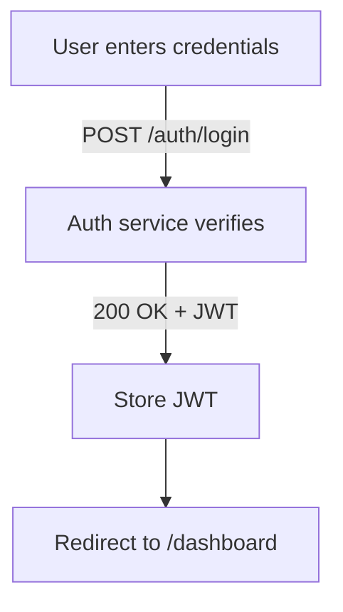
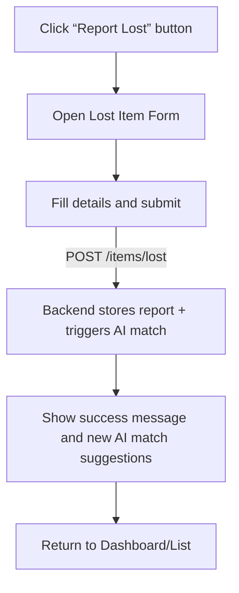
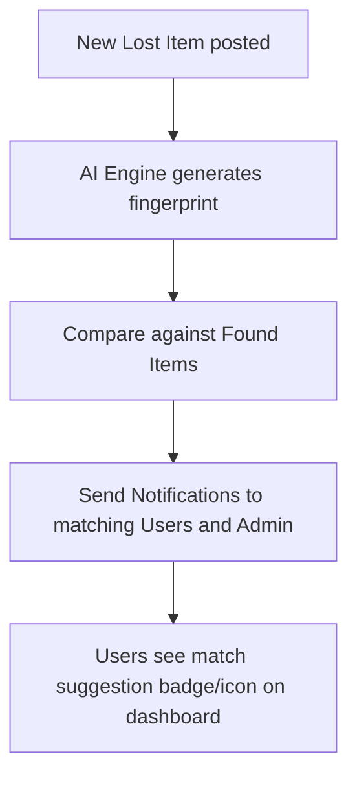

# Frontend Development Flow (Mobile-First Lost & Found App)

## Executive Summary

This document defines the **frontend architecture and implementation plan** for the AI-assisted Campus Lost & Found system, focusing on a **mobile-first** experience (390px), with fully responsive tablet (768px) and desktop (1440px) views. It inventories all screens and UI components; specifies navigation flows, routes, and layouts; and details screen-by-screen behaviors. Global UI elements (buttons, cards, forms, etc.) are defined with their props and Tailwind CSS mappings. State management (Redux Toolkit), form validation (React Hook Form + Zod), offline handling (PWA service worker), performance optimizations (lazy loading, code splitting), SEO considerations (mobile-first indexing), and testing strategies (unit, integration, E2E) are covered. Mermaid diagrams illustrate the high-level navigation and key user flows (login, report lost, AI matching notifications, claim pickup). This report is written for developers and QA to implement the app as specified in the SRS/TDD while meeting modern UX and coding standards.

## 1. Screen & Component Inventory

**Screens/Pages:** Based on the SRS and application flow, the app includes the following primary screens (mobile-first layouts; tablet/desktop add columns or sidebars):

- **Authentication:** Login, Registration, Email Verification / OTP, Forgot Password.
- **Student Dashboard:** Shows summary of user’s reports, matches, community posts, notifications.
- **Lost Item Report:** Multi-step form to enter lost item details (title, category, description, images, serial, location, date, special marks).
- **Found Item Report:** Similar form for found items (description, images, location, date, etc.). 
- **Item Detail:** Detailed view of a lost or found item, with image gallery, description, status, and actions (e.g. “Claim” on found items).
- **Claim Workflow:** For found items, a multi-step claim process: answer identification questions, upload proofs, track claim status, show QR pickup code when approved.
- **Search/Filters:** Full-text and attribute search across lost/found items with filter options (category, date, location, etc.).
- **AI Match Results:** Inline match suggestions on report submission, and an “AI Matches” panel on dashboard (showing potential matches).
- **Community Board:** Feed of recently reported found items (24-hour board), with ability to comment or suggest.
- **Profile:** User profile page showing user info, reports count, reputation/XP, badges earned, settings.
- **Leaderboard:** Rankings of top contributors (by returns, reports, reputation).
- **Notifications:** In-app notification list (real-time alerts for new matches, claim updates, admin messages).
- **Settings:** App settings (account, preferences, privacy).
- **Admin Portal (protected):** 
  - **Admin Dashboard:** Summary of reports/claims/charts.
  - **Report Management:** Lists of lost/found reports to review or archive.
  - **Claim Management:** Claim requests to verify (approve/reject).
  - **User Management:** View/edit users, adjust badges/roles.
  - **System Analytics:** Charts and logs (e.g. items recovered, average match times).
- **Miscellaneous:** 404/Error pages, modals/dialogs (confirmation, alerts).

The table below inventories **key reusable components** (the UI library), with variants and Tailwind token mappings:

| Component               | Variants / Props                         | Key Use               | Tailwind Classes (tokens)              |
|-------------------------|------------------------------------------|-----------------------|---------------------------------------|
| **Button**              | Primary (filled), Secondary (outline), Ghost (link-style), Icon-only, FAB  | All primary actions  | `bg-indigo-500/hover:bg-indigo-600 text-white px-4 py-2 rounded-full` (primary) |
| **Input Field**         | Text, Textarea, Select, Date, File Upload | Forms (login, reports, etc.) | `border-gray-200 rounded-lg p-3 w-full` |
| **Card**                | List Item Card, Match Card, Achievement Card | Item lists, matches, badges | `bg-white rounded-2xl shadow-lg p-4` |
| **Navbar**              | TopNav (desktop), BottomNav (mobile)     | Site navigation       | `bg-white shadow z-10 fixed` / `bg-white fixed bottom-0` |
| **Sidebar**             | Collapsible (desktop)                    | Admin navigation (desktop) | `bg-gray-50 w-64 min-h-screen`         |
| **Modal/Dialog**        | Confirmation, Form, Info                 | Overlays (verify, alerts) | `bg-white rounded-2xl shadow-xl p-6`  |
| **Toast Notification**  | Success, Error, Info                     | Transient messages    | `fixed top-4 right-4 bg-gray-800 text-white p-3 rounded-md` |
| **Tabs/Pills**          | Category tabs, Switches                 | Filter UI, Profile    | `flex border-b bg-white`             |
| **Pagination/Stepper**  | Stepper (multi-step forms)               | Report & Claim flows  | `flex space-x-2 items-center`         |
| **Data Table**          | Sortable table                          | Admin tables         | `min-w-full divide-y divide-gray-200`  |
| **Avatar/Badge**        | User avatars, Status badge              | User profile, status  | `inline-block p-1 bg-green-100 rounded-full` (status) |
| **Iconography**         | Phosphor Icons (outlined)                | UI icons             | `text-indigo-500` (example color)     |
| **Illustrations**       | Empty state graphics (Storyset/unDraw)   | Empty/error states    | (vector PNG/SVG)                      |

*Figure: Example low-fidelity mobile wireframe sketch. These wireframes guide the mobile-first layout for forms and lists.* 

The component variants use **Tailwind CSS** utility classes mapped to our design tokens (see section on Token Mapping). For example, primary buttons use `bg-indigo-500` (#5B5FEF) and `rounded-full` (16px radius) to align with the design. Touch targets follow minimum size (≥44px).

## 2. Navigation & Routing

The app uses React Router (browser history) to handle client-side navigation. All routes are under the single-page `App` container. The routing is defined in a table (example **table of routes**):

| Route Path                  | Component/Page              | Auth Required | Roles         | Notes                                 |
|-----------------------------|-----------------------------|---------------|---------------|---------------------------------------|
| `/login`                    | Login                       | No            | Guest         | Redirects to `/` if already logged in |
| `/register`                 | Register                    | No            | Guest         | —                                     |
| `/admin/login`              | AdminLogin                  | No            | Guest         | Separate admin entry point            |
| `/`                         | Dashboard                   | Yes           | Student       | Main user home (index route)          |
| `/profile`                  | Profile                     | Yes           | Student       | Profile & badges                      |
| `/report`                   | ReportSelection             | Yes           | Student       | Choose lost or found                  |
| `/report/found`             | ReportFound                 | Yes           | Student       | Multi-step found item form            |
| `/report/lost`              | ReportLost                  | Yes           | Student       | Multi-step lost item form             |
| `/item/:itemId`             | ItemDetail                  | Yes           | Student       | Item detail view                      |
| `/claim/:itemId`            | ClaimOwnership              | Yes           | Student       | Claim ownership workflow              |
| `/claim`                    | ClaimOwnership              | Yes           | Student       | Claim without itemId param            |
| `/community`                | CommunityBoard              | Yes           | Student       | 24-hour community board               |
| `/matches`                  | AIMatches                   | Yes           | Student       | AI match suggestions                  |
| `/leaderboard`              | Leaderboard                 | Yes           | Student       | Reputation rankings                   |
| `/suggest/:itemId`          | SuggestOwner                | Yes           | Student       | Suggest item owner                    |
| `/settings`                 | Settings                    | Yes           | Student       | Account & app settings                |
| `/help`                     | HelpSupport                 | Yes           | Student       | Help & support                        |
| `/chat/finder/:itemId`      | FinderChat                  | Yes           | Student       | Secure chat with finder               |
| `/handover/qr/:itemId`      | QRHandover                  | Yes           | Student       | Generate QR code for pickup           |
| `/handover/scan/:itemId`    | QRScan                      | Yes           | Student       | Scan QR at L&F office                 |
| `/admin`                    | AdminDashboard              | Yes           | Admin         | Admin overview                        |
| `/admin/claims`             | AdminClaimManagement        | Yes           | Admin         | Claim review/approve/reject           |
| `/admin/items`              | AdminItemModeration         | Yes           | Admin         | Item report moderation                |
| `/admin/users`              | AdminUserManagement         | Yes           | Admin         | User management & banning             |
| `/admin/community`          | AdminCommModeration         | Yes           | Admin         | Community post moderation             |
| `*` (fallback)              | Coming Soon                 | -             | All           | 404 fallback                          |

Each route corresponds to a React component (page) that fetches the necessary data via API when mounted (Redux thunks or RTK Query). Protected routes (dashboard and all `/report/*`, `/claim/*`, etc.) require a valid JWT stored in app state/localStorage; otherwise redirect to `/login`. Role-based checks prevent students from accessing `/admin` routes.

 

```mermaid
flowchart LR
  subgraph Guest
    Login[Login Page] -->|success| Dashboard
    Register --> VerifyEmail
    ForgotPass[Forgot Password]
  end
  subgraph Student
    Dashboard --> LostReport[Report Lost]
    Dashboard --> FoundReport[Report Found]
    Dashboard --> Community[Community Board]
    Dashboard --> SearchPage
    Dashboard --> Profile
    Dashboard --> Notifications
    LostReport --> LostSuccess[Success Toast]
    FoundReport --> FoundSuccess[Success Toast]
    Community --> [Comment/Like Actions]
    ItemDetail --> ClaimProcess[Claim Steps]
    ClaimProcess --> ClaimQR[Show QR Code]
  end
  subgraph Admin
    AdminLogin[Admin Login] --> AdminDashboard
    AdminDashboard --> AdminUsers
    AdminDashboard --> AdminLostReports
    AdminDashboard --> AdminFoundReports
    AdminDashboard --> AdminClaims
    AdminDashboard --> AdminAnalytics
  end
```

The **navigation map** above shows user flows at a high level. Key routing flows (mermaid sequence diagrams) include:







```mermaid
flowchart TD
  A[User starts Claim on Found Item] --> B[Answer identity questions, upload proof]
  B --> C|POST /claims| D[Claim enters “pending” queue]
  D --> E[Admin reviews claim -> approve]
  E --> F[System generates unique QR code]
  F --> G[User receives QR via email]
  G --> H[User scans QR at Helpdesk → Mark item Returned]
```

### Accessibility & UX Notes
- Use **semantic HTML**: forms use `<label>` for fields, buttons with meaningful text/icons.  
- Include `alt` text on images (e.g. item photos: alt="Photo of {item title}").  
- Ensure color contrasts ≥4.5:1 for normal text (WCAG AA). Important status colors (✅ found, ⚠ pending, 🟢 success) combine color + icon to avoid color-only cues.  
- All interactive elements are keyboard-focusable with visible focus outlines. For example, the “hamburger” and “back” buttons use `<button>` elements with `aria-label`.  
- Touch targets ≥44×44px: all form inputs, buttons, and navigation icons use generous padding (Tailwind `p-2` or `p-3`) to meet this.  
- Respect `prefers-reduced-motion`: disable or simplify animations for those who set this (e.g. conditional CSS animation vs transition).

## 3. Responsive Layout and Design Tokens

The app uses a **mobile-first responsive design**. A 12-column fluid grid (Flexbox/CSS Grid) is used across breakpoints. Key breakpoints (based on content needs, not specific devices) are:

- **Mobile (base):** up to 767px (design at 390px target). Single-column layout with bottom navigation.  
- **Tablet:** 768px–1023px (design at 768px). Two-column or navigation rail. Hamburger menu expands into drawer.  
- **Desktop:** 1024px and above (design at 1440px). Sidebar navigation, multi-column dashboards, full-width tables. 

The grid uses `gap-4` (1rem = 16px) spacing by default, with column gutters of 1rem. The **spacing scale** (8pt grid) maps to Tailwind classes:

| Pixel (dp) | Tailwind (`rem`) | Utility class | Token name    |
|------------|------------------|---------------|---------------|
| 4px (0.25rem)   | `0.25rem`   | `p-1`, `m-1`   | X-Small (Spacing-1) |
| 8px (0.5rem)    | `0.5rem`    | `p-2`, `m-2`   | Small (Spacing-2)   |
| 16px (1rem)     | `1rem`      | `p-4`, `m-4`   | Medium (Spacing-4)  |
| 24px (1.5rem)   | `1.5rem`    | `p-6`, `m-6`   | Large (Spacing-6)   |
| 32px (2rem)     | `2rem`      | `p-8`, `m-8`   | X-Large (Spacing-8) |
| 40px (2.5rem)   | `2.5rem`    | `p-10`, `m-10` | 2X-Large (Spacing-10) |
| 48px (3rem)     | `3rem`      | `p-12`, `m-12` | 3X-Large (Spacing-12) |
| 64px (4rem)     | `4rem`      | `p-16`, `m-16` | 4X-Large (Spacing-16) |
| 80px (5rem)     | `5rem`      | `p-20`, `m-20` | 5X-Large (Spacing-20) |

Components use responsive variants (`sm:`, `md:`, `lg:` prefixes in Tailwind) to adjust layout and sizing at 640px, 768px, and 1024px breakpoints respectively (these can be customized to 768px/1024px/1280px in Tailwind config). For example, a card might be `w-full md:w-1/2 lg:w-1/3` to span one column on mobile, two on tablet, three on desktop.

**Color Palette & Tailwind Mapping:** The design’s semantic colors map to Tailwind classes as follows:

| Semantic Color | Hex Code | Tailwind Class (example) | Usage                       |
|----------------|----------|--------------------------|-----------------------------|
| Primary (Indigo)   | #5B5FEF | `indigo-500` (#6366F1)       | CTA buttons, links          |
| Secondary (Purple) | #8B5CF6 | `purple-500` (#A855F7)       | Highlights, secondary buttons |
| Accent (Yellow)    | #FBBF24 | `yellow-400` (#FACC15)       | Badges, XP, rewards         |
| Success (Green)    | #22C55E | `green-500` (#22C55E)        | Success states, “found”     |
| Warning (Orange)   | #FB923C | `orange-400` (#FB923C)       | Pending states              |
| Danger (Rose)      | #F43F5E | `red-400` (#F87171)          | Errors, delete actions      |
| Info (Sky)         | #38BDF8 | `sky-400` (#60A5FA)          | AI suggestions, info alerts |
| Background         | #F8FAFC | `gray-50`                    | App background              |
| Card background    | #FFFFFF | `white`                      | Cards/containers            |
| Border             | #E5E7EB | `gray-200`                   | Dividers, input borders     |
| Text Primary       | #111827 | `gray-900`                   | Main body text              |
| Text Secondary     | #6B7280 | `gray-500`                   | Secondary text              |
| Disabled           | #CBD5E1 | `gray-300`                   | Disabled text/controls      |

Gradient backgrounds combine semantic colors (e.g. primary gradient from Indigo to Purple, success from Green to Teal, reward from Yellow to Amber) for headers and buttons, per UI design. (Use Tailwind’s gradient utilities or custom gradients in CSS.)

**Typography:** We use **Plus Jakarta Sans** (or similar sans-serif). Font sizes are defined with rem units, e.g. 16px base (1rem). Headings and text sizes use Tailwind’s text classes (`text-2xl`, `text-lg`, etc.) corresponding to the UI scale. 

**Example Responsive Layouts:** Each screen has distinct layout patterns at breakpoints. For instance, the **Dashboard**:
- Mobile: single column; summary cards stack; bottom navigation bar fixed; floating FAB for quick actions (e.g. “+ Report”).  
- Tablet: two-column (e.g. summary charts on left, activity feed on right); side hamburger menu (collapsible).  
- Desktop: three-column grid (sidebar + main + extra info); sidebar expanded with icons+labels (Admin view uses sidebar).

**Touch & Interaction:** Buttons and list items use `cursor-pointer` and subtle hover/focus highlights. Animations are smooth (150–300ms range) per UX guidelines. For example, buttons may slightly scale on hover (transform 1.03) and modals fade in/out (~200ms ease-out). Notifications slide from top (toast), cards have hover lift, and input fields highlight on focus.

## 4. Screen-by-Screen Specifications

Below are detailed specs for key screens. Each screen is mobile-first (390px), with notes on tablet and desktop variants.

### 4.1 Login / Registration Screens

**Purpose & Entry:** Allows user to authenticate. Accessed via `/login` or `/register`. Unauthenticated users see these by default; authenticated users are redirected to dashboard.

**User Goal:** Enter credentials to sign in, or create account. Registration collects name, email, password, student ID; then shows email OTP verification (the “Verify Email” step).

**Mobile Layout (390px):** Single-column form with large inputs and buttons. Logo/icon at top. Below, “Email or student ID” field, “Password” field, and “Login” button (primary color). Links for “Forgot Password?” and “Register” at bottom. Social login icons (if any) can be below main button. Validation errors are inline (red text under field). 

**Tablet/Desktop Layout:** Form centered in page with side-by-side image or illustration (left panel) and form card (right). Fields and button on card. Navigation bar visible on desktop (light) but login/register uses minimal header. “Register” page similarly shows “Confirm Password” field.

**Components:** `<Form>`, `<TextField>` with type=email/password, `<Button>`, `<Link>` (for navigation), `<Alert>` for error. 

**API Calls:** 
- `POST /api/auth/login` with `{email, password}`; response `{ token }`. On success, store JWT and user profile, redirect to `/dashboard`. On 401, show error toast. 
- `POST /api/auth/register` with `{name, email, studentId, password}`; on success show “Verify Email” prompt and redirect to `/verify-email`.
- `POST /api/auth/verify` or similar with OTP code (entered by user or via email link).

**Loading State:** While awaiting response, disable button and show spinner inside button or a full-screen semi-transparent loader (100% animated CSS or spinner component).  

**Error State:** Show inline field errors (e.g. “Invalid email”) or banner above form (“Login failed: ...”). Clear errors on input change.

**Accessibility:** Each input has `aria-label` or associated `<label>`. “Show password” toggle icon inside input. Keyboard “Enter” submits form.

### 4.2 Dashboard (Student)

**Purpose:** The home screen after login. Summarizes the user’s activity and updates.

**User Goal:** View at-a-glance information, access key functions (report item, view matches, see community posts, etc.).

**Mobile Layout:** Single scroll column. Sections stacked: 
1. **Greeting/Header** (“Welcome, Alice 👋” with XP bar beneath). 
2. **Badges/Level** preview. 
3. **Quick Actions:** Horizontal card list for “Report Lost”, “Report Found” (with icons).
4. **AI Matches:** If any new matches, show a card list of suggestions (“Possible match: iPhone found in Library”).
5. **My Reports:** List of user’s recent lost/found reports (short cards with item title, date, status).
6. **Community Board Preview:** Show 1-2 found items from board with “View All” link.
7. **Navigation Bar** fixed bottom (Home, Community, Search, Profile, Notifications).

**Tablet Layout:** Two columns: left column (larger) with “AI Matches” and “My Reports” stacked; right column with badges/XP and “Quick Actions”. Top has horizontal welcome and XP bar spanning both. Bottom nav becomes top nav or hidden (using hamburger menu if top bar exists).

**Desktop Layout:** Three columns: left sidebar (navigation, profile pic), main content (cards and feed), right sidebar (XP/badges, leaderboards snippet). Content area can have grid of cards (e.g. 2×2 quick actions, charts).

**Components:** `<Card>`, `<Button>`, `<Avatar>`, `<ProgressBar>` (for XP), `<Badge>`, `<BottomNav>`, `<TopNav>`. The bottom nav icons are large enough for thumbs (≥48px).

**API Calls:** On mount, dispatch actions to load: user profile (badges, XP), list of user's reports (`GET /api/users/{id}/reports`), new AI match notifications (`GET /api/ai/matches`), and feed for community board (`GET /api/community`). Use Redux to manage loading states.

**Loading State:** Show skeletons for cards (gray blocks) or spinners in each section placeholder while data loads.

**Empty State:** If no reports, show a friendly message (“You haven’t posted any items yet.”) with CTA button “Report Lost Item”. (Use illustrative icon.) *Figure: Example desktop wireframe. In an admin dashboard wireframe (mail client), basic card and panel structure is sketched – similar structure is used for the student dashboard.* 

**Animations:** Small fade-in on cards; counters incrementing in XP bar (count-up). On clicking “Report Lost”, navigate with a smooth transition.

**Edge Cases:** 
- If offline, display cached dashboard data if available, else show offline message. 
- If token expired (401 API), redirect to login.

### 4.3 Lost Item Report

**Purpose:** Allows user to file a lost item.

**User Goal:** Submit details about the lost item to get it logged and to find matches.

**Mobile Layout:** A multi-step form (progress bar at top or stepper dots). Steps might include: 
1. **Item Details:** Title, category (dropdown with icons), brand, color, serial number. 
2. **Description:** Text field, upload images (max 5); cropping preview. 
3. **Location & Time:** Map picker or text location, date picker.
4. **Special Attributes:** Checkbox “Had personal info (e.g. tag)?” and additional description if yes.
5. **Review:** Summary of all info, then “Submit” button.

Each step shows only one section. Navigation “Next” and “Back”. Buttons at bottom span width. Use breadcrumb or dots to indicate progress.

**Tablet/Desktop Layout:** Could show steps as a side progress bar (vertical stepper). Or show a two-column form (labels left, fields right). Desktop can display multiple fields per row (e.g. brand and color side by side). The image upload can show larger previews.

**Components:** `<FormStep>`, `<TextInput>`, `<Select>`, `<DatePicker>`, `<FileUpload>`, `<Button>`. Image upload uses Cloudinary integration (preview thumbnails, remove icon).

**API Calls:** On final “Submit”, `POST /api/items/lost` with form data (JSON plus uploaded image URLs). Use `multipart/form-data` if uploading directly to Cloudinary, or first upload to Cloudinary then include URLs.

**Loading State:** On submit, disable form and show full-screen spinner overlay (e.g. spinner on semi-transparent backdrop).

**Success State:** Show toast “Lost item reported successfully!” (🎉 in friendly tone) and redirect to Dashboard.

**Validation:** 
- All required fields (title, category, at least 1 image) must be filled. Use client-side form validation (React Hook Form + Zod schema). 
- Serial number should match alphanumeric pattern. 
- Limit image file size (<5MB, png/jpg).

**Accessibility:** Each step has aria labels. The “Next” button is disabled if current step has errors (visually greyed, cursor not-allowed).

**Edge Cases:** 
- If image upload fails, show inline error (“Upload failed, try again.”) and allow retry. 
- If network error on submit, display error toast with advice. 
- If user navigates away mid-form, warn “Discard unsaved report?”.

### 4.4 Found Item Report

(Similar flow to Lost Item Report, with slight wording change “Found” vs “Lost”.)
**Key Differences:** 
- The report form includes a field “Where was it found?” instead of “Where was it lost?”. 
- After submit, admin may add an internal status or countdown (auto-archive after 30 days if unclaimed).
- On success, show “Found item logged” and maybe a quick link “View Board”.

### 4.5 Item Detail & Claim

**Purpose:** View details of a specific item and (if found) start claim.

**User Goal:** Student can inspect an item, mark it as theirs (if found) or contact holder (if lost). Admin can review item for moderation.

**Mobile Layout:** 
- **Lost Item Detail:** Show images carousel at top, with title and “Wanted” status. Below: category, brand, description, last known location/time, reporter contact (masked until claim approved), user’s claim button (e.g. “I have a question”). 
- **Found Item Detail:** Show “Found at [location] on [date]”. Highlight “Claim this item” button (primary color). Also list any matches (to lost item).
- **Claim Process:** Multi-step: question prompts (e.g. “What color is the earbud case?”), upload photo (e.g. student ID), review then submit. After user submits claim, show “Pending Approval” with countdown.

**Desktop Layout:** The detail page can show information in side-by-side panels (image gallery left, details right). Claim form might be a centered modal or on same page below details. Admin view adds a “Moderation” panel for approving (with block/spam buttons).

**API Calls:** 
- `GET /api/items/:itemId` fetch item details. 
- `POST /api/claims` to submit a claim on a found item (with answers and attachments). 
- `GET /api/claims/:claimId/status` to poll status (or use WebSocket/push).

**States:** 
- **Pending:** After submission, show spinners/checkmarks as answers are verified. 
- **Approved:** Show QR code (image) with instructions to pick up. 
- **Rejected:** Show friendly rejection message and “Contact Admin” link.

**Animations:** After claim approval, QR code can animate in (flip effect). 

**Accessibility:** QR code image has alt text “Your pickup QR code for [Item title]”.

### 4.6 Community Board

**Purpose:** Dynamic feed of new found items (24-hour window) for community engagement.

**User Goal:** Quickly scan recent found items; comment or “mark” if user recognizes an item (an idea for lost owner).

**Mobile Layout:** Scrollable list of cards (thumbnail + title + location). Each card shows “React” button (for suggestions) and a short description. At top, a search/filter bar. Has “Refresh” button. 

**Tablet/Desktop Layout:** Two-column grid of items. Sidebar can show filtering tags (locations, categories). 

**API Calls:** `GET /api/community?since=24h` to load board items; `POST /api/community/:itemId/suggest` when a user suggests a match (collects quick message).

**Edge Cases:** If no new found items, show an illustration with “No new found items in the last 24 hours – check back later!” and a “Report Lost” button.

### 4.7 Profile and Leaderboard

**Profile:** Displays user’s details, XP progress, badges (with unlocking animation), and recent contributions. Editable fields (name) with inline editing. Lists user’s open/closed claims and items.

**Leaderboard:** Shows top N students by XP or returns. Data table or card list with avatar, name, score.

### 4.8 Settings & Preferences

Simple page for changing password, notification preferences (toggle email/SMS), and dark mode switch. Forms with toggles.

## 5. Global Components Library

A detailed component library ensures consistency. All major components should accept props for title, icon, color variant, disabled state, etc. They must be responsive (e.g. a card’s padding shrinks on small screens). For example:

- **Card(props):** `variant="info"|"warning"|"success"|"default"`, `size="sm"|"md"|"lg"`. Renders a `div` with `bg-white rounded-2xl shadow-lg`. On `md:` screens, can change flex-direction to horizontal if `variant="horizontal"`.
- **Button(props):** `type="submit"|"button"`, `color="primary"|"secondary"|"danger"|"ghost"`, `size="sm"|"md"`. Maps to `className` like `bg-indigo-500 text-white` or `border-indigo-500 text-indigo-500` for outline.
- **FormInput(props):** Common input wrapper with label, error text. Accepts `name`, `placeholder`, `type`, and error messages. Uses `focus:ring-indigo-300`.
- **Modal(props):** Title, content, actions. Always centered with backdrop. Has `isOpen` control.
- **Toast(props):** Message and type. Appears for 3s then fades.

We use **Tailwind Utility classes** wherever possible. The design tokens map to Tailwind in code:

| Design Token        | Value             | Example Tailwind Token   |
|---------------------|-------------------|--------------------------|
| Primary Color       | #5B5FEF          | `text-indigo-500`         |
| Secondary Color     | #8B5CF6          | `bg-purple-500`           |
| Border Radius Large | 24px             | `rounded-2xl`             |
| Border Radius Small | 16px             | `rounded-xl` (custom if needed) |
| Box Shadow (card)   | `0 8px 30px rgba(0,0,0,0.08)` | `shadow-lg`        |
| Box Shadow (hover)  | `0 12px 40px rgba(0,0,0,0.12)`| `hover:shadow-xl`   |
| Box Shadow (btn)    | `0 4px 14px rgba(91,95,239,0.25)` | custom like `shadow-[0_4px_14px_rgba(91,95,239,0.25)]` |

Developers should map these to Tailwind classes or custom CSS variables as needed. For example, `px-6 py-3 rounded-full bg-indigo-500 hover:bg-indigo-600 text-white` for primary buttons.

## 6. State Management Plan

We use **Redux Toolkit (RTK)** for global state. Key slices include:
- `authSlice`: stores user credentials, JWT token, loading/error. Actions for login/logout.
- `userSlice`: stores profile, badges, reputation, loading/error.
- `reportsSlice`: for lists of lost and found items (entities), with loading state. We can use `createEntityAdapter` for normalized data.
- `matchSlice`: for AI matches (list of suggestions per report).
- `claimSlice`: user’s claim state (list of user's claims + current claim progress).
- `communitySlice`: for community board items.
- `notificationSlice`: list of notifications (in-app and unread count).
- `adminSlice`: for admin data (users, reports, claims).
- Optionally `uiSlice`: for non-persistent UI state (modals open, toasts).
  
For async calls, use **`createAsyncThunk`** (Redux Toolkit) or RTK Query. Thunks follow the pattern of dispatching loading/success/error actions. Example: 
```js
export const fetchLostItems = createAsyncThunk(
  'reports/fetchLost',
  async (_, thunkAPI) => {
    const resp = await api.get('/items/lost');
    return resp.data;
  }
);
```
This automatically generates pending/fulfilled/rejected action types. The slice reducers set `state.loading = 'pending'` on fetch start and `state.entities = payload` on success. This follows the recommended pattern.

**Data Caching:** RTK Query could be used to auto-cache server data (e.g. `useGetLostItemsQuery`). Alternatively, for manual thunks, we can check `state.loading` to avoid duplicate fetches (skip if `loading === 'pending'`). Use selectors to read data (`selectAll` from adapter).

**Optimistic Updates:** When the student creates or updates data (e.g. posting a report or marking a notification as read), we can optimistically update the UI. For instance, on creating a new lost report we immediately add it to `reportsSlice` list before server confirms, rolling back if error.

## 7. Form Validation & UX

All forms use client-side validation (plus server errors). We recommend **React Hook Form** with a **Zod schema** (or Yup) resolver. Example (Register form):
```js
const schema = z.object({
  name: z.string().min(1, "Required"),
  email: z.string().email("Invalid email"),
  password: z.string().min(8),
  confirmPassword: z.string().min(8)
}).refine(data => data.password === data.confirmPassword, {
  message: "Passwords must match",
  path: ["confirmPassword"]
});
```
On submit, call `handleSubmit(formData => dispatch(register(formData)))`.  
Inline error messages appear under each field on blur or submission (e.g. “Email is required”). Buttons show validation state (disabled + red border).

**UX Tips:** Use friendly wording (“Please enter a valid email”, “Must be at least 8 characters”). On success or error, use toast notifications with playful copy (per design: e.g. “🎉 You’re in!” instead of “Success”).  

## 8. Offline & Network Error Handling

The app should behave gracefully offline:

- **Service Worker (PWA):** Register a service worker (with Workbox or manual) to cache critical assets (HTML, JS bundle, icons) and recent data (e.g. dashboard). On offline, show a banner “You’re offline” (with Cordova-style bar). Attempt to read from cache.
- **Data Persistence:** Key data (user profile, last seen items) can be stored in IndexedDB or localStorage. Use `redux-persist` on slices like `auth` and `user`.
- **API Requests:** Show user-friendly errors on fetch failure (“Network error: check your connection and try again”). Allow retry by pulling down to refresh or a “Retry” button. Use exponential backoff for transient failures.
- **Offline Feature:** Lost reports can be saved locally (maybe in IndexedDB) if submitted offline, then synced when back online, with user notification.

## 9. Performance & SEO

We follow **Web Performance** best practices:

- **Code Splitting:** Use dynamic `import()` for routes (React.lazy+Suspense) so that each page bundle loads only when needed. For example, the admin bundle should not load for students.
- **Image Optimization:** Use Cloudinary with proper transformations. Always include `width`/`height` and `loading="lazy"` on `` for feed images. Serve images in WebP if possible.
- **CDN Hosting:** Deploy static assets (JS/CSS) to a CDN (Vercel/Render auto-cdn). Use Cloudinary as an image CDN. Ensure HTTP/2 for fast parallel loading.
- **Lazy Loading:** Non-critical images and heavy components (e.g. charts, maps) are lazy-loaded.
- **Minimize Bundle Size:** Remove unused libraries, use PurgeCSS (built into Tailwind) to strip unused styles. Compress assets (brotli/gzip).
- **Core Web Vitals:** Aim for FCP < 1s, FID < 100ms, CLS < 0.1. Preload critical fonts; avoid layout shifts by reserving image space.
- **SEO:** Use **server-side rendering (SSR) or prerendering** for public pages if any. Since it’s mainly a web app, focus on client performance. The site is a single-page app but following Google’s mobile-first indexing guide, we use a **single responsive URL** for each page, so Google sees the same content as mobile users.

## 10. Testing & QA

A thorough testing strategy:

- **Unit Tests:** Jest + React Testing Library for React components. Test form validation logic, Redux slice reducers, and utility functions. Mock API calls (msw or jest mocks).
- **Integration Tests:** Test critical flows in isolation (e.g. submitting a report and seeing expected calls). 
- **End-to-End (E2E):** Use Cypress or Playwright to simulate user scenarios: login, creating reports, receiving AI match, claiming item, admin approving. Verify UI reactions and API interactions.
- **Accessibility (a11y):** Run automated audits (axe-core) to catch issues. Manual keyboard-navigation testing. Ensure color contrast meets WCAG2.1 (we aim for 4.5:1).
- **Performance Testing:** Lighthouse audits on mobile simulation to check FCP, LCP, etc. Optimize until “Good” scores.
- **QA Acceptance Criteria:** For each feature, define criteria. E.g. “Lost report form: all fields validate, uploading max 5 images works, and a new item appears in My Reports on success.”
- **Regression:** Run tests on every commit (CI). Maintain test coverage above 80%.

## 11. Developer Handoff & Folder Structure

Design tokens (colors, spacing, typography) are documented above. In code, map them via Tailwind config or CSS variables. A dedicated **design token file** (SCSS/CSS or JSON) can be used if needed for non-Tailwind values.

**Folder Structure (Frontend)** – Example with React, TypeScript:

```
src/
 ├── components/      # Reusable UI components (Button.tsx, Card.tsx, etc.)
 ├── pages/           # Page-level components (Dashboard.tsx, Login.tsx, etc.)
 ├── features/        # Redux slices and related UI (e.g. auth/, reports/, claims/)
 │     ├── auth/
 │     │    ├── authSlice.ts
 │     │    ├── LoginPage.tsx
 │     │    └── RegisterPage.tsx
 │     ├── reports/
 │     │    ├── reportsSlice.ts
 │     │    ├── LostReportForm.tsx
 │     │    └── ...
 ├── routes/          # React Router setup (AppRouter.tsx)
 ├── api/             # API utility functions or RTK Query endpoints
 ├── hooks/           # Custom hooks (e.g. useAuth, useMediaQuery)
 ├── assets/          # Images, icons, fonts
 ├── utils/           # Helpers (date formatters, validators)
 ├── store.ts         # Redux store configuration
 ├── App.tsx
 └── index.tsx
```

**Dependencies:** React, React Router, Redux Toolkit, React Query (if using RTK Query), Axios/fetch, React Hook Form, Zod, Tailwind CSS, shadcn/ui (for UI primitives), Phosphor Icons, Sonner (for toasts), Axios.

## 12. Implementation Timeline

A recommended implementation backlog (high to low priority):

1. **Setup:** Project scaffolding (React + TypeScript, Tailwind CSS, Redux store, routing). SSR strategy if needed (e.g. Next.js or prerender).
2. **Authentication:** Login/Registration flows (JWT handling).  
3. **Core Data Models:** LostItem & FoundItem forms and API integration.  
4. **Dashboard & Listing:** User dashboard, listing of reports.  
5. **AI Engine Integration:** Fingerprint generation and match APIs (backend) + UI to display suggestions.  
6. **Claim Workflow:** Steps to submit claim and admin review flow (including QR code gen).  
7. **Community Board:** Posting and viewing found items, comment/suggestion feature.  
8. **Notifications:** Real-time (WebSocket/SSE) or polling for matches/claims.  
9. **Profile & Gamification:** Badges, XP, leaderboard integration.  
10. **Admin Features:** Admin UI for managing users, reports, analytics.  
11. **Performance & PWA:** Add service worker for offline, improve load speed (bundle splitting, lazy load).  
12. **Testing & QA:** Write unit/integration tests; fix issues. Accessibility checks.  
13. **Polish:** Dark mode, animations, final design tweaks per UI guidelines.

Each item above corresponds to one or more sprints; core student flows (1–4) come first, then enrichment features (AI, gamification), with admin and PWA last. 

Finally, all API endpoints should be documented (e.g., using Swagger or a Markdown API reference) matching the routes above. The API endpoints table can be a separate doc, but examples include:

| Endpoint                 | Method | Request Body                     | Response                     | Auth  |
|--------------------------|--------|----------------------------------|------------------------------|-------|
| `/api/auth/login`        | POST   | `{ email, password }`           | `{ token, user }`            | No    |
| `/api/auth/register`     | POST   | `{ name, email, studentId, password }` | `{ success: true }`     | No    |
| `/api/items/lost`        | POST   | LostItemSchema + images          | `{ itemId, status }`         | Yes   |
| `/api/items/found`       | POST   | FoundItemSchema + images         | `{ itemId, status }`         | Yes   |
| `/api/items/:itemId`     | GET    |                                  | `{ item }`                   | Yes   |
| `/api/search?query=`     | GET    | (query params)                  | `{ results: [items] }`       | Yes   |
| `/api/claims`            | POST   | `{ itemId, answers, proofs }`    | `{ claimId, status }`        | Yes   |
| `/api/claims/:id`        | GET    |                                  | `{ claim }`                  | Yes   |
| `/api/notifications`     | GET    |                                  | `{ notifications: [] }`      | Yes   |
| `/api/ai/matches/:itemId`| GET    |                                  | `{ matches: [] }`            | Yes   |
| `/api/qrcode/:claimId`   | GET    |                                  | Binary (PNG of QR)           | Yes   |
| *etc.*                  |        |                                  |                              |       |

This frontend flow document, in conjunction with the SRS and TDD, fully specifies how to implement the user interface and client-side logic for the Campus Lost & Found system. 

