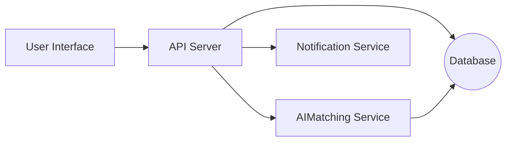

# Master Development Prompt Document

## Executive Summary  
This document serves as a **”development constitution”** for AI coding agents, outlining comprehensive guidelines and specifications for any software project. It covers scope, audience, architecture, coding practices, testing, security, data governance, deployment, collaboration, and maintenance. The goal is to ensure that every agent (e.g. Cursor, Trae, Claude Code, OpenAI Codex/ChatGPT, Gemini CLI, Devin, Windsurf, Cline, etc.) follows rigorous standards before generating code. Key highlights include defined roles, style guides, CI/CD pipelines, threat modeling with AI-specific risks, data lineage and bias mitigation, infrastructure-as-code best practices, prompt-engineering templates, and governance policies. Wherever possible, we cite industry standards (OWASP, NIST, ISO, cloud providers) to back recommendations. Example diagrams, tables, and checklists illustrate best practices.  

## Purpose and Scope  
This document defines **guidelines and requirements** that all AI-assisted development agents must adhere to across the project lifecycle. It applies to all code-producing roles (e.g. AI pair programmers, CI bots, code reviewers, test generators) and human collaborators. The scope includes: project inception (requirements, onboarding), design and architecture, coding (standards, languages), testing (unit/integration/E2E), security/privacy (threat models, secrets management), data/ML governance (data quality, bias), deployment (IaC, containers, orchestration), workflows (branching, PRs), prompt engineering, and operational policies (monitoring, incidents, documentation). The deliverables are an organized specification (30–50 pages) with appendices (templates, checklists). The repository should follow a clear file structure (e.g. `/docs`, `/src`, `/tests`, `/.github` for templates).  

**Table: Key Sections and Deliverables** (see Appendix A for sample layout):  
- **Executive Summary:** High-level overview.  
- **Purpose & Scope:** What this document covers.  
- **Audience & Agents:** Who must follow it (AI agent types, roles).  
- **Preconditions & Onboarding:** Required accounts, tools, environments, training checklists.  
- **Architecture & Modules:** System-level design with diagrams and module breakdown.  
- **Coding Standards:** Languages allowed (none specific unless stated), style guides, linters, formatting rules.  
- **Testing Strategy:** Unit/integration/E2E testing, CI/CD setup, coverage goals.  
- **Security & Privacy:** Threat modeling (including AI-specific threats), secrets management, SCA, compliance.  
- **Data & ML Governance:** Data lineage, labeling, bias mitigation, model evaluation/monitoring.  
- **Deployment & Infrastructure:** IaC (Terraform/CloudFormation etc.), containers, orchestration (e.g. Kubernetes), rollback, observability.  
- **Collaboration Workflows:** Branching strategy (trunk-based preferred), PR templates, code review checklist, issue templates.  
- **Prompt Engineering:** Prompt templates and role-specific instructions for AI agents.  
- **Agent Constraints & Guardrails:** Rate limits, resource quotas, sandboxing (e.g. container execution), human-in-loop triggers.  
- **Documentation & Versioning:** Changelogs, semantic versioning, licensing, legal/compliance notes.  
- **Onboarding & Training Materials:** Checklists for new agents/engineers, training resources, example prompts.  
- **Metrics & SLAs:** KPIs (uptime, error rates, performance, coverage targets), SLAs, monitoring metrics.  
- **Maintenance & Incidents:** Incident response plan, postmortem process (blameless culture).  
- **Appendices:** Templates (PR, issue, commit messages), checklists, sample prompts.  

Each section below presents recommendations supported by best practices and authoritative sources.  

## Target Audience and Agent Types  
This guide is intended for **AI coding agents and AI-assisted tools** operating on the codebase, as well as engineers supervising them. Examples of agent/platform types include Cursor, Trae, Claude Code, OpenAI Codex/ChatGPT, Google Gemini (CLI), Microsoft Devin, Replit Cline/Windsurf, and any similar LLM-powered developer tools. It also applies to human roles interacting with these agents (DevOps, security, QA).  

**Key Agent Roles:**  
- **Code Author (AI Pair Programmer):** Writes new code or features.  
- **Code Reviewer (AI QA):** Reviews code for style, correctness, security.  
- **Test Generator (AI Tester):** Writes unit/integration tests.  
- **Documentation Writer:** Generates docs, comments, changelogs.  
- **Deploy/Infra Agent:** Creates deployment scripts, monitors pipelines.  

For each role, we may define prompt templates and constraints (see Prompt Templates). All agents share common guidance on standards and practices.  

## Preconditions and Onboarding  
Before any agent or human can begin development, the following must be in place:  
- **Accounts & Permissions:**  
  - Git repository access (e.g. GitHub/GitLab) with least-privilege tokens.  
  - Cloud provider/devops credentials (IAM roles) for deployment.  
  - Access to secret stores (Key Vault, Vault) through service principals.  
- **Environment Setup:**  
  - Standard development environment (languages SDKs, package managers). Docker/Kubernetes command-line tools if needed.  
  - Linters, code formatters (e.g. ESLint, Prettier, Flake8) pre-installed.  
  - CI/CD runner accounts configured.  
- **Training Material:**  
  - Project documentation (requirements, design docs, this master guide).  
  - Style guide references (e.g. PEP8 for Python, Google Java Style).  
  - Security training (OWASP Top 10, company policies).  
- **Checklists:**  
  - Onboarding checklist (account creation, environment config) as interactive TODOs.  
  - Example commit/PR templates loaded (see Appendix B).  
- **Infrastructure Readiness:**  
  - Provision basic CI infrastructure (e.g. a build/test runner, staging environment).  
  - Seed any external data or models to be used (with audit logs of provenance).  

Agents should not write any code until all preconditions are satisfied.  

## Architecture and Module Breakdown  

Design the system with clear separation of concerns. For web applications, a typical three-tier (client–server–database) architecture is common. Below is an **example architecture** of a MERN (React + Node/Express + MongoDB) stack, illustrating how front-end, back-end, and data layers interact:

 *Figure: Example MERN architecture – React front-end communicates via REST/JSON with a Node.js/Express API, which in turn reads/writes data from a MongoDB database. AI model services (e.g. for matching) are hosted in the backend layer. The architecture is containerized for deployment.* 

In this example:  
- **Front-End (Client):** A Single-Page Application (e.g. React/Vue) provides UI. It calls backend APIs for data.  
- **Back-End Services:** Node.js/Express (or similar) implements RESTful endpoints: user management, item reporting, matching logic, notifications, etc. It also integrates any AI model inference services.  
- **Database:** A persistent store (e.g. MongoDB Atlas) holds collections/tables such as `Users`, `LostItems`, `FoundItems`, `Matches`, `Claims`, `Notifications`, etc. Each major entity is a module/component.  

*Module Breakdown:* (example for a Lost & Found project)  
- **Auth Module:** Handles user signup/login (e.g. via OAuth/JWT). Enforces email verification.  
- **Item Reporting Module:** APIs for submitting lost/found item data (text/images).  
- **AI Matching Module:** Microservice that runs a text/image matching model. Inputs item descriptions/images, outputs candidate matches.  
- **Verification Module:** Manages the claim workflow (owner/finder communication, approval).  
- **Notification Module:** Sends emails/SMS/QR codes at various steps.  
- **Admin Module:** Dashboards for staff to monitor system (reports, analytics).  

Where possible, decompose into microservices or modules with well-defined interfaces. Each should be small enough to reason about and independently test.  

**Example Mermaid Workflow:**  

This shows the front-end calling the API server, which interacts with the DB and AI service; results flow back to client, and alerts go via Notification. (Agents can refine this architecture as needed.)  

## Coding Standards  
Ensure consistency and readability across all code. Adopt language-agnostic principles and specific style guides per language:  

- **Languages:** Unless specified, use any language best suited for the task (e.g. Python, JavaScript/TypeScript, Go, etc.). For each, follow a well-known style guide: Google Style (Java, C++), PEP8 (Python), Airbnb (JavaScript), etc.  
- **Naming & Format:** Consistent naming (camelCase, snake_case as per language norms); clear function/module naming. Indentation (2 or 4 spaces) and braces following community norms.  
- **Linters/Formatters:** Use automated tools (ESLint, pylint, rubocop, Prettier, `go fmt`, etc.) in CI. Code must **pass linting checks** before merge.  
- **Comments & Documentation:** Write clear docstrings or Javadoc/JSdoc for public interfaces. Include usage examples. No large commented blocks; use inline comments sparingly.  
- **Commit Messages:** Follow Conventional Commits or at least meaningful, present-tense descriptions of changes. Use `feat:`, `fix:`, `docs:`, etc., to make changelogs clear.  
- **Configuration & Secrets:** No credentials or secrets in code. Use environment variables or a secrets manager (see Security).  
- **Static Analysis:** Integrate static analysis tools (SonarQube, CodeQL, Semgrep) to catch bugs/security issues. For example, run SonarQube or eslint’s security rules in CI.  

Consistent style aids understanding: “It is much easier to understand a large codebase when all the code in it is in a consistent style”.  

## Testing Strategy  

Adopt a **layered testing approach**: unit tests, integration tests, and end-to-end (E2E) tests. Automate testing in the CI pipeline:  

- **Unit Tests:** Cover individual functions/methods. Aim for high coverage (generally ≥80% line coverage) but focus on critical logic. Use testing frameworks (e.g. PyTest, JUnit, Mocha) to assert correctness. Tests should run quickly (<1 minute).  
- **Integration Tests:** Test interactions between modules (e.g. API endpoints calling the database or AI service). Use test databases or mocks as needed. Ensure business logic workflows work end-to-end (e.g. lost-item report to match suggestion).  
- **End-to-End (E2E):** Simulate user flows on the deployed app (e.g. using Selenium, Cypress). Check UI/API cohesion. Keep these fewer but ensure critical paths (login, report item, claim item) function.  
- **Test Data:** Include realistic test fixtures. For AI models, have known inputs/outputs for validation. Sanitize sensitive data.  
- **CI/CD Integration:** Configure the pipeline to run all tests on every pull request. Enforce test passing before merge. Use containers (Docker) to provide reproducible test environments.  
- **Coverage Metrics:** Track code coverage metrics. While 100% is not required, 80% is a good target. Use coverage tools (coverage.py, istanbul) and fail the build if critical areas drop below threshold.  
- **Test Reports:** Generate and archive test reports (e.g. JUnit XML, HTML) for visibility. Notify on failures (Slack/email).  
- **Quality Gates:** Use CI to enforce quality gates: linting, vulnerability scan, coverage % before allowing merges.  

By integrating testing into CI, we ensure rapid feedback. For example, a typical CI pipeline might include steps: checkout code, install dependencies, run linters, run unit tests, run integration tests, build artifact, deploy to test env, run E2E, then deploy if all pass.  

## CI/CD Pipeline & Providers  

A robust CI/CD pipeline automates build, test, and deployment. Compare common CI tools:  

| Tool             | Type            | Language Support        | Highlights                                                     |
|------------------|-----------------|-------------------------|----------------------------------------------------------------|
| **GitHub Actions** | Hosted (cloud)  | Any (via actions)       | Native GitHub integration, free tier, easy YAML workflows       |
| **GitLab CI**     | Hosted/Self-hosted | Any (GitLab Runner)  | Built-in with GitLab, supports Docker runners, self-hostable    |
| **Jenkins**       | Self-hosted     | Any (Java-based)        | Highly extensible, many plugins, but requires maintenance       |
| **CircleCI**      | Hosted/Self-hosted | Docker-based        | Fast Docker support, good Mac/Windows support, cloud execution   |
| **Travis CI**     | Hosted         | Many languages         | Easy setup for open-source, limited free tiers                  |

Choose based on project needs (e.g. GitHub Actions is convenient for GitHub repos; Jenkins for complex self-managed pipelines). Key features: agent provisioning, parallel jobs, artifact storage.  

Example high-level pipeline (from Red Hat):  shows:  
1. **Trigger:** On push or PR.  
2. **Checkout:** Pull code from SCM.  
3. **Build:** Compile/package the application.  
4. **Unit Test & Lint:** Run unit tests and linters.  
5. **Integration Test:** Deploy to a test environment (container or VM) and run integration/E2E tests.  
6. **Static Analysis:** Run SAST/SCA tools (e.g. SonarQube, OWASP Dependency-Check).  
7. **Security Scanning:** Check Docker images (Clair, Trivy).  
8. **Deploy:** On success, deploy to staging/production (rolling or blue/green).  
9. **Notify:** Alert team of success/failure.  

 *Figure: Example CI/CD pipeline – code is checked out from SCM, tested, built into artifacts, and deployed. (Source: Red Hat)*

Using such a pipeline ensures repeatability and catches issues early. For instance, after checkout and build, the pipeline “runs additional end-to-end tests and then publishes the result”, notifying on failure.  

## Security and Privacy Requirements  

Security and privacy are paramount. Follow a **security-by-design** approach:  

- **Threat Modeling:** Identify risks early. Include AI-specific threats: prompt injection, malicious data, model theft, supply chain attacks. For example, NIST recommends modeling “data poisoning, adversarial prompts, supply chain attacks” when designing security. Use OWASP Top 10 (genAI edition) as a checklist (e.g. **LLM01: Prompt Injection**, **LLM03: Data Poisoning**, **LLM05: Supply Chain Vulnerabilities**).  
- **Secret Management:** Never hard-code secrets. Store credentials, API keys, and certificates in a vault (HashiCorp Vault, AWS Secrets Manager, Azure Key Vault). For example, use Vault for multi-cloud flexibility, AWS Secrets Manager for AWS-native rotation, or Azure Key Vault for HSM-protected keys. Access secrets via API calls. Rotate credentials regularly. Limit secret access by IAM policies.  
- **Dependency Vetting (SCA):** Use Software Composition Analysis tools (OWASP Dependency-Check, Snyk, Dependabot) to scan for vulnerable libraries. Automatically fail builds if high-severity CVEs are found. Maintain a Software Bill of Materials (SBOM) to track third-party components.  
- **Static Analysis (SAST):** Integrate code analysis tools (SonarQube, Semgrep, CodeQL) to catch common bugs and security issues early. Regularly run code review tools on PRs. NIST advises scanning all code and AI models for vulnerabilities and malicious content.  
- **Authentication & Access Control:** Implement robust auth (OAuth2/JWT). Use role-based access control (RBAC) for APIs and infrastructure. Follow principle of least privilege for all services.  
- **Encryption:** Encrypt data at rest (database encryption) and in transit (TLS for APIs). Use TLS 1.2+ for all endpoints. For sensitive fields in databases, consider field-level encryption or tokenization.  
- **Secure Coding Practices:** Validate all inputs (to prevent injection, including prompt injection). Apply output encoding. Sanitize file uploads. Do not expose debug endpoints in production. Apply proper error handling (no sensitive info in error messages).  
- **Audit Logging:** Log security-relevant events (logins, authorization failures, secret access, admin actions). Ensure logs are tamper-resistant and monitored.  
- **Privacy & Compliance:** Anonymize or pseudonymize personal data. Follow GDPR/CCPA if applicable: obtain consent, allow data deletion. Avoid collecting unnecessary PII. Use secure channels for data handling.  
- **Security Reviews:** Perform regular code security reviews and threat assessments. Prior to production, conduct penetration testing and red-team exercises focusing on AI-specific scenarios.  

In summary, integrate security checks into every phase. For instance, a secure pipeline step might use OWASP Dependency-Check to “identify any known vulnerable components”, while runtime monitors guard against excessive API usage (DDOS).  

## Data Handling and ML Model Governance  

When AI/ML is involved, governance is critical:  

- **Data Lineage and Provenance:** Track where training/operational data comes from. Maintain metadata about data sources and transformations. NIST recommends verifying data provenance and integrity for all training/fine-tuning datasets. Record which model versions used which datasets.  
- **Data Labeling and Quality:** If using human-labeled data, ensure labeling standards (e.g. annotation guidelines, inter-annotator agreement). Evaluate data for bias, imbalance, or errors.  
- **Bias Mitigation:** Assess datasets for representativeness. Employ bias detection tools (e.g. fairness metrics) and corrective measures (re-sampling, debiasing techniques). The community profile advises analyzing data for “signs of ... bias” before training.  
- **Model Evaluation:** Define metrics for model performance (accuracy, precision/recall) on validation sets. For classification tasks, ensure confusion matrices and ROC curves are reviewed. Include tests for model robustness (adversarial inputs, stress tests).  
- **Model Validation and Approval:** Before deployment, models should pass approval workflows (human review of outputs on test cases).  
- **Monitoring & Drift Detection:** In production, monitor model outputs for data drift or performance degradation. Set alerts for unexpected behavior (e.g. sudden accuracy drop). Use automated retraining pipelines if drift exceeds thresholds.  
- **Versioning Models & Data:** Version both models and datasets. Keep immutable snapshots of training data for each model release to support reproducibility.  
- **Governance Policies:** Document data usage policies (e.g. no use of sensitive data without consent). Follow ethical guidelines for AI (fairness, transparency).  

By treating data and models with the same rigor as code, we ensure accountability. For example, performing a human-in-the-loop review of unusual model outputs is encouraged to catch biases.  

## Deployment and Infrastructure  

Automate deployment and infrastructure management:  

- **Infrastructure-as-Code (IaC):** Use tools like Terraform, CloudFormation, or Pulumi to define infrastructure. Compare options:  

  | Tool             | Platform         | Language/DSL         | Key Points                                 |
  |------------------|------------------|----------------------|--------------------------------------------|
  | **Terraform**    | Cross-cloud      | HCL (HashiCorp DSL)  | Open-source, broad provider support, state management. Declarative. |
  | **CloudFormation** | AWS-only       | JSON/YAML            | Native AWS, free, integrated, but less flexible cross-cloud.      |
  | **Pulumi**       | Cross-cloud      | General languages (Python, TS, Go, etc) | Uses programming languages, rich abstractions, multi-cloud.         |
  | **Ansible**      | Configuration    | YAML (procedural)    | Agentless config management, procedural (less declarative).       |
  | **Chef/Puppet**  | Configuration    | Ruby DSL/YAML       | Mature config mgmt, more setup overhead.                          |

  Example: use Terraform (declarative, many modules) for core cloud resources, and Ansible for configuring VMs. The Gruntwork blog notes that declarative IaC (Terraform) “represents the latest state of your infrastructure” unlike procedural tools.  

- **Containerization:** Package services in containers (Docker) for consistency. Store images in a registry (e.g. Docker Hub, ECR).  
- **Orchestration:** Use Kubernetes (or managed variants EKS/GKE/AKS) to deploy containers. For example, a Kubernetes cluster has a control plane (API server, etcd, controller, scheduler) and worker nodes running pods. Each node runs a kubelet and proxy. Embed an example cluster architecture: 

   *Figure: Kubernetes cluster architecture – control plane (kube-apiserver, etcd, controllers) manages multiple worker nodes (kubelets, proxies) that run application Pods.*  

- **Infrastructure Deployment Pipeline:** Integrate IaC into CI. E.g. a pipeline step uses Terraform to `plan/apply`, with automated approval for prod. For critical infra (networks, databases), use change management reviews.  
- **Rollbacks:** Maintain deployment scripts for rollbacks. Use versioned artifacts (tagged Docker images, Terraform state). Test rollback procedures in staging.  
- **Configuration Management:** Store config in version control (YAML/JSON). Use tools (Vault, SSM) for dynamic config/secrets.  
- **Observability:** Instrument applications with metrics (Prometheus) and logs (ELK, CloudWatch). Ensure monitoring of service health, resource usage. Set up dashboards and alerts (CPU, memory, error rates).  

Treat the infrastructure as code: if infrastructure drifts, automation should detect and reconfigure. For example, the Red Hat pipeline uses ephemeral agents to provision clusters by pulling a container image of tooling.  

## Collaboration Workflows  

Maintain disciplined collaboration processes:  

- **Branching Strategy:** Adopt a simplified Git workflow. Modern best practice favors trunk-based development: short-lived feature branches merged quickly into main. (Atlassian notes Gitflow is *less* favored in continuous deployment contexts). Use a `main` (or `master`) branch for production-ready code, and `develop` or feature branches for work-in-progress if needed. Merge only via pull requests with review.  
- **Pull Request (PR) Process:** All code changes must go through PRs. PRs should reference issue tickets, have clear descriptions, and follow a template (template in `/.github/PULL_REQUEST_TEMPLATE.md`). Reviewers must check adherence to style, tests, and functionality. Use checklists in the PR template (see Appendix B).  
- **Code Review Checklist:** Review for coding standards, security, proper error handling, test coverage, and documentation. For example: verify no hardcoded credentials, input validation is performed, and new code has corresponding tests.  
- **Issue Tracking:** Use a system (JIRA, GitHub Issues) with standard templates (bug, feature request). Require linking issues in commits/PRs (e.g. “Fixes #123”).  
- **Commit Guidelines:** Require small, incremental commits. Write clear commit messages (see Appendix C). Ideally use signed commits or protected branches.  
- **CI Status Blocking:** Configure protected branches such that CI checks (lint/test/security scans) must pass before merge.  
- **Code Owners:** For critical modules, use CODEOWNERS files to auto-request reviews from the right experts (security lead, architect).  

Trunk-based flow encourages continuous integration and avoids large merge conflicts. Consistency in workflow helps agents integrate smoothly with human processes.  

## Prompt Engineering Standards  

Define how to structure prompts given to different agent roles, to elicit desired behavior:

- **Role-based System Prompts:** Prepend each prompt with the agent’s role and responsibility. E.g.:  
  - *System: “You are **AI Pair Programmer**. You write code according to the development guidelines and coding standards. When you respond, output only the code or analysis requested, without additional commentary.”*  
  - *System: “You are **AI Code Reviewer**. Given a code snippet, analyze it for style, bugs, and security issues and provide suggestions.”*  

- **Clarity and Format:** Instruct agents on output format (markdown with code fences, JSON, etc.). For coding tasks, request properly formatted code blocks and specify language. For example:  
  ```
  System: You are an expert Python developer.
  User: Write a function to compute factorial.
  Agent: ```python
  def factorial(n):
      ...
  ``` 
  ```  

- **Step-by-Step Prompts:** Encourage chain-of-thought if needed. E.g. “First outline your approach, then write the code.”  

- **Examples (Few-shot):** Provide exemplars in the prompt for tasks like writing tests or documentation.  

- **Guardrails in Prompts:** Instruct agents to refuse tasks outside scope (e.g. “If asked about user data, reply with a privacy-safe message.”).  

- **Templates:** Maintain a library of prompt templates for common tasks. For instance:  

  ```text
  [Agent: Code Generator]
  You are given a feature request: {description}. Write a code snippet in {language} implementing this feature. Follow project coding standards. Return only the code.
  ```  

  ```text
  [Agent: Security Auditor]
  Review the following code for vulnerabilities and comment on any issues. 
  Code:
  ```
  {code}
  ```
  ```  

  ```text
  [Agent: QA Tester]
  Given the API specification {endpoint} and parameters, generate unit test cases (in pytest style) that cover typical and edge cases.
  ```  

- **Feedback Loops:** If an agent’s output fails validation (e.g. tests fail, lint errors), automatically trigger a revision prompt (“Fix the issues below”).  

Good prompt engineering and clear role definitions help agents produce useful code.  

## Automated Agent Constraints and Guardrails  

Implement runtime constraints to prevent runaway or unauthorized behavior:  

- **Rate Limits & Quotas:** If using external LLM APIs (e.g. OpenAI), enforce request limits per time unit to control costs. Similarly, enforce memory/CPU quotas for agent processes.  
- **Sandboxing:** Run agent code in isolated sandboxes (containers, VMs) to restrict file/network access. For example, use Docker containers with limited permissions when executing generated scripts.  
- **Time/Resource Limits:** Abort long-running processes. Set timeouts for code execution/tests to avoid infinite loops.  
- **Content Filters:** Employ security filters on outputs. Block attempts to generate disallowed content or leak secrets.  
- **Human-in-the-Loop Triggers:** Define conditions for human review. E.g., if code modifies critical files (infrastructure config, auth logic), require manual approval. If AI model confidence is low or it flags “review needed,” escalate to an engineer.  
- **Audit Logging:** Log all agent actions and prompts for traceability (what prompt, what response).  

These guardrails ensure agents stay within safe operational bounds.  

## Documentation, Changelogs, Versioning, Licensing, Compliance  

Maintain high-quality documentation and formal processes:  

- **Documentation:** Keep updated project docs in `/docs` or `/wiki`. Include architecture diagrams, API reference, and user manuals. For code, require inline documentation (docstrings, READMEs) for all modules. Use tools like Sphinx or Docusaurus for static doc sites.  
- **Change Logs:** For each release, update a `CHANGELOG.md` following [Keep a Changelog](https://keepachangelog.com/) format (version headings, date, added/changed/fixed). This helps track changes over time.  
- **Versioning:** Use *Semantic Versioning* (MAJOR.MINOR.PATCH) for all releases. Increment: 
  - MAJOR for incompatible API changes, 
  - MINOR for backward-compatible enhancements, 
  - PATCH for fixes.  
  Tag releases in Git. Document version in a top-level file.  
- **Licensing:** Include an OSI-approved license (e.g. MIT, Apache 2.0) in `LICENSE` file. Ensure compliance: if using third-party code, follow their license requirements.  
- **Code of Conduct / Compliance:** If open source or multi-org, include a Code of Conduct. For regulated domains, ensure standards (HIPAA, PCI DSS, etc.) are documented.  
- **SME Sign-Off:** For major deliverables (architecture changes, security architecture), require sign-off from relevant stakeholders (security officer, data privacy officer).  

By formalizing these practices, the team ensures maintainability and legal compliance.  

## Onboarding Checklists, Training Materials, and Example Prompts  

Provide practical resources for new agents and developers:  

- **Onboarding Checklist (sample):**  
  - [ ] Obtain credentials for repo and cloud (with limited scope).  
  - [ ] Install development tools (editors, language runtimes).  
  - [ ] Access project Slack/Teams channels and documentation.  
  - [ ] Complete security & style training.  
  - [ ] Run a sample build/test to verify environment.  

- **Training Material:** Host tutorials or slide decks on: secure coding, DevOps pipeline usage, AI model safety. Include links to OWASP Top 10, cloud provider docs, and internal wikis.  

- **Example Prompts:** Include exemplar prompt templates (as in the Prompt section). For instance, the root repository may have `prompt_templates.md` with categorized examples (CodeGen, CodeReview, TestGen).  

- **Mentorship & Review:** New AI agents should first review example PRs or code samples before writing code. Provide labeled “good vs bad” examples in code review training.  

These resources ensure consistency and quick ramp-up.  

## Metrics, KPIs, and SLAs  

Define measurable targets to assess project health:  

- **CI/CD Metrics:** Build success rate, time to build/test (target <10 min), frequency of deployments (e.g. daily), code coverage percentage (target ≥80%).  
- **Reliability SLAs:** E.g. “System will have ≥99.9% uptime” (≤8h/year downtime). Track with uptime monitoring. Define error budget (e.g. 0.1% downtime per month).  
- **Performance KPIs:** API response latency (e.g. 95th percentile <200ms), system throughput, resource utilization. Use APM tools (New Relic, Datadog) to monitor.  
- **Quality Metrics:** Number of critical bugs found post-release (aim for zero), security vulnerabilities.  
- **User Metrics:** If applicable, user satisfaction (survey scores), adoption rates.  
- **ML Model KPIs:** Model accuracy, false positive/negative rates. Monitor drift (input feature distribution shift).  

Regularly review these metrics (weekly dashboards, on-call alerts). Set Service Level Objectives (SLOs) like error rate <0.1%. If SLAs are breached, trigger incident response (see next section).  

## Maintenance, Incident Response, and Postmortems  

Prepare for failures and continuous improvement:  

- **Monitoring & Alerting:** Configure alerts for critical thresholds (e.g. service down, high error rates, security alerts). Use on-call rotations to ensure someone responds 24/7.  
- **Incident Response Plan:** Define roles (Incident Commander, Communicator, etc.). Document steps: identify, triage, contain, fix. Maintain a runbook for common issues.  
- **Blameless Postmortems:** After incidents, conduct retrospective. Focus on “what went wrong” and “how to improve,” not on blame. Atlassian emphasizes that in a blameless postmortem, “instead of identifying—and punishing—whoever screwed up, [focus is] on improving performance”. Document findings and action items. Share lessons learned across teams.  
- **Maintenance Schedule:** Plan regular maintenance windows for updates. Use canary releases or phased rollouts to minimize impact.  
- **Dependency Updates:** Regularly update third-party libs/dependencies. Use tools like Dependabot to automatically propose updates for minor/patch releases.  

Proper incident management and continuous learning culture will keep the system resilient.  

## Appendices (Templates & Checklists)  

- **A: Section Outline and Deliverables:** Suggest page/section structure (as above). Include PDF export configurations if needed (e.g. LaTeX for printing).  
- **B: Repository Layout:** 
  ```
  /docs                # this Master Dev Guidelines, architecture docs, etc.
  /src                 # application source code
  /models              # ML model files or training code
  /tests               # test suites
  /.github
     /PULL_REQUEST_TEMPLATE.md
     /ISSUE_TEMPLATE.md
     /CODE_OF_CONDUCT.md
  /ci                 # CI/CD pipeline configs (YAML scripts)
  /scripts            # helper scripts (setup, deploy)
  /scripts/prompts.md # prompt templates for agents
  LICENSE
  README.md
  CHANGELOG.md
  ```
- **C: Sample Checklists/Prompts:** Provide markdown tables or checklists (see example above) and sample prompts for each agent role as shown.  

Each agent should be given this master prompt document at startup. They must confirm understanding and include its directives in their operations.  

> *The above guidelines combine industry standards and best practices to ensure that every piece of code and every agent action is safe, reliable, and aligned with project goals. By following these protocols, teams leverage AI effectively while minimizing risk and maximizing quality.*  

**Sources:** Authoritative references and standards were used throughout, including NIST SP 800-218A (AI Secure Dev), OWASP GenAI Top 10, Google’s Style Guides, Atlassian CI/CD & SRE guidance, and sector blogs. (Images are illustrative embeds.)