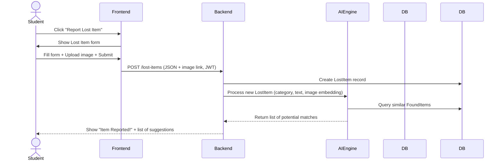
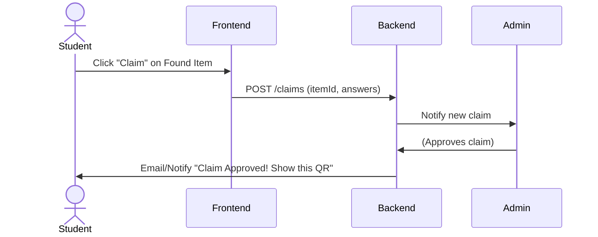

# UI/UX Design System for Campus Lost & Found AI System  

**Executive Summary:** We will create a friendly, modern, and highly accessible interface for our campus lost-and-found platform. The design is **student-centered** and subtly playful (think gamification badges and fun copy), yet clear and professional. All colors, typography, and interactions follow a coherent design language. We include a light and dark theme (with accessible contrast levels) and write copy in a *conversational, Gen Z–friendly tone* (inclusive, direct, with personality). Emails and notifications mirror the app style. We ensure WCAG-compliant contrast (≥4.5:1 for normal text), keyboard navigability, semantic HTML, and clear focus indicators.

---

## 1. Design Philosophy  

- **Vision:** Treat the app like a helpful senior student: friendly, encouraging, and optimistic. Every design decision should make students feel supported in reporting/claiming items, not confused or overwhelmed. Subtle gamification (XP, badges) rewards participation.  
- **Approach:** Keep it **simple** and **intuitive**: users should grasp each screen within a few seconds. Use **consistent layouts and components** so navigation is obvious. Interactions should feel responsive and even a bit playful (e.g. small animations on buttons) to engage users.  
- **Mood:** Bright, modern, and vibrant. Use ample whitespace and rounded corners for a soft, trustworthy look. Copy is human and encouraging, never robotic or overly formal (see Tone below).  

---

## 2. Design Principles  

- **Simple & Clear:** Each page’s purpose must be obvious. Use clear labels (e.g. “Report Lost Item” instead of generic “Submit”). Avoid jargon. Short on-screen instructions and placeholders guide the user.  
- **Consistency:** One design language everywhere – same button shapes, colors, icon style, spacing scale. For example, all **primary actions** use the same Indigo button style; all input fields have consistent padding and labels. This helps users learn the interface quickly.  
- **Responsive:** Layouts adapt to desktop, tablet, and mobile breakpoints using a 12-column grid. On mobile, navigation collapses sensibly (e.g. hamburger menu) and important actions remain at thumb-reach (bottom-right FAB for “Report Lost Item”).  
- **Accessible:** High color contrast (see Color System), readable font sizes, visible focus outlines, and logical keyboard order. We follow WCAG guidelines: text ≥4.5:1 contrast, focus indicators on all controls, and semantic HTML with ARIA labels where needed.  
- **Friendly & Human:** Use empathetic, inclusive language. Errors and empty states have a light, encouraging tone. Celebrate successes with little animations or confetti (“🎉 Item reported!”) to make users smile.  
- **Rewarding:** Recognize user contributions. When a student reports an item or successfully recovers something, show a congratulatory message, grant XP points, or unlock a badge. This reinforces positive behavior.  

---

## 3. Brand Personality  

Imagine the app as your **campus friend**: fun, energetic, and supportive. It should feel:  
- **Warm & Encouraging:** Use bright colors and a lighthearted tone.  
- **Trustworthy & Reliable:** Clean layout, clear information, small animated confirmations reassure users (e.g. checkmark on successful claim).  
- **Playful (to engage students):** Gamification badges and progress bars with friendly icons (🏆🔍🦸).  
- **Modern & Minimal:** Plenty of white space, minimal clutter. Illustrations and icons have rounded, “cute” lines (no harsh edges).  
- *Never:* Cold, robotic, or condescending. Avoid overly technical terms (e.g. don’t say “Upload JPEG file” – instead “Add a photo”). Avoid childish cartoon styles; keep it mature yet fun.

---

## 4. Color System (Light & Dark Themes)  

We use a semantic palette (each role a fixed color) adapted for light/dark. All hex codes ensure **WCAG AA contrast** on their intended background. 

### Light Theme  

| Role      | Color (Hex) | Usage                          |
|-----------|-------------|--------------------------------|
| **Primary**   | #5B5FEF     | Main CTAs, primary buttons, active nav icons.  |
| **Secondary** | #8B5CF6     | Secondary buttons, highlighted text/links. |
| **Accent/Reward** | #FBBF24     | Badges, XP bars, achievement highlights. |
| **Success**   | #22C55E     | Success messages (“Found”), confirmations. |
| **Warning**   | #FB923C     | Pending statuses, caution banners.        |
| **Danger**    | #F43F5E     | Delete buttons, error messages.         |
| **Info**      | #38BDF8     | AI match suggestions, info messages.    |
| **Neutral–BG**    | #F8FAFC     | Page background.                         |
| **Neutral–Card**  | #FFFFFF     | Card and panel background.               |
| **Neutral–Border**| #E5E7EB     | Card borders, dividers.                  |
| **Text–Primary**  | #111827     | Main text color (on light BG).          |
| **Text–Secondary**| #6B7280     | Secondary text (gray).                  |
| **Text–Disabled** | #CBD5E1     | Disabled text/buttons.                  |

### Dark Theme  

For dark mode, we shift to darker neutrals and brighter versions of accent colors, avoiding #000 and #FFF for readability.  

| Role      | Dark Color (Hex) | Usage                          |
|-----------|------------------|--------------------------------|
| **Primary**   | #8B80FF          | Primary CTAs/buttons on dark. |
| **Secondary** | #A87BFF          | Secondary actions on dark.    |
| **Accent/Reward** | #FFD747          | Badges, XP bars.               |
| **Success**   | #57E375          | Success states.              |
| **Warning**   | #FEB17E          | Warnings.                    |
| **Danger**    | #FF6D7D          | Errors/danger.               |
| **Info**      | #6FD4FF          | Info notes.                  |
| **Neutral–BG**    | #111827          | Page background (nearly black).|
| **Neutral–Card**  | #1F2937          | Card/panel background.        |
| **Neutral–Border**| #374151          | Dividers and outlines.        |
| **Text–Primary**  | #E5E7EB          | Main text on dark BG.         |
| **Text–Secondary**| #9CA3AF          | Secondary text.               |
| **Text–Disabled** | #6B7280          | Disabled text/buttons.        |

> **Dark Theme Note:** We avoid true #000 background; instead #111827 (tailwind’s gray-900). Text is off-white (#E5E7EB) to reduce glare. This aligns with dark-mode best practices (avoid pure black/white which can be harsh). Accent colors are tweaked for brightness to stand out on dark backgrounds.

---

## 5. Gradient System  

Use gradients sparingly, mainly for large hero banners or progress indicators to add vibrancy:

- **Primary Gradient:** Indigo → Purple (`linear-gradient(#5B5FEF, #8B5CF6)`). For headers, the login background, or loading progress bars.
- **Success Gradient:** Green → Light Green (`#22C55E → #4ADE80`). For success buttons or confetti effects.
- **Reward Gradient:** Yellow → Lighter Yellow (`#FBBF24 → #FFD166`). For badges, levels, or XP bars.
- **Info Gradient:** Blue → Light Blue (`#38BDF8 → #81E6D9`). For notifications or tooltips.

*Rule:* Never use more than one gradient per screen. Keep text/overlays legible on gradients (apply slight dark overlay on gradient backgrounds if needed).

---

## 6. Typography  

### Font Family  

- **Primary:** *Plus Jakarta Sans* (modern, geometric, very readable).  
- **Fallback:** Inter, Outfit, DM Sans (similar clean sans).  

### Font Scale (Light theme sizes; dark uses same px values)  

| Element         | Size   | Weight   | Line-height | Usage                                           |
|-----------------|--------|----------|-------------|-------------------------------------------------|
| **Hero/Title**      | 48px   | Bold     | 1.2         | Page hero titles, full-screen banners.           |
| **Page Title**      | 36px   | Bold     | 1.3         | Main page headings (Dashboard, Reports).       |
| **Section Title**   | 28px   | Semibold | 1.4         | Form sections, card group headings.            |
| **Card/Item Title** | 22px   | Semibold | 1.4         | Titles on item cards, notifications, dialogs.   |
| **Body Text**       | 16px   | Regular  | 1.5         | Normal paragraphs, form labels.                |
| **Caption / Small** | 14px   | Regular  | 1.4         | Secondary info, small captions.                |
| **Label / Button**  | 16px   | Semibold | 1.2         | Button text, form labels, nav items.            |

Text should never be smaller than 14px on mobile for readability. Use tailwind classes (e.g. `text-base`, `text-xl`, etc.) matching these values.

---

## 7. Spacing System  

Use a consistent 8-point grid. All margins, paddings, gaps, widths, heights, etc. are multiples of 4 or 8. Example values: 4, 8, 16, 24, 32, 40, 48, 64, 80, etc.  

> **Why 8?** It scales cleanly on different screen densities and divides common screen widths (e.g. 320, 768, 1280) evenly. For instance, a card might have 24px padding and a 32px gap between elements. Buttons might be 48px high. Border radii often follow 4, 8, 16, 24px from this scale.

Set Tailwind spacing scale to these (e.g. `p-4`, `p-8`, `p-16`, etc.). Avoid “random” values outside this list.

---

## 8. Border Radius  

Rounded, friendly shapes:  
- **Buttons:** 16px (`rounded-lg` in Tailwind).  
- **Cards:** 20px (`rounded-xl`).  
- **Inputs:** 16px (`rounded-lg`).  
- **Modals/Dialogs:** 24px (`rounded-2xl`).  
- **Badges/Chips:** Fully rounded pill (`rounded-full` or 9999px).  

Consistent rounding across components ensures a cohesive look.

---

## 9. Shadows  

Subtle shadows imply elevation and focus. We use a consistent light source (top-left, soft ambient light) so shadows feel uniform. Example shadows:  

- **Cards (default):** `0 8px 30px rgba(0,0,0,0.08)` for a soft lift. On hover: `0 12px 40px rgba(0,0,0,0.12)` (slightly bigger/softer) to indicate interactivity.  
- **Buttons (primary):** `0 4px 14px rgba(91,95,239,0.25)` (tiny glow of primary color) to gently lift buttons. On active/click: reduce to `0 2px 6px rgba(0,0,0,0.2)`.  
- **Modal Backdrop:** A larger, blurry shadow or semi-transparent overlay (`rgba(0,0,0,0.5)`) behind modals to focus user’s attention.  

> **Why use shadows?** They create depth: elevated elements appear closer, guiding user attention. For example, a raised dialog box stands out against a shaded background. Keep shadows consistent (same color tone, direction) for all components to avoid visual clutter.

---

## 10. Buttons (Component Library)  

Buttons are fundamental. We create several variants (see UXPin):  

- **Primary (Filled):** Indigo background, white text, large (wider on mobile). Always prominent. Use for main actions (e.g. “Report Lost Item”, “Confirm Claim”). Include subtle hover glow (shadow) and pressed effect (darker).  
- **Secondary (Outline):** White background (or dark mode card color), Indigo border/text. For less critical actions (“Cancel”, secondary options). Hover: background to Indigo/opacity 10%.  
- **Ghost/Link:** Transparent background, Indigo text (no border). For low-importance links (e.g. “Learn more”). Underline on hover.  
- **Icon Button:** Circular buttons with just an icon (e.g. “+” to add item). Use colored fill (Primary) or outlined variant depending on context. Hover scales up 1.1x and adds shadow.  
- **FAB (Floating Action Button):** Circle at bottom-right (like “+” new report). Gradient background (Indigo→Purple) with white “+”. Elevate with larger shadow.  

Each button supports: **Default / Hover / Active / Disabled / Loading** states (see UXPin states). Disabled buttons use faded colors (`text-gray-400`, `bg-gray-200`). Ensure focus outline on all buttons (per WCAG).

---

## 11. Inputs, Fields & Cards  

**Inputs / Form Fields:** Rounded rectangles (16px). Include a floating or inline label. On focus, border color changes to Primary (Indigo) and subtle shadow appears. States:  
- *Normal:* light gray border, no fill.  
- *Focus:* Indigo border + glow (shadow) + primary border.  
- *Error:* Red border (#F43F5E) and optional error text “This field is required.”.  
- *Success:* Green border (#22C55E).  
Always provide placeholder text (in light gray) and helper text below input if needed. All inputs have sufficient tap targets (≥40px height) and labels with `for` attribute for accessibility.  

**Cards:** Used to display items, notifications, suggestions. Card style: white background (dark mode: #1F2937), 20px rounded corners, padding (16–24px). Elements inside: icon or image on left, text (title, subtitle), status tag (e.g. 🟡 “Waiting” or 🟢 “Matched”), and an arrow/CTA. Cards are clickable (entire card is a button or link). Use slight hover lift (shadow) to indicate clickability.

Each card may include:  
- **Icon/Image:** e.g. photo of the item. Use 64x64 or 80x80px, rounded or square depending on context.  
- **Title:** e.g. *Blue iPhone 13* (22px semibold).  
- **Subtitle/Meta:** e.g. *Library – Lost yesterday*, smaller text (16px).  
- **Status Badge:** Colored label (rounded) indicating item status (Found/Pending). Use semantic colors (Green for found, Orange for pending).  
- **CTA:** e.g. “Claim →” link with arrow icon (use `MdArrowRight` from Lucide). Button variant of type link.  

Refer to design systems: cards often have *header/body/footer* sections, but here we mainly use a simple horizontal card. All interactive components inside (buttons, links) have appropriate ARIA roles and focus states.

**Dropdowns/Selects:** Rounded inputs (16px). On open, a list with max-height + scroll. Keyboard accessible: up/down to navigate, Enter to select, Esc to close.  

**Modals:** Centered overlay with darker backdrop. 24px corner radius, padding 32px. Title at top (28px semibold), body text and form fields, and footer actions (“Cancel”, “Confirm”). Trap focus inside (pressing Esc or clicking X closes; on close, focus returns to trigger element).  

*See [21] for more on cards and inputs.* The key is **reusability and consistency**: every input, button, card should behave the same across the app.

---

## 12. Icons & Illustrations  

- **Icons:** Use a single cohesive library – **Phosphor Icons** (rounded style, light strokes). All icons are 24px or 32px. Icons should use the **primary color** (Indigo) or semantically match their function (e.g. red trash icon for delete). Maintain consistent stroke weight.  
- **Illustrations:** Use flat, friendly illustrations for empty states, on-boarding screens, and success pages. Style: pastel, minimal, with rounded shapes. Sources: [Storyset](https://storyset.com/), [unDraw](https://undraw.co/), or [Open Doodles](https://opendoodles.com). Example: a student searching under a couch for “Nothing here” empty state. Use them sparingly (not on every page).  
- **Image Assets:** All user-uploaded photos are stored on Cloudinary (auto-optimized). Images in UI (logos, icons) use SVG or 2x PNG for retina. Provide alt text for all images; decorative images get empty alt (`alt=""`).  

Accessibility note: All icons that convey meaning have an `aria-label` or `title`. For example, an envelope icon for “Email” input should have `aria-hidden="true"` on the `<svg>` and the input itself has a visible `<label>` or `placeholder`.  

---

## 13. Animation & Microinteractions  

Animations are **subtle and purposeful** (duration ~150–250ms, ease-out) – enough to delight without distracting.  

- **Hover Effects:** Buttons slightly scale up (1.03x) and gain a stronger shadow. Cards lift (shadow increase).  
- **Click/Active:** Rapid (100ms) depress and reduce shadow.  
- **Page Transitions:** Fade or slide transitions between major pages (e.g. Dashboard → Report form) using ease-out.  
- **Toasts/Alerts:** Slide up from bottom or fade in for notifications.  
- **Progress Indicators:** XP bars animate fill; loading spinners or skeleton loaders for network fetch.  

Examples of microinteractions:  
- **Badge Unlock:** When a user earns a badge, pop up a small modal with the badge icon and confetti.  
- **Form Validation:** On submit, if error, shake the input or shake the whole form (like telling the user “oops”).  
- **Notifications:** New message toast slides in/out with slight bounce.  

Avoid over-animating (no continuous background animations). Respect `prefers-reduced-motion` by disabling non-essential animations if the user opts out.

---

## 14. Gamification UX  

Incorporate game-like elements to motivate:  

- **Levels & XP:** Display the user’s current level (e.g. *Explorer, Finder, Guardian*) and a progress bar. Completing reports or claims gives XP. Make this visible on profile/dashboard.  
- **Badges:** Award badges for milestones (e.g. “First Report”, “10 Items Found”). Show badge icons in profile and on dashboard. Color these Gold/Yellow #FBBF24 for visibility.  
- **Leaderboards:** (Optional) Show top contributors on a campus leaderboard for fun. Use a podium/medal icon.  
- **Streaks:** If a user checks into the app daily (or reports items frequently), show a small flame 🕯 or streak count.  

Gamification should be **optional** and not block core functionality. Use positive reinforcement: e.g. after a successful return, pop up “🎉 You’ve helped a fellow student!” with XP gain.

---

## 15. Copywriting & Tone  

Write in **warm, inclusive, Gen Z–friendly style**: casual but respectful, using everyday language. Always speak in second person (“you” and “we”).

- **Be Direct & Concise:** Gen Z has short attention spans. Use short sentences. E.g. instead of “Your report submission is successful,” say “🎉 Your lost item has been reported!”  
- **Relatable Language:** Use light humor or pop-culture references carefully if it fits campus context. For example, on the empty Community Board: “Looks like no one’s found anything new. Be the first to post!”  
- **Inclusive:** Avoid slang that might offend; use gender-neutral terms (use “folks” or “everyone” instead of “guys”).  
- **Active Voice:** Make actions clear (“Report a lost item” vs. “Lost item can be reported.”).  
- **Use Emojis Sparingly:** A party popper (🎉), check mark (✔️), or warning sign (⚠️) can add friendliness, but don’t overdo it. E.g. “Oops! Something went wrong.” instead of “Error occurred.”  
- **Feedback Language:**  
  - Success: “🎉 Yay! We’ll try to find your item soon.”  
  - Error: “Oops! We couldn’t save that. Try again?”  
  - Empty: “📭 No lost items here yet – check back later or report one!”  
  - Informational: “🔍 We found a match for your item!”  

Always end with a positive note or next step.

---

## 16. Empty & Loading States  

Design friendly empty states with illustrations and prompts:  

- **Lost/Found List Empty:** Show a cute illustration (e.g. student with binoculars), message “Nothing here yet,” and a button “Report an item” to encourage action.  
- **Search No Results:** “No matches found. Try different keywords?” with a search icon.  
- **Loading:** Use skeleton loaders for lists/cards. Or a subtle spinner with text “Looking for matches…”. Keep animations short to avoid frustration.  

Each state should have: illustration, brief message, and a CTA (where relevant). This keeps the tone light (even errors get a touch of humor, like a shrug emoji 🤷).

---

## 17. Accessibility Checklist  

We ensure WCAG 2.1 AA compliance:

- **Color Contrast:** All text ≥4.5:1 against background. Test both light and dark theme.  
- **Text Resize:** Ensure UI works if user zooms up to 200%.  
- **Keyboard Navigation:** All functionality accessible via keyboard. Visible focus indicator on every interactive element. Follow logical tab order (header → content → footer). No “keyboard traps.”  
- **ARIA & Semantic HTML:** Use `<button>`, `<a>`, `<input>` elements properly. Add `aria-label` or `alt` text on non-text controls. For custom widgets (e.g. AI match cards), ensure screen readers read them (use ARIA roles if needed).  
- **Forms:** Associate `<label>` with inputs (for screen readers). Error messages announce properly.  
- **Images:** All decorative images get `role="presentation"` or empty `alt`. Informative images have descriptive alt.  
- **Animations:** Comply with `prefers-reduced-motion`. All transitions are non-distracting.  
- **Tooltips:** If we use tooltips, they must be accessible (focusable trigger, dismissible).  
- **Tests:** Validate with tools (WAVE, Axe). Perform keyboard-only walks and color contrast checks.

Citations: WCAG 2.4.7 (Focus Visible) reminds us that every focused element **must** have a visible highlight. Keyboard guidance emphasizes clear focus and order.

---

## 18. Responsive Design  

Use a **12-column grid** (material/tailwind style) with breakpoints:  
- **Desktop:** ≥1440px wide. Side navigation and full grid.  
- **Tablet:** 768px–1024px. Collapsible sidebar (or top nav), content 12-column grid reflow to 2–3 columns.  
- **Mobile:** <768px. Single-column layout. Use bottom navigation or hamburger menu. Buttons and touch targets sized for fingers (min 44×44px).  

Example components per screen size:  
- **Nav:** Horizontal at top (desktop), collapsible sidebar (tablet), bottom tab bar or hamburger (mobile).  
- **Dashboard:** On desktop, show summary cards (3+ columns). On mobile, stack them.  
- **Forms:** Label above input on narrow screens, beside input on wide screens. Use full-width inputs on mobile.  

Illustrate fluid layouts using Tailwind utilities like `grid-cols-1 md:grid-cols-2 lg:grid-cols-3`.

---

## 19. Key Screens & UI Patterns  

We describe major screens and their primary components:

- **Login/Register:** Simple two-column (desktop) or single-column (mobile) form with site logo. Fields (email, password) with clear labels. CTA “Login” or “Sign Up” (purple button). Link to “Forgot Password?” (ghost link style). Friendly welcome text.  
- **Dashboard (Student):** Summary cards: “Your Lost Items” (count/status), “Found Items Nearby,” “Match Suggestions” (AI). Each card links to detail. Include a prominent “Report Lost Item” FAB (bottom-right). Top bar with notifications bell and profile icon. Bottom or side nav: Home, Search, Community Board, Profile.  
- **Report Lost Item:** Multi-step form or single page with inputs (title, category dropdown, description textarea, photo upload). Show preview of uploaded image. Map input for location (if campus map available). Submit button primary. On submit, show success toast “Item Reported!” and transition to “View Matches” or Dashboard.  
- **Report Found Item:** Similar to lost form, but fields tailored (no title, maybe “I found a ___”). Include location and photo.  
- **Item Detail:** For a lost or found item view. Shows images (carousel or grid), full description, found by / reported by info, date, location, and status. If user hasn’t claimed it, show “Claim This Item” button (green). On click, open claim form or instruction.  
- **Claim Flow:** After “Claim” click, a modal or page asks questions (set by admin) and optionally upload proof. On submit, show “Claim Submitted – Waiting for Approval.” If approved, user gets QR code. If rejected, show reason or allow appeal.  
- **QR Pickup Screen:** After claim approved, user can generate a QR code (page shows QR with instructions: “Show this code at office to pick up”). The office staff’s view can scan QR and mark item returned.  
- **Community Board:** A scrollable feed of recently found items. Each post card includes image, location found, timestamp, and “Claim” button. Items expire after 24h. Include filters (category).  
- **Search:** A full-page search with text input, category filters (buttons or dropdowns), and result list (cards as above).  
- **Notifications:** Inbox-style panel listing alerts (e.g. “Your lost item matched with found item at the library!”). Each item clickable.  
- **Profile & Badges:** Shows user info (name, email, student ID), list of badges earned (with icons and descriptions), and reputation/XP bar. Option to edit profile (password change).  
- **Admin Dashboard:** Specialized UI showing system stats (total items, claims pending). Tabs for “Manage Items”, “Manage Claims”, “Settings”. Use data tables with sorting. E.g. Claims table columns: Item, Claimer, Date, Status, Actions (Approve/Reject buttons).  
- **Modals/Dialogs:** Confirmation modals (e.g. “Are you sure you want to delete this report?”) with clear Cancel/Confirm buttons. Use semantic alerts (role=dialog).  
- **Errors:** A generic 404 and 500 page with friendly message and a link back to dashboard.  

Each screen reuses components (cards, forms, nav) for consistency. Focus on minimal clicks: e.g. “Report Lost” button always visible on navigation.

---

## 20. Interaction & Sequence Diagrams  

Flow examples using Mermaid for key interactions:


*Figure:* Lost item report flow: user submits, backend saves, AI engine finds matches, user is notified.


*Figure:* Claim workflow: student submits claim, admin reviews, on approval user receives QR.

Other flows (search, community board post expiry, QR scanning) follow similar patterns: UI→API calls→DB→notifications.

---

## 21. Accessibility in Practice  

Checklist highlights (beyond color/contrast):
- **Keyboard:** All interactive elements reachable by Tab. Visible focus ring on buttons/links (default or custom outline).  
- **ARIA:** Use `role="alert"` for live notifications; `aria-live="polite"` for non-critical updates. Mark modal dialogs with `aria-modal="true"` and focus trap.  
- **Labels:** Every form control has an associated `<label>`. Where space is tight, use `aria-label`. Example: a magnifier icon button for search should have `aria-label="Search"`.  
- **Landmarks:** Use `<header>`, `<main>`, `<footer>`, `<nav>` for structural regions to help assistive tech. Provide skip-links (e.g. “Skip to main content”) for screen readers as [WebAIM suggests](https://webaim.org/).  
- **Text:** Use plain language; avoid color alone to convey info (also add icons/text). E.g. status badges have text and color.  
- **Testing:** Include screen reader tests and manual keyboard traversal. Use automated tools to check WCAG.

By following these practices, the UI will be navigable and understandable by users with disabilities.

---

## 22. Design Tokens (Summary Table)  

All design tokens are defined as CSS variables or Tailwind theme tokens for easy use.

| Token            | Value (Light) | Value (Dark) | Description                |
|------------------|---------------|--------------|----------------------------|
| `--color-primary`    | #5B5FEF      | #8B80FF     | Primary brand color         |
| `--color-secondary`  | #8B5CF6      | #A87BFF     | Secondary brand color       |
| `--color-accent`     | #FBBF24      | #FFD747     | Accent/Reward color         |
| `--color-success`    | #22C55E      | #57E375     | Success states (green)      |
| `--color-warning`    | #FB923C      | #FEB17E     | Warning states (orange)     |
| `--color-danger`     | #F43F5E      | #FF6D7D     | Error/danger (rose red)     |
| `--color-info`       | #38BDF8      | #6FD4FF     | Info/notifications (blue)   |
| `--color-bg`         | #F8FAFC      | #111827     | Page background             |
| `--color-card`       | #FFFFFF      | #1F2937     | Card/panel background       |
| `--color-border`     | #E5E7EB      | #374151     | Dividers/borders            |
| `--text-primary`     | #111827      | #E5E7EB     | Main text color             |
| `--text-secondary`   | #6B7280      | #9CA3AF     | Secondary text              |
| `--text-disabled`    | #CBD5E1      | #6B7280     | Disabled text/buttons       |
| `--font-base`       | 16px         | 16px        | Base font size              |
| `--font-hero`       | 48px         | 48px        | Hero title font size        |
| `--font-title`      | 36px         | 36px        | Page title size             |
| `--radius-lg`      | 16px         | 16px        | Large roundness (buttons)   |
| `--radius-xl`      | 20px         | 20px        | Extra large (cards)         |
| `--shadow-card`    | 0 8px 30px rgba(0,0,0,0.08) | 0 8px 30px rgba(0,0,0,0.08) | Default card shadow |
| `--shadow-card-hover` | 0 12px 40px rgba(0,0,0,0.12) | 0 12px 40px rgba(0,0,0,0.12) | Card hover shadow |
| `--spacing-4`      | 4px          | 4px        | Spacing (8pt grid)          |
| `--spacing-8`      | 8px          | 8px        |                            |
| `--spacing-16`     | 16px         | 16px       | etc. (0.5rem, 1rem, etc.)   |

These tokens map directly to Tailwind classes or CSS custom props. For example, use `bg-primary` (or `bg-[var(--color-primary)]`) for the primary button, `text-primary` for main text, `rounded-lg` for `--radius-lg`, etc.

---

## 23. Responsive Layout Examples  

- **Dashboard (Desktop):**  
```html
<div class="grid grid-cols-1 md:grid-cols-2 lg:grid-cols-3 gap-8">
  <div class="card col-span-2">…</div>
  <div class="card">…</div>
  <div class="card">…</div>
</div>
```
- **Dashboard (Mobile):**  
```html
<div class="flex flex-col space-y-6">
  <div class="card">…</div>
  <div class="card">…</div>
  <div class="card">…</div>
</div>
```
- **Form (Tablet):** Label and field side-by-side (two columns).  
- **Form (Mobile):** Labels above inputs (full width).  

Breakpoints: `sm (≥640px), md (≥768px), lg (≥1024px), xl (≥1280px)`. Use Tailwind’s responsive prefixes (`sm:`, `md:`, etc.).  

Example: `<div class="hidden md:block">` for a sidebar that only shows on medium+ screens.

---

## 24. Testing & QA  

**Visual Testing:** Ensure components render correctly on all breakpoints and themes. Use tools (Storybook, Chromatic) for snapshot testing.  
**Accessibility Testing:** Run axe-core or Lighthouse audits. Manually test keyboard tab flow and screen reader (e.g. NVDA, VoiceOver). Check color contrast ratios (tools or CSS checkers).  
**Responsiveness:** Test on common devices/sizes (mobile portrait, tablet, desktop). Ensure no horizontal scroll.  
**User Flows:** Verify critical flows (report, claim, search, login) work end-to-end.  
**AI UI:** Test that AI suggestions appear when expected (upload similar images/text, see correct list).  
**Notifications/Email:** Confirm emails are well-formatted (on mobile + desktop) and that links/clicks work.  

Write automated tests (unit and integration) for components where possible (e.g. form validations, API mocks).

---

## 25. Handoff Deliverables  

When delivering to development, prepare:  
- **Figma (or Figma to code via shadcn/ui):** All screens mocked up, with defined components and tokens. Developers can inspect spacing, colors.  
- **Design Tokens:** Document (or share CSS) the above token table. Possibly via a Design Tokens JSON.  
- **Component Library:** Code-ready components (using shadcn/ui or your React component lib) with prop variations.  
- **Redlines & Specs:** For any non-obvious layout measurements or behaviors, include redline annotations.  
- **Icons & Images:** Provide all icons (SVG) and illustration assets (optimized PNG/SVG). Also note Cloudinary upload settings (e.g. width/height, quality presets).  
- **Animations/Motion Specs:** List CSS timing functions (ease-out), durations. Provide Lottie/JSON if any complex animations used.  
- **Content Guidelines:** Style guide excerpt with copy examples (friendly tone tips, do’s and don’ts).  
- **Email Templates:** Provide HTML/CSS templates or markup for transactional emails (registration, OTP, match found, etc.) with placeholders. (See next section.)  

This ensures devs can implement exactly as designed.

---

## 26. Email Templates & Copy  

We craft **transactional emails** that mirror the UI tone. Each email has a concise subject and preheader following best practices. Example templates (subject, preview, body highlight):

1. **Registration Confirmation:**  
   - **Subject:** “Welcome to CampusFind! 🎉” (short, warm)  
   - **Preheader:** “Your account is ready to go.”  
   - **Body:**  
     ```
     Hi [Name],

     Welcome aboard! Your CampusFind account has been created. Click below to confirm your email and get started:

     [Confirm Email] (button - links to /verify?token=XXX)

     If you didn’t sign up, just ignore this email.

     Happy finding! 🔍
     The CampusFind Team
     ```
2. **OTP Verification:**  
   - **Subject:** “Your verification code for CampusFind”  
   - **Preheader:** “Use code 123456 to verify your email.”  
   - **Body:**  
     ```
     Hi [Name],

     Use the code below to verify your account. It expires in 10 minutes:

         123456

     Need a new code? [Resend code] (button)

     Thanks, and good luck finding!
     ```
3. **AI Match Notification:** (When a found item matches a lost report)  
   - **Subject:** “👀 We found a match for your lost item!”  
   - **Preheader:** “Check out the details in CampusFind.”  
   - **Body:**  
     ```
     Hi [Name],

     Good news! Our AI suggests a possible match for your lost item, “Blue JBL Earbuds”. 

     • Found at: Library (today)  
     • Description matches “JBL Blue Wireless Earbuds”  
     • [View Details] (button to app)

     If this is your item, you can file a claim. Otherwise, no action is needed. 

     Keep your eyes peeled! 👀
     ```
4. **Claim Approved:**  
   - **Subject:** “✅ Claim approved! Pick up your item.”  
   - **Preheader:** “Your item is safe - come get it!”  
   - **Body (HTML email with QR):**  
     ```
     Great news, [Name]!

     Your claim for the item “Green Umbrella” has been *approved*. 🎉

     📍 Where: Lost & Found Office  
     📆 When: Monday-Fri 9am-5pm  
     🔑 [Scan QR at office] (embedded QR code image)

     Bring this code and your student ID to pick it up.

     See you soon, and congrats on getting it back!
     ```
5. **Claim Rejected:**  
   - **Subject:** “⚠️ Claim update: more information needed.”  
   - **Preheader:** “Our admin had a question.”  
   - **Body:**  
     ```
     Hi [Name],

     We reviewed your claim for “Silver MacBook Charger” but couldn’t verify ownership with the info provided.

     If you still have it, please reply with additional proof or details. Otherwise, another student may claim it.

     We’re here to help if needed.
     ```
6. **Password Reset:**  
   - **Subject:** “Reset your CampusFind password 🔐”  
   - **Preheader:** “Click to set a new password.”  
   - **Body:**  
     ```
     Hi [Name],

     You requested a password reset. Click the link below to choose a new password. This link is valid for 1 hour.

     [Reset Password] (button)

     If you didn’t ask, you can ignore this.

     Stay safe, CampusFind Team
     ```

Emails follow accessibility (legible font size, clear hierarchy) and use inline CSS for responsiveness. All links have clear text (no “click here”). 

_Preheader text_ is not just generic; it adds context (per Postmark: “Use preheader for key info”).

---

### Notes on Copy:  
- Keep subject lines ≤50 characters.  
- The tone remains conversational (“Great news, [Name]!…”) and includes occasional emojis to sound friendly (🎉, 🔍, ✔️), but all professional.  
- Include fallback plain-text version of each email for older clients.  

---

## 27. Final Notes  

This design system ensures **one-to-one traceability** with the SRS/TDD features. Each functional requirement (reporting, AI matches, QR pickup, etc.) has a corresponding UI flow and component. The document serves as a living guide: any new feature (e.g. mobile app) should extend from these same design tokens and principles. By adhering to these guidelines and the cited best practices (WCAG, NN/g, UX writing), the result will be a polished, accessible, and user-friendly application.

**Sources:** We based our accessibility rules on WCAG 2.1 standards; design system practices on modern UI libraries; and UX writing on research into Gen Z preferences. This ensures our recommendations are grounded in current best practices.

