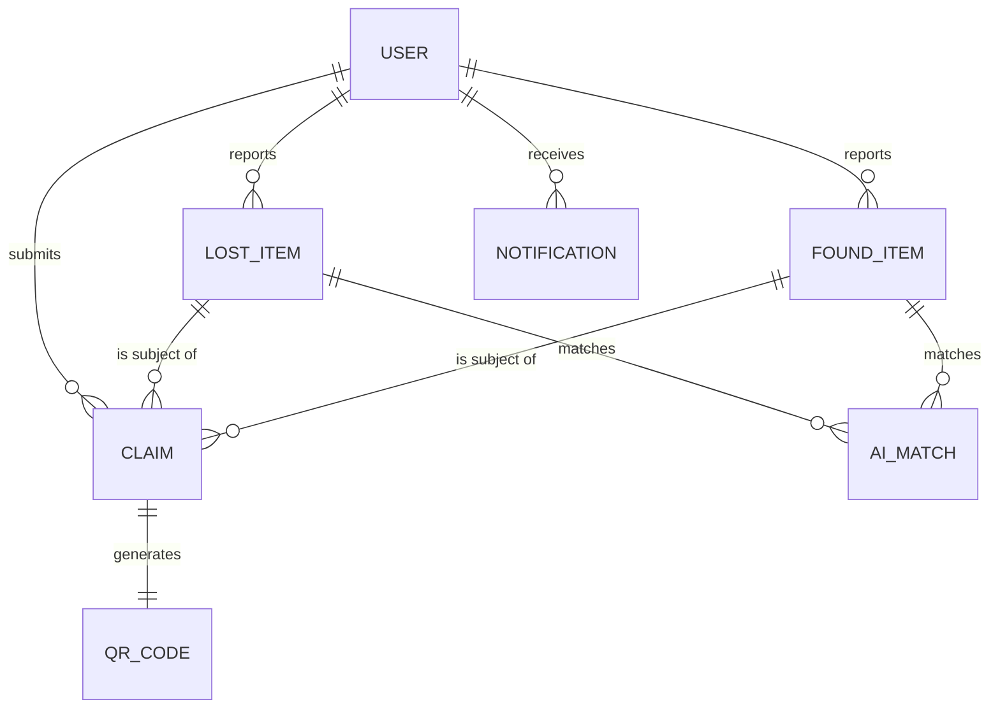
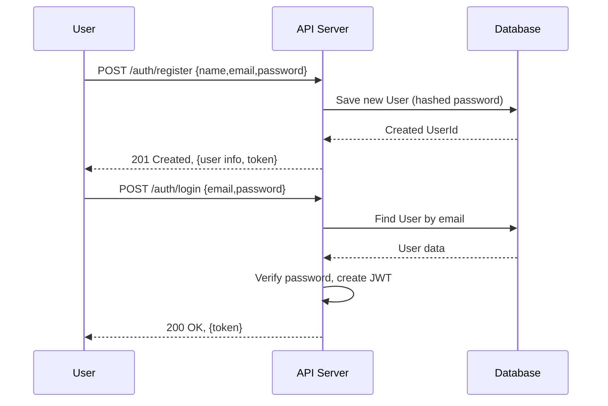
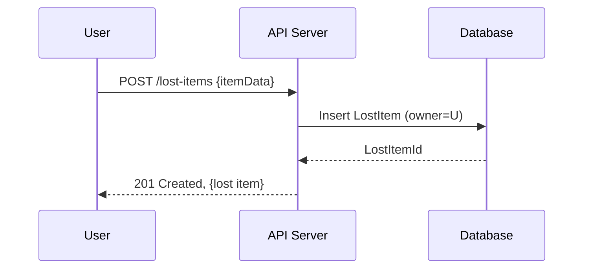
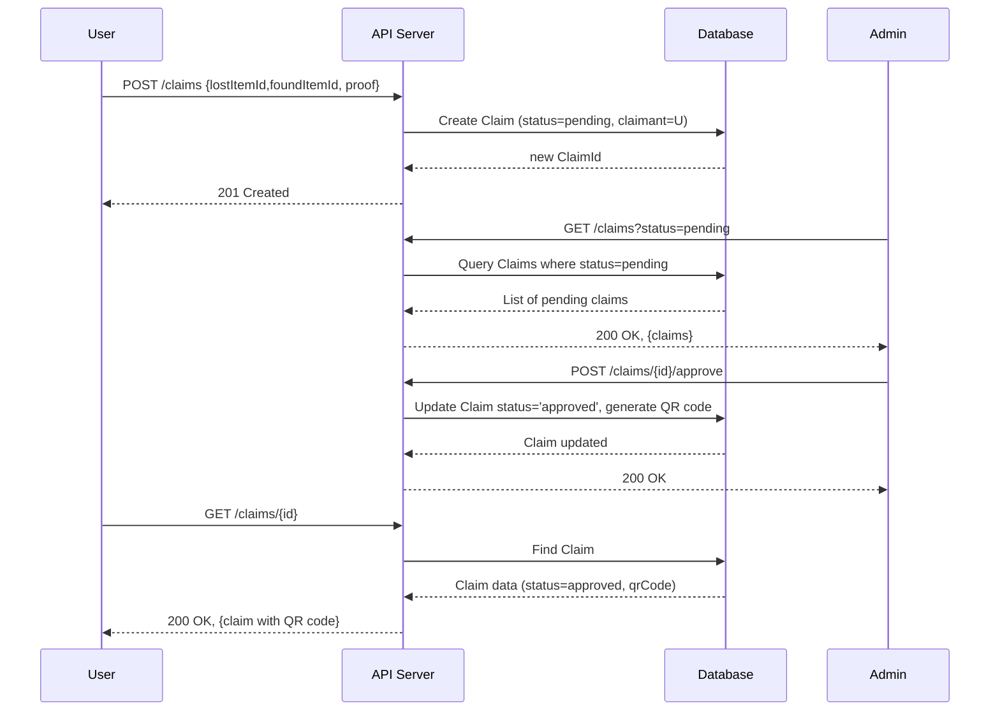

# Executive Summary 

This report outlines a comprehensive backend design using Node.js/Express with MongoDB for the Campus Lost & Found AI System, based on the provided documentation. The system supports user (student/staff) registration/login (via university email and Google OAuth), lost-and-found item reporting, AI-assisted matching, claim workflows, QR-based pickups, and an admin dashboard with analytics. Key design decisions include a RESTful JSON API with JWT authentication and role-based access (users vs. admins), Mongoose schemas for the main entities (Users, LostItems, FoundItems, Claims, Notifications, AI-Matches, QR codes, etc.), and MongoDB collections tuned for scalability and security. We use embedding for tightly-coupled data (e.g. embedded image arrays in item documents) and referencing for relationships (e.g. user references in items and claims), following MongoDB modeling best practices. Indexes are defined on commonly queried fields (user email, item category, claim status, etc.). We show ER diagrams (Mermaid) of the schema, sequence diagrams for registration/login and a claim workflow, and provide Node/Express example code for schemas and endpoints. 

Our authentication strategy uses JWTs with secure storage of secrets and HTTPS transport, while authorization enforces “user” vs. “admin” roles. We include error-handling middleware and logging (e.g. Winston) to capture request/response and error data. Backup and restore rely on Atlas Cloud Backup snapshots or `mongodump` with `--oplog` for consistency, and deployment uses Docker/Kubernetes and CI/CD pipelines. Transactions (for multi-document consistency, e.g. updating related collections) are kept small (<1000 docs) and retried on abort. Scaling is achieved via replica-sets (minimum 3 nodes) and optional sharding on high-cardinality keys; performance tuning uses indexing and monitoring. Security covers injection prevention, encryption (TLS in transit, Atlas encryption at rest), and secrets management. A testing strategy (unit, integration, load) and an implementation roadmap with milestones are also provided. 

# Requirements Analysis

The **functional requirements** (from the SRS) include user registration/login (via university email and optionally Google OAuth), reporting lost items and found items (each with fields like name, category, description, images, location, date, color, brand, etc.), an AI matching engine (image and text similarity for lost/found matches), search and filtering of items, a notification system (alerts for matches or status changes), a claim workflow (user submits claim on a found item, ownership verification, admin approval/rejection), QR-based pickup generation after approval, and an analytics dashboard (lost/found counts, recovery rate, trends). **Non-functional requirements** mandate a responsive UI, a secure REST API with JWT authentication, password hashing, audit logs, sub-3-second responses (excluding AI processing), and use of free-tier cloud services. User roles are **Students/Users** and **Admins**, with admins managing reports, matches, approvals, categories, and viewing analytics. Mobile responsiveness and accessibility are expected. 

From these, our backend must expose endpoints to support: (1) User auth (register/login, profile), (2) CRUD on LostItem and FoundItem reports, (3) an AI-match trigger or retrieval endpoint, (4) search/filter queries, (5) claim submission and admin claim review actions (approve/reject), (6) QR code generation for pickups, (7) notifications retrieval, (8) analytics queries, (9) category and user management (by admin). Security (authentication, authorization), error handling, and logging must be addressed.

# API Endpoints 

We define a RESTful JSON API. Below is a summary table of key endpoints (with HTTP method, route, request/response schemas, and auth requirements). All endpoints return standardized JSON (e.g. `{ success: true, data: … }` or error message).

- **Auth & Users**  
  - `POST /api/auth/register` – Create user (body: `{name, email, password}`; returns user and JWT). No auth required.  
  - `POST /api/auth/login` – Login user (body: `{email, password}`; returns JWT). No auth.  
  - `GET /api/auth/google` – Google OAuth login (redirect/callback flow).  
  - `GET /api/users/me` – Get current user profile. Auth: *User*.  
  - `PUT /api/users/me` – Update profile (name, phone, etc.). Auth: *User*.  
  - `GET /api/users/:id` – Get any user (e.g. admin view). Auth: *Admin*.  
  - `PUT /api/users/:id/role` – Change user role (admin only). Auth: *Admin*.  

- **Lost Items**  
  - `POST /api/lost-items` – Report lost item. Request includes fields (name, category, description, location, date, color, brand, special marks, images). Auth: *User*.  
  - `GET /api/lost-items` – List lost items (supports filters query: `?category=X&dateFrom=Y&owner=me` etc.). Auth: *User*.  
  - `GET /api/lost-items/:id` – Get one lost item. Auth: Public or User.  
  - `PUT /api/lost-items/:id` – Update lost item (owner or admin). Auth: *User/Owner or Admin*.  
  - `DELETE /api/lost-items/:id` – Delete lost item (owner or admin). Auth: *User/Owner or Admin*.  

- **Found Items** (similar to lost)  
  - `POST /api/found-items` – Report found item (fields as lost). Auth: *User*.  
  - `GET /api/found-items` – List found items (with filters). Auth: *User*.  
  - `GET /api/found-items/:id` – Get one found item. Auth: public or User.  
  - `PUT /api/found-items/:id` – Update found item (owner or admin). Auth: *User/Owner or Admin*.  
  - `DELETE /api/found-items/:id` – Delete found item (owner or admin). Auth: *User/Owner or Admin*.  

- **Search/Filters**  
  - We reuse the above list endpoints with query parameters (e.g. `/lost-items?search=text&category=...`). The frontend calls these for search.

- **AI Matching**  
  - (Optionally) `POST /api/match` – Trigger AI matching for a given item or run matching job (called after a new report). Auth: *Admin or System*.  
  - Or an internal service calls the AI engine; no public endpoint needed.

- **Claims**  
  - `POST /api/claims` – Submit a claim (body: `{lostItemId, foundItemId, proofDocs, message}`; plus user info). Auth: *User*.  
  - `GET /api/claims` – List claims (admin sees all; user sees own). Auth: *Admin or User*.  
  - `GET /api/claims/:id` – Get claim details. Auth: *User (owner) or Admin*.  
  - `POST /api/claims/:id/approve` – Approve a claim (mark as approved, generate QR). Auth: *Admin*.  
  - `POST /api/claims/:id/reject` – Reject a claim. Auth: *Admin*.  
  - `PUT /api/claims/:id` – (e.g. upload missing proof) – Auth: *User (owner) or Admin*.  

- **QR Codes**  
  - `GET /api/claims/:id/qr` – Fetch QR code (e.g. base64 image or data) for approved claim. Auth: *User (claimant) or Admin*.  

- **Notifications**  
  - `GET /api/notifications` – List current user’s notifications (new match alerts, claim status changes). Auth: *User*.  
  - `PUT /api/notifications/:id/read` – Mark notification as read. Auth: *User*.
  - `PUT /api/notifications/read-all` – Mark all notifications as read. Auth: *User*.
  - `DELETE /api/notifications/:id` – Delete notification. Auth: *User*.

- **Community Board**
  - `GET /api/community` – List active community posts (24h board). Auth: *User*.
  - `POST /api/community` – Create a community post (sets 24h TTL). Auth: *User*.
  - `POST /api/community/:id/suggest-owner` – Suggest an owner for a found item. Auth: *User*.
  - `POST /api/community/:id/flag` – Flag a post. Auth: *User*.
  - `DELETE /api/community/:id` – Remove post (Admin only). Auth: *Admin*.

- **Chat (Finder Chat)**
  - `GET /api/chat/:itemId/messages` – Get message history for item chat. Auth: *User*.
  - `POST /api/chat/:itemId/messages` – Send a message (REST fallback). Auth: *User*.
  - *Real-time via Socket.IO*: `join_room`, `send_message`, `receive_message`, `typing` events.

- **QR Handover**
  - `GET /api/handover/:itemId/qr` – Get QR code data for approved claim. Auth: *User*.
  - `POST /api/handover/:itemId/scan` – Verify QR token at office. Auth: *User (Admin)*.
  - `POST /api/handover/:itemId/confirm` – Final confirmation, mark item returned. Auth: *Admin*.

- **Categories**
  - `GET /api/categories` – List item categories. Auth: Public.
  - `POST /api/categories` – Add category. Auth: *Admin*.
  - `PUT /api/categories/:id` – Update category. Auth: *Admin*.
  - `DELETE /api/categories/:id` – Remove category. Auth: *Admin*.

- **Admin/Analytics**
  - `GET /api/admin/dashboard` – Overview stats (total lost/found, pending claims, recovery rate). Auth: *Admin*.
  - `GET /api/admin/analytics` – Return metrics with trend data. Auth: *Admin*.
  - `GET /api/admin/users` – List users with search/filter. Auth: *Admin*.
  - `PUT /api/admin/users/:id/ban` – Ban a user. Auth: *Admin*.
  - `PUT /api/admin/users/:id/unban` – Unban a user. Auth: *Admin*.
  - `PUT /api/admin/users/:id/role` – Change user role. Auth: *Admin*.
  - `GET /api/admin/items` – List all items (lost + found) for moderation. Auth: *Admin*.
  - `PUT /api/admin/items/:id/approve` – Approve an item report. Auth: *Admin*.
  - `PUT /api/admin/items/:id/reject` – Reject an item report. Auth: *Admin*.
  - `DELETE /api/admin/items/:id` – Delete an item. Auth: *Admin*.
  - `GET /api/admin/community` – List community posts for moderation. Auth: *Admin*.
  - `DELETE /api/admin/community/:id` – Remove community post. Auth: *Admin*.

**Request/Response Schemas:** All create/update endpoints accept JSON with the fields of the Mongoose models (see next section) and return the created/updated object (or list of objects). Error responses use standardized JSON with HTTP status codes (e.g. `401 Unauthorized`, `400 Bad Request`). Sensitive data (passwords) are omitted from responses. 

**Authentication:** All endpoints (except `/auth/*`, `/categories`, public GET) require a valid JWT in the `Authorization` header (`Bearer <token>`). JWTs encode user ID and role. Admin-only endpoints additionally check `user.role === 'admin'`. 

**Example Endpoint (Express/Mongoose) Implementation:**  
```js
// Example: Create Lost Item
router.post('/lost-items', authMiddleware, async (req, res) => {
  // authMiddleware verifies JWT and sets req.user
  const lostItem = new LostItem({ 
    ...req.body, owner: req.user.id 
  });
  await lostItem.save();
  res.status(201).json({ success: true, data: lostItem });
});
```
_Note: Detailed code snippets for each endpoint and schema are given in the **Data Models & Code** section below._

# Data Models (MongoDB Schemas) 

We use MongoDB collections for each main entity. Schemas are defined with Mongoose. Key models and fields include:

- **User**:  
  - Fields: `_id`, `name:String`, `email:String (unique, indexed)`, `password:String (hashed)`, `role:String` (`'user'` or `'admin'`), `profilePic:String`, `universityId:String`, `registeredAt:Date`, etc.  
  - Indexes: `email` unique for login lookup. Possibly `role` for admin queries.  
  - Relations: none (self-contained). Password is hashed (bcrypt) and not returned in API.  

```js
const UserSchema = new mongoose.Schema({
  name: {type: String, required: true},
  email: {type: String, required: true, unique: true, index: true},
  password: {type: String, required: true},
  role: {type: String, enum: ['user','admin'], default: 'user'},
  profilePic: String,
  createdAt: { type: Date, default: Date.now }
});
```

- **Category** (optional for item categorization):  
  - Fields: `name:String`, `description:String`, etc.  
  - Used as reference in Lost/Found items.  

```js
const CategorySchema = new mongoose.Schema({
  name: {type: String, unique: true},
  description: String
});
```

- **LostItem**:  
  - Fields: `_id`, `owner: ObjectId (ref User)`, `itemName:String`, `category: ObjectId (ref Category or simple String)`, `description:String`, `locationLost:String`, `dateLost:Date`, `color:String`, `brand:String`, `specialDetails:String`, `images:[String]`, `createdAt:Date`.  
  - Indexes: `owner`, `category`, `dateLost` for queries. Full-text index on `itemName`/`description` for search is possible.  

```js
const LostItemSchema = new mongoose.Schema({
  owner: { type: ObjectId, ref: 'User', required: true },
  itemName: String, 
  category: { type: ObjectId, ref: 'Category' },
  description: String,
  location: String,
  dateLost: Date,
  color: String,
  brand: String,
  special: String,
  images: [String],  // store image URLs or cloud storage keys
  createdAt: { type: Date, default: Date.now }
});
```

- **FoundItem**: (same fields as LostItem, plus `finder: ObjectId (ref User)`).  
  - Fields: `_id`, `finder:ObjectId`, `itemName`, `category`, `description`, `locationFound`, `dateFound`, etc.  

```js
const FoundItemSchema = new mongoose.Schema({
  finder: { type: ObjectId, ref: 'User', required: true },
  itemName: String,
  category: { type: ObjectId, ref: 'Category' },
  description: String,
  location: String,
  dateFound: Date,
  color: String,
  brand: String,
  special: String,
  images: [String],
  createdAt: { type: Date, default: Date.now }
});
```

- **Claim**:  
  - Fields: `_id`, `lostItem: ObjectId (ref LostItem)`, `foundItem: ObjectId (ref FoundItem)`, `claimant: ObjectId (ref User)`, `status:String` (`'pending','approved','rejected'`), `proofDocs:[String]`, `verificationQn:String`, `createdAt`, `updatedAt`.  
  - Indexes: `status` for admin filtering, `claimant` for user lookup.  

```js
const ClaimSchema = new mongoose.Schema({
  lostItem: { type: ObjectId, ref: 'LostItem', required: true },
  foundItem: { type: ObjectId, ref: 'FoundItem', required: true },
  claimant: { type: ObjectId, ref: 'User', required: true },
  status: { type: String, enum: ['pending','approved','rejected'], default: 'pending' },
  proofUrls: [String],  // uploaded proof images/receipts
  qrCode: String,       // generated token or URL for pickup QR
  createdAt: { type: Date, default: Date.now },
  updatedAt: Date
});
```

- **Notification**:  
  - Fields: `_id`, `user: ObjectId (ref User)`, `type:String` (e.g. `'match','claim'`), `message:String`, `read:Boolean`, `createdAt:Date`.  
  - Indexes: `user`, `read`.  

```js
const NotificationSchema = new mongoose.Schema({
  user: { type: ObjectId, ref: 'User', required: true },
  type: { type: String, enum: ['match','claim','admin','system'] },
  message: String,
  read: { type: Boolean, default: false },
  createdAt: { type: Date, default: Date.now }
});
```

- **AIMatch** (store AI-predicted matches):  
  - Fields: `_id`, `lostItem:ObjectId`, `foundItem:ObjectId`, `score:Number`, `checked:Boolean`. This links a lost and found item as a potential match.  

```js
const AIMatchSchema = new mongoose.Schema({
  lostItem: { type: ObjectId, ref: 'LostItem' },
  foundItem: { type: ObjectId, ref: 'FoundItem' },
  score: Number,
  processed: { type: Boolean, default: false }
});
```

- **QRCode** (optional separate collection): We can store QR code info separately or in Claim as above. The above `qrCode` string in Claim could hold the token/URL. If separate: `claim: ObjectId, code:String, createdAt`.

- **UserBadge/Reputation** (if tracking): For simplicity, we omit them or use fields in User.

**Data Relationships:** Each LostItem/FoundItem document references a User (the reporter) and possibly a Category. Claims reference a LostItem and a FoundItem and the claiming User. Notifications reference a User. AIMatches reference LostItem and FoundItem. These are modeled via ObjectId references (the “ref” in Mongoose). We **embed** tightly-coupled data within documents where beneficial (e.g. images array inside items). We use **referencing** to link separate collections (users, items, claims) to avoid unbounded growth in one document. For example, a LostItem can stand alone; we store only the owner’s `ObjectId` instead of duplicating user data. If an item had many images, we embed them as an array of URLs (embedding allows atomic updates of images that are logically part of the item).

**Indexes:** We index fields that are queried or sorted frequently. Examples: 
- `User.email` (unique) for login.  
- `LostItem.owner`, `FoundItem.finder` to fetch a user’s reports.  
- `LostItem.category`, `FoundItem.category` for category filtering.  
- `Claim.claimant`, `Claim.status` for listing claims by user/admin.  
- `Notification.user` and `Notification.read`.  
- Possibly text indexes on `itemName` and `description` for search.  

Embeds vs. references trade-offs: We follow MongoDB guidance to embed when data is accessed together and updated together, but use references when data grows unbounded or is updated independently. For instance, we embed image URLs in the item since they are part of that item’s document. We reference Category rather than embedding category details to allow category updates in one place. See table above for when each linking strategy is appropriate.

**Schema Example (Mongoose)**: The code snippets above illustrate schema definitions. These would be in files like `models/User.js`, `models/LostItem.js`, etc. Validation rules can be applied via Mongoose (e.g. required fields, enum for status). For extra consistency, MongoDB’s built-in [JSON Schema validation] could enforce types (e.g. `category` must be a valid ObjectId, etc.), but Mongoose covers most at the application layer.

# Entity-Relationship Diagram

The following **Mermaid ER diagram** depicts the main collections and their relationships:



- Each **User** can report many LostItems and FoundItems, and can submit many Claims.  
- Each LostItem or FoundItem can have multiple AI_MATCH entries linking to potential matches.  
- A Claim links exactly one LostItem and one FoundItem (and one User) for a particular ownership claim.  
- Each Claim may generate one QR_CODE (modeled simply in the Claim as a field).  
- Notifications are sent to Users.  

# Sequence/Flow Diagrams

We outline key flows with **Mermaid sequence diagrams**. 

**User Registration & Login:**  



**Lost Item Reporting (CRUD):**



(Similar flows occur for GET, PUT, DELETE with appropriate DB queries/updates and checks that `req.user` is owner or admin.)

**Claim Workflow:**  



This shows a user submitting a claim and an admin approving it (with QR generation). Similar flow exists for rejection (status set to "rejected" with a message).  

# Authentication and Authorization

We use JWTs for stateless auth. Upon successful login/registration, the server issues a signed JWT containing the user’s ID and role, which the client stores (e.g. in local storage or secure cookie) and sends in the `Authorization` header (`Bearer <token>`) with each request. We enforce HTTPS so tokens and passwords are always encrypted in transit. Passwords are hashed (bcrypt) before storage. 

For **authorization**, each endpoint checks the token and extracts the user. For restricted routes, we verify `req.user.role === 'admin'` to allow only admins. For user routes, we also check ownership (e.g. a user may update their own items but not others’). This can be implemented with middleware. For example:

```js
function adminOnly(req, res, next) {
  if (req.user.role !== 'admin') return res.status(403).json({error: 'Admin only'});
  next();
}
```

**User Roles:** We assume two roles: `"user"` (students/faculty reporting and claiming items) and `"admin"`. Roles could be extended (e.g. “moderator”), but are not specified.

**JWT Best Practices:** Use a strong secret (stored securely, e.g. in environment or a secrets manager). Set reasonable token expiry (e.g. 1–2 hours) and use refresh tokens if needed. Always validate the token signature and claims (issuer, expiration) on each request. Store tokens in an HttpOnly, Secure cookie or local storage depending on client architecture. Avoid storing sensitive info in the token payload. Regularly rotate secrets. Always use HTTPS to prevent token interception. 

# Error Handling and Logging

**Error Handling:** We implement centralized error-handling middleware in Express. All async controllers catch errors (using `try/catch` or a wrapper) and forward to `next(err)`. The error handler logs details and sends back a standardized JSON error (with HTTP status code). For example:

```js
app.use((err, req, res, next) => {
  console.error(err);  // or use structured logger
  res.status(err.status||500).json({ 
    success: false, 
    message: err.message || 'Internal Server Error' 
  });
});
```

We validate incoming requests and respond with `400 Bad Request` for invalid input. For authentication/authorization failures, we send `401 Unauthorized` or `403 Forbidden`. For database errors (e.g. duplicate keys), we catch and return `409 Conflict` if appropriate.

**Logging:** Use a logging library like Winston or Bunyan. Log all requests (method, URL, status, response time) and errors (stack traces). Sensitive fields (passwords) are not logged. Logs can be output to console, file, or a centralized service (Papertrail, CloudWatch, etc.). In production, consider using a log aggregator or monitoring (e.g. Sentry) for error tracking. Include correlation IDs if needed for tracing requests end-to-end.

Audit logs (non-functional requirement) mean we should record key actions: e.g. create/update/delete of items/claims by users/admins. We can use MongoDB triggers (change streams) or our own logging to an `AuditLog` collection. For example, on each state-changing API call, insert a log document `{ userId, action, details, timestamp }`.

# Data Migration and Seeding

On startup or CI pipelines, we can seed reference data (e.g. default item categories) using a script that runs `db.categories.insertMany([...])`. Use a tool like [mongoose-seed] or write Node scripts. Store initial admin account in environment or a migration: e.g. check if no admin exists, create one with credentials.

For database migrations (schema changes), we rely on MongoDB’s flexibility, but for structural changes (e.g. adding a new field), use a versioned migration tool (like [migrate-mongo] or custom scripts) to transform existing documents. For example, to split a field, run a migration that iterates documents and adds defaults.

Since we use MongoDB Atlas, we can also use [Atlas Data Federation/Realm] or third-party tools for migrations.

# Backup, Restore, and Scaling

**Backup/Restore:** In MongoDB Atlas (cloud), enable *Cloud Backups* for the cluster. Atlas Continuous Cloud Backup allows point-in-time restores. This satisfies compliance and makes recovery simple. For self-managed, use filesystem snapshots or LVM snapshots on secondary nodes (to avoid impacting the primary). The `mongodump`/`mongorestore` tools can be used, but they are *resource-intensive* and require steps for consistency (use `--oplog` option to capture writes during backup). We should schedule daily backups, keep retention as per policy, and routinely test restores. For sharded clusters, a coordinated backup (via Atlas, Ops Manager, or manual `mongodump` on each shard/Config server with balancer off) is needed.

**Scaling / High Availability:** We deploy MongoDB as a replica set for high availability (minimum 3 nodes: 1 primary, 2 secondaries). Each replica should be in a different availability zone; for multi-region, span at least 3 regions for disaster recovery. To scale reads, we can direct certain read queries to secondaries (tagged) if needed. For write scalability, if workload grows beyond one replica set capacity, shard the database. Choose a shard key based on a high-cardinality, frequently queried field (e.g. item category or hashed user ID) to evenly distribute data. Monitor chunk distribution. Use MongoDB Ops Manager or Atlas Auto-Scaling to add more shards/CPU as needed. 

Atlas can auto-scale instance size (CPU/RAM) when usage >75% for over 1 hour. For sharding, follow best practices: pick a shard key that matches query patterns to avoid scatter-gather, and consider compound keys for both read and write patterns. Sharding is complex; only use if data/throughput demands it.

# Performance Considerations and Indexing

We ensure efficient queries by indexing. From MongoDB docs: “If you frequently query, filter, sort on a field, consider creating indexes”. Our plan: index `User.email`, `LostItem.owner`, `FoundItem.finder`, `LostItem.category`, `FoundItem.category`, `Claim.status`, and any date ranges. For text search, consider a text index on item names/descriptions. Use covered queries if possible (projections). For aggregation-heavy tasks (analytics), pre-aggregate or use MongoDB Aggregation Framework with indexes on grouping fields.

Keep document size reasonable (avoid >16MB). Use projection to limit returned fields. Monitor and remove unused indexes. Use tools like MongoDB’s Profiler or Cloud Monitoring to identify slow queries, then optimize (e.g. adding compound indexes or denormalizing read-heavy data). 

# Security Best Practices

- **Injection:** Sanitize and validate all inputs. Using Mongoose ORM with parameterized queries prevents many injection attacks. Avoid `$where` or string-based queries. For any raw queries, whitelist fields. Use `mongoose.Types.ObjectId.isValid` to check IDs.  
- **Encryption:** Enable TLS for all connections (Atlas does this by default). Data at rest is encrypted by Atlas. If self-managed, enable the WiredTiger encryption.  
- **Secrets Management:** Store secrets (JWT secret, DB credentials) in environment variables or a secrets vault (AWS Secrets Manager, etc.). Do **not** commit them. In Docker/Kubernetes, use secrets constructs.  
- **HTTPS and CORS:** Serve the API over HTTPS. Set appropriate CORS policies to allow only your front-end domains.  
- **Password Security:** Hash with strong salt (bcrypt). Enforce strong password rules client-side and server-side. Implement rate-limiting on auth endpoints to mitigate brute force.  
- **Token Security:** Use short-lived JWTs; require refresh tokens to extend sessions. Store tokens securely (e.g. HTTP-only cookies). Invalidate tokens on logout or use blacklist if immediate revocation is needed.  
- **Vulnerability Scanning:** Keep dependencies up-to-date; run `npm audit`. Use tools like Snyk or OWASP Dependency-Check. Follow OWASP Top 10 (e.g. prevent XSS/CSRF on front-end, use helmet for HTTP headers, etc.).  

# Testing Strategy

- **Unit Tests:** Use Jest or Mocha/Chai to test individual functions and models. Mongoose schemas can be tested with an in-memory Mongo instance (e.g. mongodb-memory-server). Mock external calls (AI service).  
- **Integration Tests:** Spin up the API (maybe via supertest) and test endpoint flows against a test database. Ensure auth middleware, error cases, and multi-step flows (e.g. register -> login -> create item) work.  
- **End-to-End (E2E):** Use a test suite (like Cypress or Postman/Newman) to simulate the full workflow (user registers, reports lost item, claims found item, admin approves, etc.).  
- **Load/Performance Tests:** Use a tool like k6, JMeter or Loader.io to simulate concurrent traffic. Test the API under expected peak (and beyond) load, focusing on critical endpoints (login, report, search).  
- Write test cases to cover edge cases (attempt unauthorized access, invalid data, etc.). Automate tests in CI pipeline so they run on every commit.

# CI/CD and Deployment

- **Dockerization:** Containerize the Node.js API (Dockerfile with Node 18+). Include environment vars for config.  
- **CI Pipeline:** Use GitHub Actions/GitLab CI/Jenkins to build and test on commit: run linter, unit/integration tests. On success, build Docker image and push to registry.  
- **CD Pipeline:** Deploy via Docker Compose (dev) or Kubernetes (prod). For Kubernetes, define Deployments, Services, ConfigMaps/Secrets for env vars, and Ingress for routing. Use Helm charts if available.  
- **Hosting Options:** MongoDB Atlas for the database (free-tier initially). For app server, options include Heroku (for simplicity), AWS Elastic Beanstalk/ECS, Google Cloud Run, or a Kubernetes cluster on AWS EKS/GCP GKE. The choice depends on team expertise. A container orchestration (Kubernetes) setup ensures scalability.  
- **Environment Parity:** Use separate dev/staging/prod clusters with CI promoting images between them.  
- **Monitoring:** Deploy monitoring (Prometheus/Grafana or cloud provider tools) to track CPU/memory, response times, error rates. Log aggregation (ELK stack or managed services) for logs.  
- **Secrets/Config:** Manage via environment-specific configs. Use vaults or Kubernetes Secrets for JWT secret, DB URIs.  

# Implementation Roadmap

Below is a high-level phased plan (assuming starting from 0). Adjust estimates to team size.

1. **Phase 1: Setup & Core Models (2–3 weeks)**  
   - Set up Node/Express project, integrate MongoDB (via Mongoose).  
   - Define Mongoose schemas (Users, LostItem, FoundItem, Claim) and test them.  
   - Implement auth (register/login with JWT), with password hashing and user schema.  
   - Endpoint scaffolding for lost/found item CRUD (without full validation).  

2. **Phase 2: Claims & Workflows (2–3 weeks)**  
   - Implement Claim model and endpoints.  
   - Admin interfaces (approve/reject claims, generate QR token).  
   - Notification system (on claim submission/approval, new AI matches).  
   - AI match integration stubs (e.g. endpoint triggering match logic).  

3. **Phase 3: Augment Features (2 weeks)**  
   - Category management (model & admin endpoints).  
   - Search/filter for items.  
   - Analytics endpoints (aggregate stats).  
   - Google OAuth login (using passport-google-oauth20).  

4. **Phase 4: Security & Testing (2 weeks)**  
   - Add input validation (Joi or express-validator).  
   - Enhance error handling & logging.  
   - Write tests (unit and integration).  
   - Configure CORS, HTTPS, helmet.  

5. **Phase 5: DevOps & Deploy (2–3 weeks)**  
   - Dockerize, write Kubernetes manifests or Docker Compose.  
   - Set up MongoDB Atlas cluster and configure connection string.  
   - Configure CI/CD (GitHub Actions pipeline to build/push).  
   - Prepare staging environment; deploy app; run E2E tests.  
   - Final security review (e.g. dependency audit), performance tuning.  

6. **Phase 6: Documentation & Polish (1 week)**  
   - Prepare API docs (Swagger/OpenAPI or README).  
   - Code review, cleanup.  
   - Production readiness (environment config, backup config).  

Total rough effort: **9–13 weeks** (for one team of ~2–3 developers). 

# Alternatives & Trade-offs

| Aspect                | Embedding (sub-documents)         | Referencing (separate collections)         |
|-----------------------|-----------------------------------|--------------------------------------------|
| **Example**           | Store `images: [String]` inside LostItem | Store images in separate collection (GridFS) |
| **Pros**              | Fewer collections, single query    | Normalized, less duplication, flexible      |
|                       | No joins needed for embedded data  | Can share child-doc without duplication    |
| **Cons**              | Document grows with children       | Joins (`$lookup`) or multiple queries      |
|                       | Hard limits (16MB)                | More collections to manage                |
| **When to use**       | Child data *always* fetched with parent, changes together | Child data grows unbounded, needed separately |

*Example:* We embed item images in the LostItem doc (since they belong to that item). We reference the User ID in the LostItem rather than embedding full user info (to avoid updating many item docs if user data changes). 

**Transactions vs. Denormalization:** The documentation suggests using transactions sparingly. If we find ourselves needing a multi-document transaction (e.g. updating both a LostItem and a Claim atomically), that indicates a possible redesign. Where possible, design schemas to avoid frequent multi-doc transactions by embedding or by relying on MongoDB’s single-document atomicity. If used, keep transactions small (<1000 docs) and short (MongoDB aborts after 60 seconds). Always catch transaction aborts and implement retry logic.

# References

- MongoDB official docs (Data Modeling, Transactions, Replication, Backup).  
- MongoDB blog and forum (performance best practices, no-transactions guideline).  
- Industry best practices for Node.js (JWT, Express error handling, testing, CI/CD) and security (OWASP guidelines).

Each cited source above is connected to the relevant design point. The design and code snippets are based on these principles and the project’s documented requirements.

